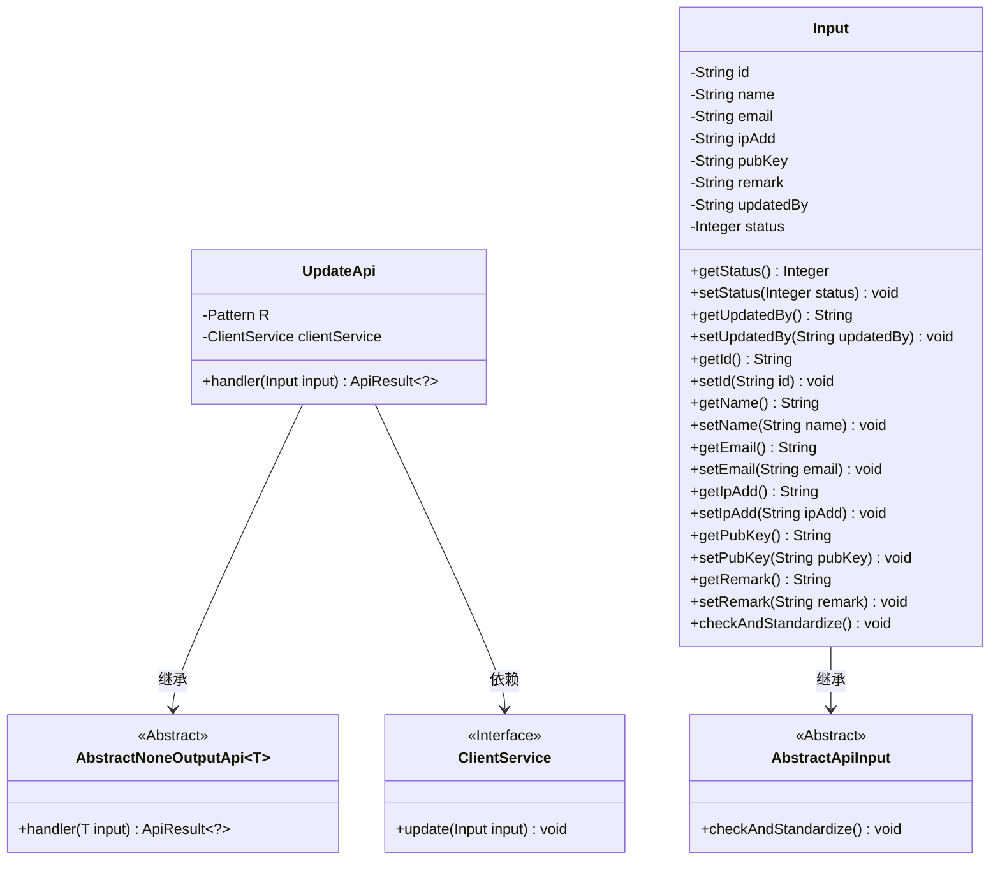

# 基础信息

|      |      |
|------|------|
| 名称 | UpdateApi |
| 编码语言 | .java |
| 代码路径 | WeFe/serving/serving-service/src/main/java/com/welab/wefe/serving/service/api/client/UpdateApi.java |
| 包名 | com.welab.wefe.serving.service.api.client |
| 依赖项 | ['com.welab.wefe.common.StatusCode', 'com.welab.wefe.common.exception.StatusCodeWithException', 'com.welab.wefe.common.fieldvalidate.annotation.Check', 'com.welab.wefe.common.util.StringUtil', 'com.welab.wefe.common.web.api.base.AbstractNoneOutputApi', 'com.welab.wefe.common.web.api.base.Api', 'com.welab.wefe.common.web.dto.AbstractApiInput', 'com.welab.wefe.common.web.dto.ApiResult', 'com.welab.wefe.serving.service.service.ClientService', 'org.springframework.beans.factory.annotation.Autowired', 'java.sql.SQLIntegrityConstraintViolationException', 'java.util.List', 'java.util.regex.Matcher', 'java.util.regex.Pattern'] |
| 概述说明 | UpdateApi用于更新客户信息，包含必填字段名称、IP地址和公钥，IP需符合正则校验。调用clientService.update处理输入并返回成功结果。 |

# 说明

该代码定义了一个名为UpdateApi的API类，用于处理客户端更新请求。API路径为client/update，继承自AbstractNoneOutputApi，输入类型为内部类Input。Input类包含客户ID、名称、邮箱、IP地址、公钥、备注、修改人和状态等字段，其中名称、IP地址和公钥为必填项。IP地址通过正则表达式验证格式。handler方法调用ClientService的update方法处理输入数据。Input类还包含字段校验和标准化逻辑，确保IP地址格式正确。

# 类列表 Class Summary

| 名称   | 类型  | 说明 |
|-------|------|-------------|
| UpdateApi | class | 更新客户信息的API类，包含必填字段校验和IP地址格式验证，调用ClientService完成更新操作。 |

## 类 UpdateApi

|      |      |
|------|------|
| 访问范围 | @Api(path = "client/update", name = "update");public |
| 类型 | class |
| 名称 | UpdateApi |
| 说明 | 更新客户信息的API类，包含必填字段校验和IP地址格式验证，调用ClientService完成更新操作。 |

### UML类图

类图描述：该图展示了UpdateApi及其相关类的结构关系。UpdateApi继承自泛型类AbstractNoneOutputApi<Input>，并依赖ClientService接口。Input类继承自AbstractApiInput，包含多个私有字段及其getter/setter方法，并重写了checkAndStandardize()方法用于参数校验。ClientService作为接口提供update方法。整体结构体现了API处理请求时的分层设计模式。

### 内部方法调用关系图

```mermaid
graph TD
    A["类UpdateApi"]
    B["父类: AbstractNoneOutputApi<Input>"]
    C["常量: Pattern R (IP正则)"]
    D["依赖: ClientService clientService"]
    E["方法: handler(Input input)"]
    F["嵌套类Input"]
    G["属性: id/name/email/ipAdd/pubKey/remark/updatedBy/status"]
    H["方法: checkAndStandardize()"]
    I["Getter/Setter方法组"]

    A --> B
    A --> C
    A --> D
    A --> E
    A --> F
    F --> G
    F --> H
    F --> I
    H -->|"splitWithoutEmptyItem"| J["分割IP字符串"]
    H -->|"R.matcher()"| K["IP格式校验"]
    H -->|"StringUtil.join"| L["合并合法IP"]
    E -->|"clientService.update"| M["调用服务更新"]
    E -->|"success()"| N["返回成功结果"]
```

该流程图展示了UpdateApi类的核心结构，包含IP校验流程和服务调用链路。主要分为三部分：1) 类继承关系和依赖注入；2) Input嵌套类的参数校验逻辑，通过正则表达式验证IP格式；3) handler方法处理流程，调用clientService完成数据更新后返回成功结果。校验过程严格处理多IP分割和重组，确保参数合法性。

### 字段列表 Field List

| 名称  | 类型  | 说明 |
|-------|-------|------|
| clientService | ClientService | 使用@Autowired自动注入ClientService实例。 |
| R = Pattern.compile("((2(5[0-5]|[0-4]\\d))|[0-1]?\\d{1,2})(\\.((2(5[0-5]|[0-4]\\d))|[0-1]?\\d{1,2})){3}") | Pattern | 该代码定义了一个正则表达式模式，用于匹配IPv4地址格式。 |

### 方法列表

| 名称  | 类型  | 说明 |
|-------|-------|------|
| handler | ApiResult<?> | Java方法重写，调用clientService更新输入并返回成功结果。 |

