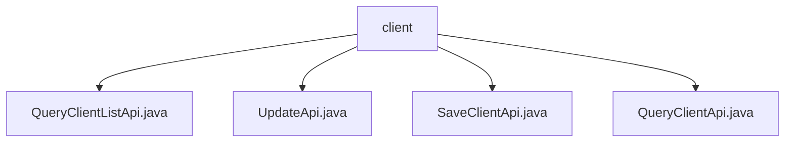

# 基础信息

|      |      |
|------|------|
| 名称 | client |
| 编码语言 | .java |
| 代码路径 | WeFe/serving/serving-service/src/main/java/com/welab/wefe/serving/service/api/client |
| 包名 | docs.serving.serving-service.src.main.java.com.welab.wefe.serving.service.api.client |
| 概述说明 | QueryClientListApi用于分页查询客户列表，包含名称时间等参数。UpdateApi处理客户更新，校验必填字段和IP格式。SaveClientApi保存客户信息，校验IP和公钥。QueryClientApi查询单个客户详情。均继承基础API类，通过ClientService处理。 |

# 说明

## 概述  
该模块提供客户端全生命周期管理功能，包括查询列表、更新、保存和单条查询等操作。接口规范统一继承AbstractApi或AbstractNoneOutputApi，采用分页输出（如PagingOutput<Output>）或无输出设计。关键数据结构包含客户ID、名称、邮箱、IP白名单、公钥等字段，通过校验注解确保数据有效性（例如IPv4格式正则校验）。外部依赖仅为ClientService，用于处理核心业务逻辑。例如SaveClientApi要求公钥长度≥128字符。

## 主要业务场景  
模块支持客户端信息的CRUD操作，类似基础数据管理平台。业务流程包括：通过QueryClientListApi分页查询列表，使用SaveClientApi/UpdateApi保存或更新数据（需校验IP和公钥），通过QueryClientApi获取单条详情。交互模式均为RESTful风格，例如client/update路径处理更新请求。典型应用如客户信息维护，集成案例涵盖从创建到查询的全链路操作。

### 包内部结构视图

该流程图展示了WeFe项目中client目录下的API文件结构。根节点为client文件夹，包含四个Java接口文件：QueryClientListApi、UpdateApi、SaveClientApi和QueryClientApi，这些文件均直接隶属于client目录，没有更深层级的子目录结构。

# 文件列表

| 名称   | 类型  | 说明 |
|-------|------|-------------|
| [QueryClientListApi.java](QueryClientListApi.md) | file | QueryClientListApi是一个分页查询客户列表的接口，输入包含客户名称和时间范围，输出包含客户ID、名称、邮箱、IP白名单、公钥、状态等信息。通过ClientService处理查询逻辑。 |
| [UpdateApi.java](UpdateApi.md) | file | UpdateApi用于更新客户信息，包含必填字段名称、IP地址和公钥，IP需符合正则校验。调用clientService.update处理输入并返回成功结果。 |
| [SaveClientApi.java](SaveClientApi.md) | file | SaveClientApi用于保存客户信息，包含必填字段如名称、IP地址和公钥，IP需符合格式，公钥长度至少128位。 |
| [QueryClientApi.java](QueryClientApi.md) | file | 查询客户端API，通过ID或名称查询客户信息，返回包含ID、名称、邮箱等详细信息的输出。 |

