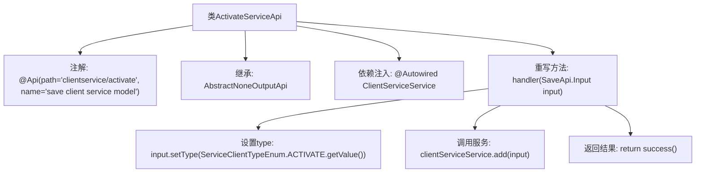

# 基础信息

|      |      |
|------|------|
| 名称 | ActivateServiceApi |
| 编码语言 | .java |
| 代码路径 | WeFe/serving/serving-service/src/main/java/com/welab/wefe/serving/service/api/clientservice/ActivateServiceApi.java |
| 包名 | com.welab.wefe.serving.service.api.clientservice |
| 依赖项 | ['org.springframework.beans.factory.annotation.Autowired', 'com.welab.wefe.common.exception.StatusCodeWithException', 'com.welab.wefe.common.web.api.base.AbstractNoneOutputApi', 'com.welab.wefe.common.web.api.base.Api', 'com.welab.wefe.common.web.dto.ApiResult', 'com.welab.wefe.serving.service.enums.ServiceClientTypeEnum', 'com.welab.wefe.serving.service.service.ClientServiceService'] |
| 概述说明 | 这是一个激活客户服务的API类，路径为"clientservice/activate"，通过调用ClientServiceService的add方法处理输入并返回成功结果。 |

# 说明

该内容描述了一个名为ActivateServiceApi的Java类，用于处理客户端服务激活请求。该类继承自AbstractNoneOutputApi，泛型参数为SaveApi.Input。通过@Api注解定义了API路径为"clientservice/activate"和名称为"save client service model"。类中注入了ClientServiceService服务，并重写了handler方法，该方法将输入参数的类型设置为ACTIVATE枚举值，调用clientServiceService.add方法处理输入，最后返回成功结果。整个类实现了无输出的API处理逻辑。

# 类列表 Class Summary

| 名称   | 类型  | 说明 |
|-------|------|-------------|
| ActivateServiceApi | class | ActivateServiceApi类用于激活客户端服务，通过调用clientServiceService.add方法保存输入数据，设置类型为ACTIVATE并返回成功结果。 |


## 类 ActivateServiceApi

|      |      |
|------|------|
| 访问范围 | @Api(path = "clientservice/activate", name = "save client service model");public |
| 类型 | class |
| 名称 | ActivateServiceApi |
| 说明 | ActivateServiceApi类用于激活客户端服务，通过调用clientServiceService.add方法保存输入数据，设置类型为ACTIVATE并返回成功结果。 |


### UML类图

```mermaid
classDiagram
    class ActivateServiceApi {
        -ClientServiceService clientServiceService
        +handler(SaveApi~Input~ input) ApiResult~?~
    }
    class AbstractNoneOutputApi~T~ {
        <<Abstract>>
        #handler(T input) ApiResult~?~
    }
    class SaveApi {
        class Input {
            +setType(String type)
        }
    }
    class ClientServiceService {
        +add(SaveApi~Input~ input)
    }
    class ServiceClientTypeEnum {
        <<Enumeration>>
        +ACTIVATE
        +getValue() String
    }

    ActivateServiceApi --|> AbstractNoneOutputApi~SaveApi~Input~~ : 继承
    ActivateServiceApi --> ClientServiceService : 调用
    ActivateServiceApi --> SaveApi~Input~ : 使用
    SaveApi~Input~ --> ServiceClientTypeEnum : 依赖
```

该代码展示了一个基于Spring框架的API实现类ActivateServiceApi，它继承自泛型抽象类AbstractNoneOutputApi，专门处理客户端服务激活请求。类图中包含核心业务逻辑：通过ClientServiceService添加类型为ACTIVATE的服务记录，涉及输入参数处理和枚举类型转换。各组件间通过依赖注入和继承关系协作，体现了清晰的层级结构和职责划分。


### 内部方法调用关系图



这段代码展示了一个基于Spring框架的API类ActivateServiceApi，主要用于处理客户端服务激活请求。流程图清晰呈现了类结构：通过@Api注解定义API路径和名称，继承抽象父类并注入ClientServiceService服务。核心handler方法依次执行设置服务类型、调用服务层添加数据、返回成功结果三个步骤，完整描述了请求处理流程。

### 字段列表 Field List

| 名称  | 类型  | 说明 |
|-------|-------|------|
| clientServiceService | ClientServiceService | 使用@Autowired自动注入ClientServiceService实例。 |

### 方法列表

| 名称  | 类型  | 说明 |
|-------|-------|------|
| handler | ApiResult<?> | 该方法处理保存API请求，设置输入类型为激活，调用客户端服务添加输入，最后返回成功结果。 |


