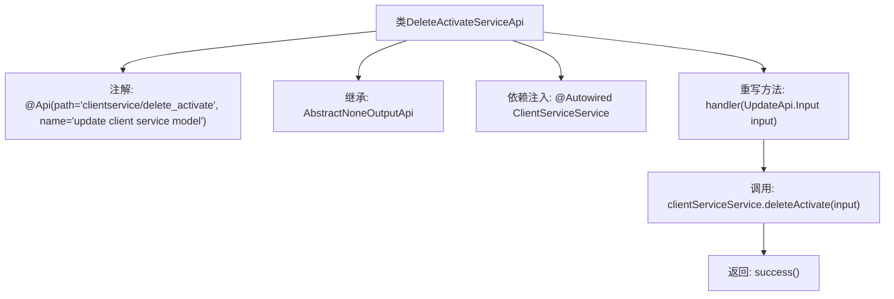

# 基础信息

|      |      |
|------|------|
| 名称 | DeleteActivateServiceApi |
| 编码语言 | .java |
| 代码路径 | WeFe/serving/serving-service/src/main/java/com/welab/wefe/serving/service/api/clientservice/DeleteActivateServiceApi.java |
| 包名 | com.welab.wefe.serving.service.api.clientservice |
| 依赖项 | ['org.springframework.beans.factory.annotation.Autowired', 'com.welab.wefe.common.exception.StatusCodeWithException', 'com.welab.wefe.common.web.api.base.AbstractNoneOutputApi', 'com.welab.wefe.common.web.api.base.Api', 'com.welab.wefe.common.web.dto.ApiResult', 'com.welab.wefe.serving.service.service.ClientServiceService'] |
| 概述说明 | 这是一个删除激活客户端服务的API类，路径为"clientservice/delete_activate"，调用ClientServiceService的deleteActivate方法处理输入并返回成功结果。 |

# 说明

该内容描述了一个名为DeleteActivateServiceApi的Java类，继承自AbstractNoneOutputApi，用于处理客户端服务模型的更新操作。类上标注了Api注解，指定路径为"clientservice/delete_activate"，名称为"update client service model"。类中注入了ClientServiceService服务，并通过handler方法调用deleteActivate功能处理输入参数，成功时返回ApiResult。整个类专注于删除激活客户端服务的功能实现。

# 类列表 Class Summary

| 名称   | 类型  | 说明 |
|-------|------|-------------|
| DeleteActivateServiceApi | class | 这是一个名为DeleteActivateServiceApi的API类，路径为"clientservice/delete_activate"，用于更新客户端服务模型。它继承自AbstractNoneOutputApi，处理UpdateApi.Input输入，调用clientServiceService的deleteActivate方法并返回成功结果。 |


## 类 DeleteActivateServiceApi

|      |      |
|------|------|
| 访问范围 | @Api(path = "clientservice/delete_activate", name = "update client service model");public |
| 类型 | class |
| 名称 | DeleteActivateServiceApi |
| 说明 | 这是一个名为DeleteActivateServiceApi的API类，路径为"clientservice/delete_activate"，用于更新客户端服务模型。它继承自AbstractNoneOutputApi，处理UpdateApi.Input输入，调用clientServiceService的deleteActivate方法并返回成功结果。 |


### UML类图

```mermaid
classDiagram
    class DeleteActivateServiceApi {
        -ClientServiceService clientServiceService
        +handler(UpdateApi~Input~ input) ApiResult~?~
    }
    <<Interface>> UpdateApi
    UpdateApi : +Input
    class AbstractNoneOutputApi~T~ {
        <<abstract>>
        +handler(T input) ApiResult~?~
    }
    class ClientServiceService {
        +deleteActivate(UpdateApi~Input~ input) void
    }
    DeleteActivateServiceApi --|> AbstractNoneOutputApi~UpdateApi~Input~~
    DeleteActivateServiceApi --> ClientServiceService : 依赖
    DeleteActivateServiceApi ..|> UpdateApi : 实现
```

这段类图展示了DeleteActivateServiceApi继承自泛型类AbstractNoneOutputApi，并实现了UpdateApi接口的结构。该类通过依赖注入使用ClientServiceService来执行deleteActivate操作，handler方法处理输入参数并返回ApiResult。AbstractNoneOutputApi作为抽象基类定义了核心处理逻辑，UpdateApi接口则规范了API的输入输出契约。整个设计体现了清晰的层级关系和职责分离，符合Spring框架的API开发模式。


### 内部方法调用关系图



这段代码描述了一个基于Spring框架的API服务类DeleteActivateServiceApi，用于处理客户端服务的删除激活操作。类通过@Api注解定义接口路径和名称，继承抽象父类并注入ClientServiceService服务。核心逻辑在handler方法中，调用服务层方法完成删除操作后返回成功结果。流程图清晰展示了从类结构定义到方法调用的完整处理链条。

### 字段列表 Field List

| 名称  | 类型  | 说明 |
|-------|-------|------|
| clientServiceService | ClientServiceService | 使用@Autowired自动注入ClientServiceService实例。 |

### 方法列表

| 名称  | 类型  | 说明 |
|-------|-------|------|
| handler | ApiResult<?> | Java方法重写，调用clientServiceService删除激活输入，成功返回ApiResult。处理异常StatusCodeWithException。 |


