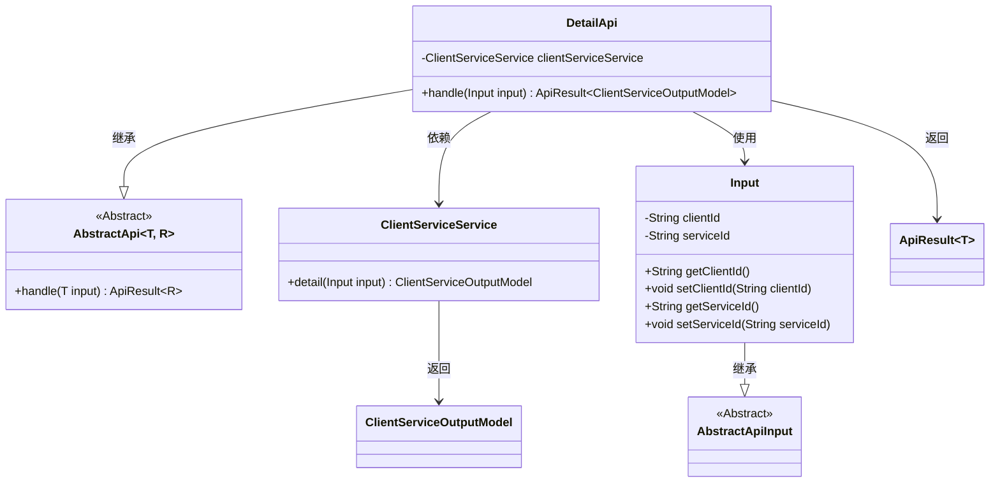

# 基础信息

|      |      |
|------|------|
| 名称 | DetailApi |
| 编码语言 | .java |
| 代码路径 | WeFe/serving/serving-service/src/main/java/com/welab/wefe/serving/service/api/clientservice/DetailApi.java |
| 包名 | com.welab.wefe.serving.service.api.clientservice |
| 依赖项 | ['java.io.IOException', 'org.springframework.beans.factory.annotation.Autowired', 'com.welab.wefe.common.exception.StatusCodeWithException', 'com.welab.wefe.common.fieldvalidate.annotation.Check', 'com.welab.wefe.common.web.api.base.AbstractApi', 'com.welab.wefe.common.web.api.base.Api', 'com.welab.wefe.common.web.dto.AbstractApiInput', 'com.welab.wefe.common.web.dto.ApiResult', 'com.welab.wefe.serving.service.database.entity.ClientServiceOutputModel', 'com.welab.wefe.serving.service.service.ClientServiceService'] |
| 概述说明 | DetailApi类用于获取客户服务详情，需提供clientId和serviceId参数，调用clientServiceService.detail方法返回结果。 |

# 说明

该代码定义了一个名为DetailApi的API类，用于获取客户服务详情。它继承自AbstractApi，接受Input类作为输入参数，返回ClientServiceOutputModel类型结果。Input类包含两个必填字段：clientId和serviceId，均通过@Check注解进行校验。API路径为"clientservice/detail"，通过注入的ClientServiceService调用detail方法处理请求，并返回成功结果。整个类封装了客户服务详情的查询逻辑。

# 类列表 Class Summary

| 名称   | 类型  | 说明 |
|-------|------|-------------|
| DetailApi | class | DetailApi类用于获取客户服务详情，需提供clientId和serviceId，调用ClientServiceService处理并返回结果。 |

## 类 DetailApi

|      |      |
|------|------|
| 访问范围 | @Api(path = "clientservice/detail", name = "get client service ");public |
| 类型 | class |
| 名称 | DetailApi |
| 说明 | DetailApi类用于获取客户服务详情，需提供clientId和serviceId，调用ClientServiceService处理并返回结果。 |

### UML类图

类图描述：该图展示了一个基于抽象类的API实现结构。DetailApi继承自泛型类AbstractApi，处理Input参数并返回ApiResult<ClientServiceOutputModel>。Input类继承自AbstractApiInput，包含客户端和服务ID字段。DetailApi通过依赖注入的ClientServiceService获取详细数据，体现了典型的控制器-服务层交互模式。

### 内部方法调用关系图

```mermaid
graph TD
    A["类DetailApi"]
    B["注解: @Api(path='clientservice/detail', name='get client service')"]
    C["继承: AbstractApi<Input, ClientServiceOutputModel>"]
    D["依赖注入: @Autowired ClientServiceService"]
    E["重写方法: handle(Input input)"]
    F["嵌套类Input"]
    G["属性: @Check String clientId"]
    H["属性: @Check String serviceId"]
    I["getter/setter方法"]
    J["调用: clientServiceService.detail(input)"]
    K["返回: success(result)"]

    A --> B
    A --> C
    A --> D
    A --> E
    C --> F
    F --> G
    F --> H
    F --> I
    E --> J
    J --> K
```

该流程图展示了DetailApi类的完整结构，包含类注解、继承关系、依赖注入字段和核心业务逻辑处理流程。重点描述了handle方法通过clientServiceService获取详情数据并返回成功结果的调用链，同时详细呈现了嵌套类Input的字段结构和校验注解。整个流程体现了从请求处理到数据返回的完整业务闭环。

### 字段列表 Field List

| 名称  | 类型  | 说明 |
|-------|-------|------|
| clientServiceService | ClientServiceService | 使用@Autowired自动注入ClientServiceService实例。 |

### 方法列表

| 名称  | 类型  | 说明 |
|-------|-------|------|
| handle | ApiResult<ClientServiceOutputModel> | 该方法处理输入并返回客户端服务详情，成功时封装结果，异常时抛出状态码异常或IO异常。 |

