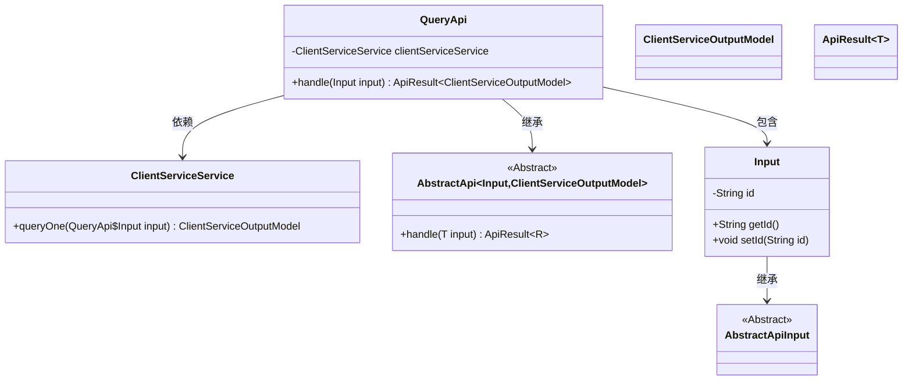

# 基础信息

|      |      |
|------|------|
| 名称 | QueryApi |
| 编码语言 | .java |
| 代码路径 | WeFe/serving/serving-service/src/main/java/com/welab/wefe/serving/service/api/clientservice/QueryApi.java |
| 包名 | com.welab.wefe.serving.service.api.clientservice |
| 依赖项 | ['com.welab.wefe.common.exception.StatusCodeWithException', 'com.welab.wefe.common.fieldvalidate.annotation.Check', 'com.welab.wefe.common.web.api.base.AbstractApi', 'com.welab.wefe.common.web.api.base.Api', 'com.welab.wefe.common.web.dto.AbstractApiInput', 'com.welab.wefe.common.web.dto.ApiResult', 'com.welab.wefe.serving.service.database.entity.ClientServiceOutputModel', 'com.welab.wefe.serving.service.service.ClientServiceService', 'org.springframework.beans.factory.annotation.Autowired', 'java.io.IOException'] |
| 概述说明 | QueryApi类处理客户端服务查询，通过id输入调用clientServiceService.queryOne方法返回ClientServiceOutputModel结果。 |

# 说明

这是一个名为QueryApi的Java类，继承自AbstractApi，用于处理客户端服务查询请求。类上标注了Api注解，指定路径为"clientservice/query"和名称为"get models"。它通过Autowired注入了ClientServiceService服务。主要功能是处理输入参数Input（包含一个经过Check注解校验的id字段），并调用clientServiceService.queryOne方法查询数据，返回ClientServiceOutputModel结果。整个类封装了查询接口的核心逻辑，包括输入参数验证和业务处理流程。

# 类列表 Class Summary

| 名称   | 类型  | 说明 |
|-------|------|-------------|
| QueryApi | class | QueryApi类通过路径"clientservice/query"提供查询服务，继承AbstractApi并处理输入ID，调用clientServiceService.queryOne返回结果。 |

## 类 QueryApi

|      |      |
|------|------|
| 访问范围 | @Api(path = "clientservice/query", name = "get models ");public |
| 类型 | class |
| 名称 | QueryApi |
| 说明 | QueryApi类通过路径"clientservice/query"提供查询服务，继承AbstractApi并处理输入ID，调用clientServiceService.queryOne返回结果。 |

### UML类图

这段代码展示了一个基于Spring框架的API查询服务结构。QueryApi类继承自泛型抽象类AbstractApi，处理客户端服务查询请求。它包含一个内部类Input用于接收参数，并依赖ClientServiceService执行实际业务逻辑。整体设计采用了分层架构，通过泛型实现了输入输出类型的灵活性，同时利用Spring的依赖注入机制管理服务实例。

### 内部方法调用关系图

```mermaid
graph TD
    A["类QueryApi"]
    B["注解: @Api(path='clientservice/query', name='get models')"]
    C["继承: AbstractApi<Input, ClientServiceOutputModel>"]
    D["依赖注入: @Autowired ClientServiceService"]
    E["重写方法: handle(Input input)"]
    F["内部类: Input"]
    G["校验注解: @Check(name='id')"]
    H["属性: String id"]
    I["方法: getId()/setId()"]
    J["调用: clientServiceService.queryOne(input)"]
    K["返回: ApiResult<ClientServiceOutputModel>"]

    A --> B
    A --> C
    A --> D
    A --> E
    E --> J
    J --> K
    A -.-> F
    F --> G
    F --> H
    F --> I
```

该流程图展示了QueryApi类的结构，它是一个带有REST接口注解的API类，继承自泛型抽象类AbstractApi。核心逻辑是通过注入的ClientServiceService执行查询，并返回封装结果。内部类Input包含带校验注解的ID字段及其访问方法，用于处理请求参数。整体流程清晰体现了Spring Boot中API层的典型设计模式。

### 字段列表 Field List

| 名称  | 类型  | 说明 |
|-------|-------|------|
| clientServiceService | ClientServiceService | 使用@Autowired自动注入ClientServiceService实例。 |

### 方法列表

| 名称  | 类型  | 说明 |
|-------|-------|------|
| handle | ApiResult<ClientServiceOutputModel> | 该方法处理输入并返回查询结果，成功时调用clientServiceService.queryOne方法。 |

