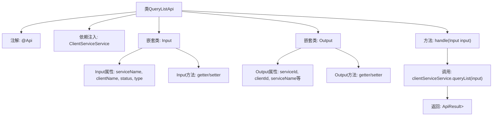

# 基础信息

|      |      |
|------|------|
| 名称 | QueryListApi |
| 编码语言 | .java |
| 代码路径 | WeFe/serving/serving-service/src/main/java/com/welab/wefe/serving/service/api/clientservice/QueryListApi.java |
| 包名 | com.welab.wefe.serving.service.api.clientservice |
| 依赖项 | ['java.io.IOException', 'java.util.Date', 'org.springframework.beans.factory.annotation.Autowired', 'com.welab.wefe.common.exception.StatusCodeWithException', 'com.welab.wefe.common.fieldvalidate.annotation.Check', 'com.welab.wefe.common.web.api.base.AbstractApi', 'com.welab.wefe.common.web.api.base.Api', 'com.welab.wefe.common.web.dto.AbstractApiOutput', 'com.welab.wefe.common.web.dto.ApiResult', 'com.welab.wefe.serving.service.dto.PagingInput', 'com.welab.wefe.serving.service.dto.PagingOutput', 'com.welab.wefe.serving.service.service.ClientServiceService'] |
| 概述说明 | QueryListApi是一个查询客户服务列表的接口，输入包括服务名称、客户名称、状态和类型，输出包含服务详情如ID、名称、状态、IP等。 |

# 说明

这是一个名为QueryListApi的Java类，用于处理客户端服务查询列表的API请求。该类继承自AbstractApi，接受Input参数并返回分页的Output结果。Input类包含分页参数及服务名称、客户名称、状态和类型等查询条件。Output类包含服务ID、客户ID、服务名称、客户名称、服务类型、状态、IP地址、URL、支付类型、单价、创建人、更新人、创建时间、类型和代码等详细信息。该API通过调用clientServiceService的queryList方法处理请求，并返回分页结果。

# 类列表 Class Summary

| 名称   | 类型  | 说明 |
|-------|------|-------------|
| QueryListApi | class | QueryListApi是一个分页查询接口，输入包含服务名称、客户名称、状态和类型，输出包含服务详情和客户信息。 |


## 类 QueryListApi

|      |      |
|------|------|
| 访问范围 | @Api(path = "clientservice/query-list", name = "query list");public |
| 类型 | class |
| 名称 | QueryListApi |
| 说明 | QueryListApi是一个分页查询接口，输入包含服务名称、客户名称、状态和类型，输出包含服务详情和客户信息。 |


### UML类图

```mermaid
classDiagram
    class AbstractApi~T, R~ {
        <<abstract>>
        +handle(T input) ApiResult~R~
    }

    class PagingInput {
        <<abstract>>
    }

    class PagingOutput~T~ {
        <<abstract>>
    }

    class AbstractApiOutput {
        <<abstract>>
    }

    class QueryListApi {
        -ClientServiceService clientServiceService
        +handle(Input input) ApiResult~PagingOutput~Output~~
    }

    class QueryListApi$Input {
        -String serviceName
        -String clientName
        -Integer status
        -Integer type
        +get/set methods
    }

    class QueryListApi$Output {
        -String serviceId
        -String clientId
        // ...其他字段
        +get/set methods
    }

    class ClientServiceService {
        <<Interface>>
        +queryList(QueryListApi$Input input) PagingOutput~QueryListApi$Output~
    }

    QueryListApi --> AbstractApi : 继承
    QueryListApi --> ClientServiceService : 依赖
    QueryListApi$Input --> PagingInput : 继承
    QueryListApi$Output --> AbstractApiOutput : 继承
    PagingOutput <|-- QueryListApi : 泛型参数
```

这段代码展示了一个分页查询API的实现结构。QueryListApi继承自AbstractApi，使用泛型指定输入类型为内部类Input（继承PagingInput）和输出类型为PagingOutput<Output>。核心处理委托给ClientServiceService接口的queryList方法。Input类包含服务名称、客户名称等查询条件，Output类则包含服务ID、客户ID等丰富的返回字段。整个设计体现了清晰的层级关系和职责分离，Input/Output作为静态内部类封装了相关数据模型。


### 内部方法调用关系图



这段代码定义了一个名为QueryListApi的API类，继承自AbstractApi，用于处理分页查询客户服务列表的请求。该类包含Input和Output两个嵌套类，Input用于接收查询参数（包括服务名称、客户名称、状态等），Output定义了返回数据的结构。主要流程是通过handle方法调用ClientServiceService的queryList方法，并返回分页结果。流程图清晰地展示了类结构、属性方法以及核心调用关系。

### 字段列表 Field List

| 名称  | 类型  | 说明 |
|-------|-------|------|
| clientServiceService | ClientServiceService | 使用@Autowired自动注入ClientServiceService实例。 |

### 方法列表

| 名称  | 类型  | 说明 |
|-------|-------|------|
| handle | ApiResult<PagingOutput<QueryListApi.Output>> | 处理输入并返回分页查询结果，成功时调用服务方法。 |


