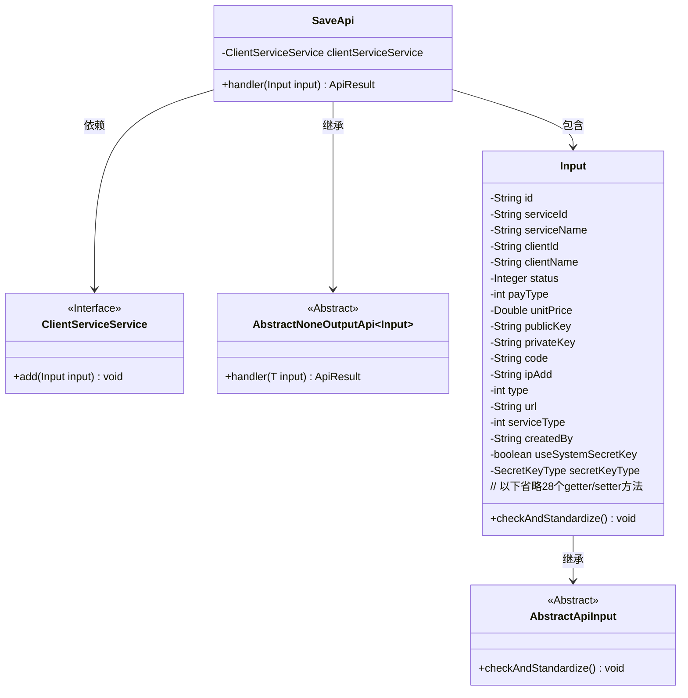

# 基础信息

|      |      |
|------|------|
| 名称 | SaveApi |
| 编码语言 | .java |
| 代码路径 | WeFe/serving/serving-service/src/main/java/com/welab/wefe/serving/service/api/clientservice/SaveApi.java |
| 包名 | com.welab.wefe.serving.service.api.clientservice |
| 依赖项 | ['com.welab.wefe.common.StatusCode', 'com.welab.wefe.common.constant.SecretKeyType', 'com.welab.wefe.common.exception.StatusCodeWithException', 'com.welab.wefe.common.fieldvalidate.annotation.Check', 'com.welab.wefe.common.web.api.base.AbstractNoneOutputApi', 'com.welab.wefe.common.web.api.base.Api', 'com.welab.wefe.common.web.dto.AbstractApiInput', 'com.welab.wefe.common.web.dto.ApiResult', 'com.welab.wefe.serving.service.enums.ServiceClientTypeEnum', 'com.welab.wefe.serving.service.enums.ServiceStatusEnum', 'com.welab.wefe.serving.service.service.ClientServiceService', 'org.springframework.beans.factory.annotation.Autowired'] |
| 概述说明 | SaveApi类用于保存客户端服务模型，包含输入参数校验和处理逻辑，主要字段有服务ID、客户ID、公私钥、价格等，确保单价非负后调用服务保存数据。 |

# 说明

该代码定义了一个名为SaveApi的API类，用于保存客户端服务模型。它继承自AbstractNoneOutputApi，输入参数为内部类Input。Input类包含多个字段，如id、serviceId、clientId、status、payType、unitPrice、publicKey、privateKey等，每个字段都有相应的校验注解和getter/setter方法。其中serviceId和clientId为必填字段。handler方法调用clientServiceService.add保存输入数据。Input类还包含checkAndStandardize方法，用于校验unitPrice不能为负数。该API路径为clientservice/save。

# 类列表 Class Summary

| 名称   | 类型  | 说明 |
|-------|------|-------------|
| SaveApi | class | SaveApi类用于保存客户端服务模型，包含输入参数校验和业务处理逻辑，主要字段有服务ID、客户ID、价格、密钥等，确保数据有效后调用服务保存。 |

## 类 SaveApi

|      |      |
|------|------|
| 访问范围 | @Api(path = "clientservice/save", name = "save client service model");public |
| 类型 | class |
| 名称 | SaveApi |
| 说明 | SaveApi类用于保存客户端服务模型，包含输入参数校验和业务处理逻辑，主要字段有服务ID、客户ID、价格、密钥等，确保数据有效后调用服务保存。 |

### UML类图

这段代码展示了一个保存客户端服务模型的API实现，核心类SaveApi继承自泛型抽象类AbstractNoneOutputApi，包含一个静态内部类Input作为输入参数。Input类继承自AbstractApiInput，包含多个带校验注解的字段和标准化逻辑。SaveApi通过依赖注入使用ClientServiceService接口来执行实际保存操作。整个设计体现了分层架构思想，输入参数校验与业务逻辑分离，符合单一职责原则。

### 内部方法调用关系图

```mermaid
graph TD
    A["类SaveApi"]
    B["注解: @Api"]
    C["继承: AbstractNoneOutputApi<Input>"]
    D["依赖注入: @Autowired ClientServiceService"]
    E["重写方法: handler(Input input)"]
    F["内部类: Input"]
    G["Input属性: 23个@Check标注字段"]
    H["Input方法: checkAndStandardize()"]
    I["Input方法: 23个getter/setter"]
    J["Input继承: AbstractApiInput"]

    A --> B
    A --> C
    A --> D
    A --> E
    A --> F
    F --> G
    F --> H
    F --> I
    F --> J
    E --> D
    E --> H
```

这段代码描述了一个用于保存客户端服务模型的API类SaveApi，它继承自AbstractNoneOutputApi并包含一个复杂的Input内部类。流程图展示了类的主要结构：API注解、服务依赖注入、核心处理方法handler，以及Input内部类的继承关系、字段验证和方法组成。Input类包含23个经过@Check验证的字段和对应的getter/setter，并重写了checkAndStandardize()方法进行额外参数校验。

### 字段列表 Field List

| 名称  | 类型  | 说明 |
|-------|-------|------|
| clientServiceService | ClientServiceService | 使用@Autowired自动注入ClientServiceService实例。 |

### 方法列表

| 名称  | 类型  | 说明 |
|-------|-------|------|
| handler | ApiResult<?> | Java方法重写，调用clientServiceService.add处理输入，成功返回ApiResult。异常时抛出StatusCodeWithException。 |

