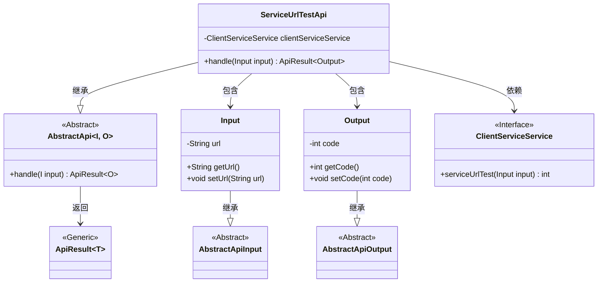
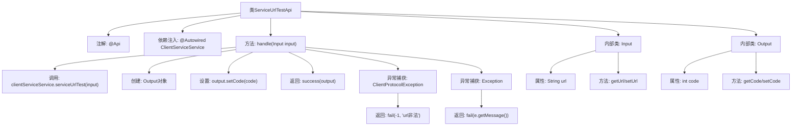

# 基础信息

|      |      |
|------|------|
| 名称 | ServiceUrlTestApi |
| 编码语言 | .java |
| 代码路径 | WeFe/serving/serving-service/src/main/java/com/welab/wefe/serving/service/api/clientservice/ServiceUrlTestApi.java |
| 包名 | com.welab.wefe.serving.service.api.clientservice |
| 依赖项 | ['org.apache.http.client.ClientProtocolException', 'org.springframework.beans.factory.annotation.Autowired', 'com.welab.wefe.common.fieldvalidate.annotation.Check', 'com.welab.wefe.common.web.api.base.AbstractApi', 'com.welab.wefe.common.web.api.base.Api', 'com.welab.wefe.common.web.dto.AbstractApiInput', 'com.welab.wefe.common.web.dto.AbstractApiOutput', 'com.welab.wefe.common.web.dto.ApiResult', 'com.welab.wefe.serving.service.service.ClientServiceService'] |
| 概述说明 | ServiceUrlTestApi类用于测试服务URL，输入为URL，输出为状态码，处理异常返回错误信息。 |

# 说明

该代码定义了一个名为ServiceUrlTestApi的API类，用于测试服务URL。它继承自AbstractApi，接受Input参数并返回Output结果。Input包含一个必填的URL字段，Output包含一个状态码字段。处理逻辑中调用clientServiceService的serviceUrlTest方法测试URL，成功返回状态码，失败捕获异常并返回错误信息。

# 类列表 Class Summary

| 名称   | 类型  | 说明 |
|-------|------|-------------|
| ServiceUrlTestApi | class | ServiceUrlTestApi类用于测试服务URL，通过ClientServiceService检查URL合法性，返回状态码或错误信息。输入需包含URL，输出包含状态码。 |

## 类 ServiceUrlTestApi

|      |      |
|------|------|
| 访问范围 | @Api(path = "clientservice/service_url_test", name = "service url test");public |
| 类型 | class |
| 名称 | ServiceUrlTestApi |
| 说明 | ServiceUrlTestApi类用于测试服务URL，通过ClientServiceService检查URL合法性，返回状态码或错误信息。输入需包含URL，输出包含状态码。 |

### UML类图

这段代码展示了一个服务URL测试API的实现结构。ServiceUrlTestApi继承自泛型抽象类AbstractApi，处理Input和Output两种数据类型。Input类包含URL字段并继承AbstractApiInput，Output类包含状态码字段并继承AbstractApiOutput。该API通过ClientServiceService接口进行实际服务调用，返回封装在ApiResult中的结果。整个设计采用了分层抽象和明确的输入输出类型定义，体现了良好的接口隔离原则和类型安全设计。

### 内部方法调用关系图

这段代码展示了一个基于Spring框架的API类ServiceUrlTestApi，用于测试服务URL的连通性。流程图清晰地呈现了类结构，包括主类与两个内部类Input/Output的继承关系，以及核心方法handle的处理逻辑：通过ClientServiceService进行URL测试，成功时返回状态码，异常时分别处理协议错误和通用错误。注解和依赖注入的使用体现了Spring框架特性，而输入输出类的设计则遵循了抽象API模板模式。

### 字段列表 Field List

| 名称  | 类型  | 说明 |
|-------|-------|------|
| clientServiceService | ClientServiceService | 使用@Autowired自动注入ClientServiceService实例。 |

### 方法列表

| 名称  | 类型  | 说明 |
|-------|-------|------|
| handle | ApiResult<Output> | 处理输入并调用服务测试URL，成功返回状态码，异常返回错误信息。 |

