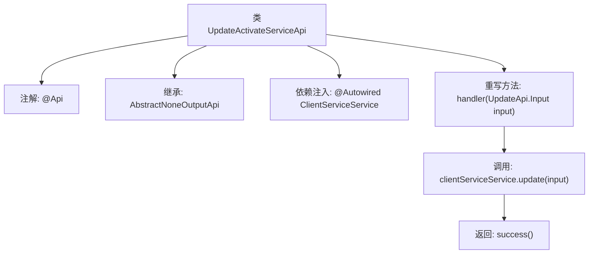

# 基础信息

|      |      |
|------|------|
| 名称 | UpdateActivateServiceApi |
| 编码语言 | .java |
| 代码路径 | WeFe/serving/serving-service/src/main/java/com/welab/wefe/serving/service/api/clientservice/UpdateActivateServiceApi.java |
| 包名 | com.welab.wefe.serving.service.api.clientservice |
| 依赖项 | ['org.springframework.beans.factory.annotation.Autowired', 'com.welab.wefe.common.exception.StatusCodeWithException', 'com.welab.wefe.common.web.api.base.AbstractNoneOutputApi', 'com.welab.wefe.common.web.api.base.Api', 'com.welab.wefe.common.web.dto.ApiResult', 'com.welab.wefe.serving.service.service.ClientServiceService'] |
| 概述说明 | 这是一个更新客户端服务模型的API类，路径为"clientservice/update_activate"，继承自无输出的抽象API类，通过ClientServiceService处理更新请求并返回成功结果。 |

# 说明

这是一个名为UpdateActivateServiceApi的Java类，用于更新客户端服务模型的激活状态。它继承自AbstractNoneOutputApi类，泛型参数为UpdateApi.Input。类上标注了@Api注解，指定路径为"clientservice/update_activate"，名称为"update client service model"。通过@Autowired自动注入ClientServiceService服务实例。重写了handler方法，接收UpdateApi.Input输入参数，调用clientServiceService的update方法处理输入，最后返回成功的ApiResult。整个类实现了无输出的API功能，用于更新客户端服务状态。

# 类列表 Class Summary

| 名称   | 类型  | 说明 |
|-------|------|-------------|
| UpdateActivateServiceApi | class | 这是一个更新客户端服务激活状态的API类，路径为"clientservice/update_activate"，通过ClientServiceService处理输入并返回成功结果。 |


## 类 UpdateActivateServiceApi

|      |      |
|------|------|
| 访问范围 | @Api(path = "clientservice/update_activate", name = "update client service model");public |
| 类型 | class |
| 名称 | UpdateActivateServiceApi |
| 说明 | 这是一个更新客户端服务激活状态的API类，路径为"clientservice/update_activate"，通过ClientServiceService处理输入并返回成功结果。 |


### UML类图

```mermaid
classDiagram
    class UpdateActivateServiceApi {
        -ClientServiceService clientServiceService
        +handler(UpdateApi$Input input) ApiResult<?>
    }
    class AbstractNoneOutputApi~T~ {
        <<Abstract>>
        +handler(T input) ApiResult<?>
    }
    class ClientServiceService {
        +update(UpdateApi$Input input)
    }
    class UpdateApi$Input {
        // 输入参数类
    }
    class ApiResult~T~ {
        // 通用返回结果
    }

    UpdateActivateServiceApi --|> AbstractNoneOutputApi~UpdateApi$Input~ : 继承
    UpdateActivateServiceApi --> ClientServiceService : 调用更新方法
    AbstractNoneOutputApi~T~ ..> ApiResult~T~ : 返回结果依赖
    ClientServiceService ..> UpdateApi$Input : 方法参数依赖
```

这段类图展示了UpdateActivateServiceApi作为AbstractNoneOutputApi的实现类，通过依赖注入使用ClientServiceService来执行更新操作。该API接收UpdateApi.Input参数并返回ApiResult结果，体现了Spring Boot中典型的控制器层与服务层交互模式。抽象基类通过泛型限定输入类型，子类实现具体业务逻辑处理。


### 内部方法调用关系图



该流程图展示了UpdateActivateServiceApi类的结构和工作流程。该类通过@Api注解定义API路径，继承抽象父类并注入ClientServiceService依赖。核心逻辑在handler方法中，先调用服务层更新数据，最后返回成功结果。箭头清晰标注了从类定义到方法执行的完整调用链，层级关系准确反映了代码的实际结构。

### 字段列表 Field List

| 名称  | 类型  | 说明 |
|-------|-------|------|
| clientServiceService | ClientServiceService | 使用@Autowired自动注入ClientServiceService实例。 |

### 方法列表

| 名称  | 类型  | 说明 |
|-------|-------|------|
| handler | ApiResult<?> | Java方法重写，调用clientServiceService.update处理输入，成功返回ApiResult。异常时抛出StatusCodeWithException。 |


