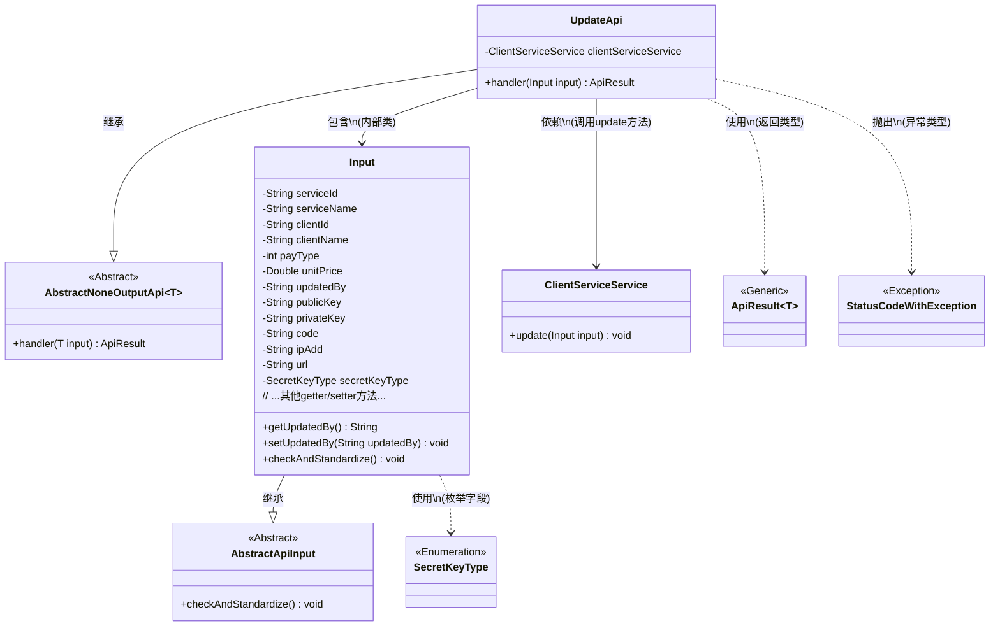

# 基础信息

|      |      |
|------|------|
| 名称 | UpdateApi |
| 编码语言 | .java |
| 代码路径 | WeFe/serving/serving-service/src/main/java/com/welab/wefe/serving/service/api/clientservice/UpdateApi.java |
| 包名 | com.welab.wefe.serving.service.api.clientservice |
| 依赖项 | ['com.welab.wefe.common.constant.SecretKeyType', 'org.springframework.beans.factory.annotation.Autowired', 'com.welab.wefe.common.exception.StatusCodeWithException', 'com.welab.wefe.common.fieldvalidate.annotation.Check', 'com.welab.wefe.common.web.api.base.AbstractNoneOutputApi', 'com.welab.wefe.common.web.api.base.Api', 'com.welab.wefe.common.web.dto.AbstractApiInput', 'com.welab.wefe.common.web.dto.ApiResult', 'com.welab.wefe.serving.service.service.ClientServiceService'] |
| 概述说明 | UpdateApi类用于更新客户服务信息，包含服务ID、客户ID、支付类型、价格等必填字段，以及公钥、IP白名单等可选字段。通过ClientServiceService执行更新操作。 |

# 说明

UpdateApi是一个用于更新客户服务的API类，继承自AbstractNoneOutputApi，路径为"clientservice/update"。它通过ClientServiceService处理更新操作，输入参数Input包含服务ID、名称、客户ID、名称、支付类型、单价、更新者、公钥、私钥、调用者代码、IP白名单、服务地址和公私钥类型等字段，其中服务ID和客户ID为必填项。所有字段都有相应的getter和setter方法，并进行了校验和标准化处理。

# 类列表 Class Summary

| 名称   | 类型  | 说明 |
|-------|------|-------------|
| UpdateApi | class | 更新客户服务的API接口，包含服务ID、客户ID、支付类型、价格、密钥等必填字段，调用ClientServiceService进行更新操作。 |

## 类 UpdateApi

|      |      |
|------|------|
| 访问范围 | @Api(path = "clientservice/update", name = "update client service");public |
| 类型 | class |
| 名称 | UpdateApi |
| 说明 | 更新客户服务的API接口，包含服务ID、客户ID、支付类型、价格、密钥等必填字段，调用ClientServiceService进行更新操作。 |

### UML类图

这段代码展示了一个客户端服务更新API的实现结构。UpdateApi继承自AbstractNoneOutputApi，使用内部类Input作为参数类型，并通过ClientServiceService完成业务逻辑。Input类包含多个带校验注解的字段，继承自AbstractApiInput并实现了参数标准化检查。类图清晰地展示了类之间的继承、包含和依赖关系，以及泛型类和枚举类型的使用。整个设计体现了分层架构思想，输入验证与业务逻辑分离。

### 内部方法调用关系图

```mermaid
graph TD
    A["类UpdateApi"]
    B["继承: AbstractNoneOutputApi<Input>"]
    C["注解: @Api"]
    D["依赖注入: @Autowired ClientServiceService"]
    E["重写方法: handler(Input input)"]
    F["静态内部类: Input"]
    G["继承: AbstractApiInput"]
    H["属性: 13个@Check标注字段"]
    I["方法: checkAndStandardize()"]
    J["方法: 各字段getter/setter"]

    A --> B
    A --> C
    A --> D
    A --> E
    A --> F
    F --> G
    F --> H
    F --> I
    F --> J
    E --> D
    E --> F
```

这段代码描述了一个基于Spring框架的API更新服务类UpdateApi，它继承自抽象基类并实现了带输入参数的请求处理逻辑。流程图展示了类继承关系、依赖注入、核心处理方法以及嵌套的Input数据类结构。Input类包含13个经过校验注解的字段，并提供了标准化的数据校验方法和完整的访问器方法。整个设计实现了客户端服务更新功能，通过handler方法调用ClientServiceService完成业务处理。

### 字段列表 Field List

| 名称  | 类型  | 说明 |
|-------|-------|------|
| clientServiceService | ClientServiceService | 使用@Autowired自动注入ClientServiceService实例。 |

### 方法列表

| 名称  | 类型  | 说明 |
|-------|-------|------|
| handler | ApiResult<?> | Java方法重写，调用clientServiceService.update处理输入，成功返回ApiResult。异常时抛出StatusCodeWithException。 |

