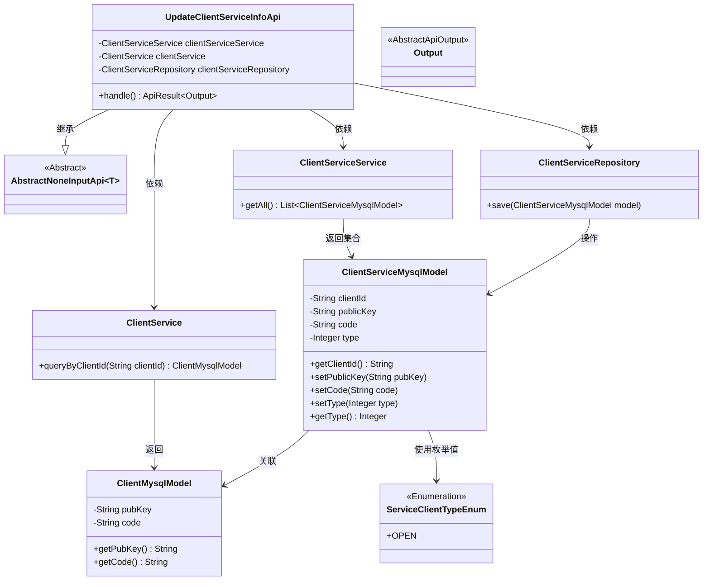
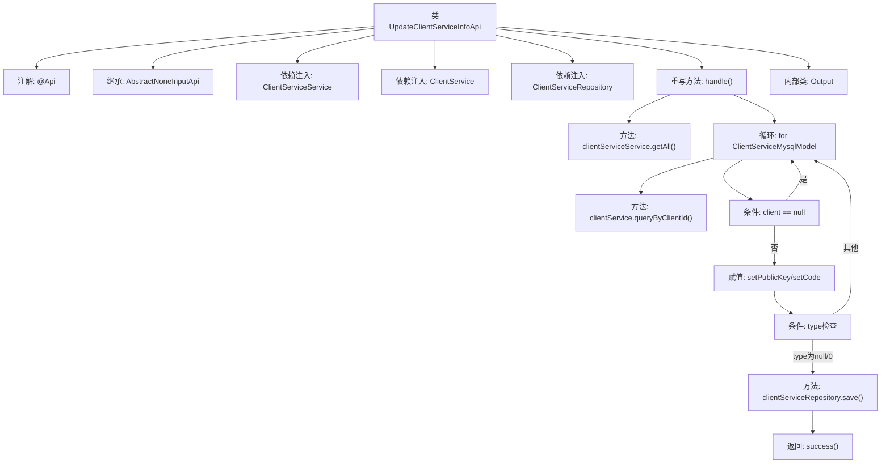

# 基础信息

|      |      |
|------|------|
| 名称 | UpdateClientServiceInfoApi |
| 编码语言 | .java |
| 代码路径 | WeFe/serving/serving-service/src/main/java/com/welab/wefe/serving/service/api/clientservice/UpdateClientServiceInfoApi.java |
| 包名 | com.welab.wefe.serving.service.api.clientservice |
| 依赖项 | ['com.welab.wefe.common.exception.StatusCodeWithException', 'com.welab.wefe.common.web.api.base.AbstractNoneInputApi', 'com.welab.wefe.common.web.api.base.Api', 'com.welab.wefe.common.web.dto.AbstractApiOutput', 'com.welab.wefe.common.web.dto.ApiResult', 'com.welab.wefe.serving.service.database.entity.ClientMysqlModel', 'com.welab.wefe.serving.service.database.entity.ClientServiceMysqlModel', 'com.welab.wefe.serving.service.database.repository.ClientServiceRepository', 'com.welab.wefe.serving.service.enums.ServiceClientTypeEnum', 'com.welab.wefe.serving.service.service.ClientService', 'com.welab.wefe.serving.service.service.ClientServiceService', 'org.springframework.beans.factory.annotation.Autowired', 'java.util.List'] |
| 概述说明 | 更新客户端服务信息的API类，通过查询和修改客户端数据，更新服务类型和密钥信息，最后保存到数据库。 |

# 说明

该代码定义了一个名为UpdateClientServiceInfoApi的API类，用于更新客户端服务信息。它继承了AbstractNoneInputApi基类，输出类型为内部定义的Output类。API路径为"clientservice/update_client_service_info"。主要功能是遍历所有客户端服务记录，根据客户端ID查询对应客户端信息，更新服务记录的公钥、代码和服务类型。对于未设置类型或类型为0的服务，将其类型设置为OPEN枚举值。最后通过Repository保存更新后的记录。该API依赖ClientServiceService、ClientService和ClientServiceRepository三个服务组件来实现业务逻辑。

# 类列表 Class Summary

| 名称   | 类型  | 说明 |
|-------|------|-------------|
| UpdateClientServiceInfoApi | class | 这是一个更新客户端服务信息的API类，通过查询和遍历客户端服务数据，更新公钥、编码和服务类型，最后保存到数据库。 |

## 类 UpdateClientServiceInfoApi

|      |      |
|------|------|
| 访问范围 | @Api(path = "clientservice/update_client_service_info", name = "update client service info");public |
| 类型 | class |
| 名称 | UpdateClientServiceInfoApi |
| 说明 | 这是一个更新客户端服务信息的API类，通过查询和遍历客户端服务数据，更新公钥、编码和服务类型，最后保存到数据库。 |

### UML类图

这段代码描述了一个用于更新客户端服务信息的API类`UpdateClientServiceInfoApi`，它继承自抽象基类`AbstractNoneInputApi`，通过三个依赖组件（`ClientServiceService`、`ClientService`、`ClientServiceRepository`）完成核心业务逻辑。主要功能是遍历所有客户端服务记录，根据客户端ID查询关联的客户端信息，更新服务记录的密钥、编码和服务类型（使用`ServiceClientTypeEnum`枚举值），最后通过仓储层保存修改。整个设计体现了清晰的层级结构和职责分离，通过依赖注入实现组件协作。

### 内部方法调用关系图

该流程图展示了UpdateClientServiceInfoApi类的核心处理逻辑。首先通过clientServiceService获取所有客户端服务模型，然后遍历每个模型查询对应的客户端信息。若客户端存在则更新公钥和编码字段，并根据服务类型决定是否保存修改（仅处理未开通服务）。整个过程体现了依赖注入、循环处理、条件判断和持久化操作等关键步骤，最终返回成功结果。内部类Output作为API响应模板存在，但未参与主流程处理。

### 字段列表 Field List

| 名称  | 类型  | 说明 |
|-------|-------|------|
| clientServiceService | ClientServiceService | 自动注入ClientServiceService实例。 |
| clientService | ClientService | 自动注入ClientService实例 |
| clientServiceRepository | ClientServiceRepository | 使用@Autowired自动注入ClientServiceRepository实例。 |

### 方法列表

| 名称  | 类型  | 说明 |
|-------|-------|------|
| handle | ApiResult<Output> | 处理客户端服务数据，更新公钥和编码，设置服务类型并保存。 |

