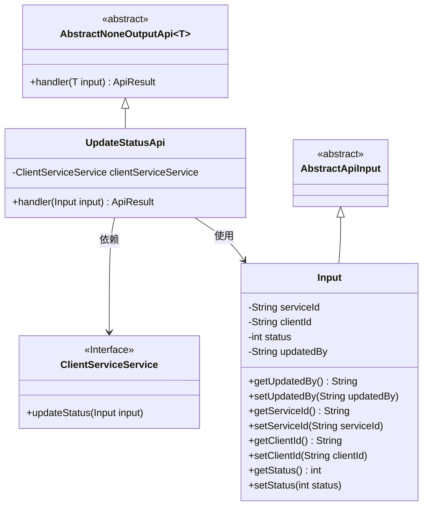

# 基础信息

|      |      |
|------|------|
| 名称 | UpdateStatusApi |
| 编码语言 | .java |
| 代码路径 | WeFe/serving/serving-service/src/main/java/com/welab/wefe/serving/service/api/clientservice/UpdateStatusApi.java |
| 包名 | com.welab.wefe.serving.service.api.clientservice |
| 依赖项 | ['com.welab.wefe.common.exception.StatusCodeWithException', 'com.welab.wefe.common.fieldvalidate.annotation.Check', 'com.welab.wefe.common.web.api.base.AbstractNoneOutputApi', 'com.welab.wefe.common.web.api.base.Api', 'com.welab.wefe.common.web.dto.AbstractApiInput', 'com.welab.wefe.common.web.dto.ApiResult', 'com.welab.wefe.serving.service.service.ClientServiceService', 'org.springframework.beans.factory.annotation.Autowired'] |
| 概述说明 | 更新客户服务状态的API，接收服务ID、客户ID、状态和更新人参数，调用服务层更新状态并返回成功结果。 |

# 说明

该代码定义了一个名为UpdateStatusApi的API类，用于更新客户服务状态。API路径为"clientservice/update_status"，继承自AbstractNoneOutputApi，输入参数为内部类Input。Input包含必填字段serviceId和clientId，以及可选字段status和updatedBy。处理逻辑通过clientServiceService更新状态，成功后返回空结果。所有输入字段均通过@Check注解进行校验。

# 类列表 Class Summary

| 名称   | 类型  | 说明 |
|-------|------|-------------|
| UpdateStatusApi | class | 更新客户服务状态的API，接收服务ID、客户ID、状态和更新人参数，调用服务更新状态并返回成功结果。 |

## 类 UpdateStatusApi

|      |      |
|------|------|
| 访问范围 | @Api(path = "clientservice/update_status", name = "update client service status");public |
| 类型 | class |
| 名称 | UpdateStatusApi |
| 说明 | 更新客户服务状态的API，接收服务ID、客户ID、状态和更新人参数，调用服务更新状态并返回成功结果。 |

### UML类图

这段代码描述了一个用于更新客户端服务状态的API实现。UpdateStatusApi继承自AbstractNoneOutputApi抽象类，使用Input作为输入参数类型，并通过ClientServiceService接口来执行实际的状态更新操作。Input类继承自AbstractApiInput，包含服务ID、客户ID、状态和更新者等字段，并提供了相应的getter和setter方法。该API通过handler方法处理输入参数，调用clientServiceService的updateStatus方法完成状态更新，并返回成功结果。

### 内部方法调用关系图

```mermaid
graph TD
    A["类UpdateStatusApi"]
    B["注解: @Api(path='clientservice/update_status', name='update client service status')"]
    C["继承: AbstractNoneOutputApi<Input>"]
    D["依赖注入: @Autowired ClientServiceService"]
    E["重写方法: handler(Input input)"]
    F["内部类: Input extends AbstractApiInput"]
    G["属性: @Check String serviceId"]
    H["属性: @Check String clientId"]
    I["属性: @Check int status"]
    J["属性: @Check String updatedBy"]
    K["Getter/Setter方法"]

    A --> B
    A --> C
    A --> D
    A --> E
    A --> F
    F --> G
    F --> H
    F --> I
    F --> J
    F --> K
```

这段代码定义了一个用于更新客户端服务状态的API类UpdateStatusApi，它继承自抽象类AbstractNoneOutputApi并实现了handler方法。代码包含一个内部类Input用于封装输入参数，这些参数都带有验证注解@Check。流程图展示了类结构、继承关系、依赖注入、内部类结构及其属性和方法。主要功能是通过clientServiceService.updateStatus()方法更新服务状态，并返回成功结果。

### 字段列表 Field List

| 名称  | 类型  | 说明 |
|-------|-------|------|
| clientServiceService | ClientServiceService | 使用@Autowired自动注入ClientServiceService实例。 |

### 方法列表

| 名称  | 类型  | 说明 |
|-------|-------|------|
| handler | ApiResult<?> | 方法重写，调用clientServiceService更新状态，成功返回结果。 |

