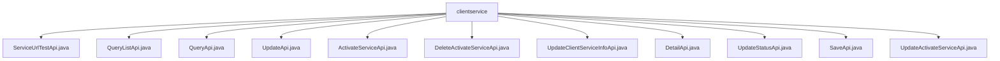

# 基础信息

|      |      |
|------|------|
| 名称 | clientservice |
| 编码语言 | .java |
| 代码路径 | WeFe/serving/serving-service/src/main/java/com/welab/wefe/serving/service/api/clientservice |
| 包名 | docs.serving.serving-service.src.main.java.com.welab.wefe.serving.service.api.clientservice |
| 概述说明 | ServiceUrlTestApi测试URL；QueryListApi查询服务列表；QueryApi查询服务详情；UpdateApi更新服务；ActivateServiceApi激活服务；DeleteActivateServiceApi删除激活；UpdateClientServiceInfoApi更新服务信息；DetailApi获取详情；UpdateStatusApi更新状态；SaveApi保存服务；UpdateActivateServiceApi更新激活状态。 |

# 说明

## 概述  
该模块核心职责是提供客户端服务管理的完整API集合，包括服务测试、查询、更新、状态管理等功能，类似CRM系统中的服务管理子系统。接口规范统一继承AbstractApi基类，采用Input-Output模式，支持分页查询和状态操作。关键数据结构包含ClientServiceOutputModel（含服务ID、客户信息、支付类型等字段）和分页结果集。外部依赖包括ClientServiceService业务服务和JPA Repository。例如ServiceUrlTestApi测试URL可用性，QueryListApi支持多条件分页查询。

## 主要业务场景  
主要业务流程涵盖服务全生命周期管理：创建（SaveApi）、查询（DetailApi/QueryApi）、更新（UpdateApi）、状态变更（UpdateStatusApi）和删除（DeleteActivateServiceApi）。交互模式采用RESTful风格，如POST请求触发状态变更，GET获取分页数据。典型应用包括客户服务激活（ActivateServiceApi）和公私钥更新（UpdateClientServiceInfoApi）。API类型包含CRUD操作和状态机驱动接口，例如UpdateActivateServiceApi通过状态枚举驱动服务流转。

### 包内部结构视图

该流程图展示了serving-service项目中clientservice目录下的API文件结构。根节点为clientservice文件夹，包含11个具体的API实现类，涵盖服务URL测试、查询、更新、激活服务、删除激活服务、更新客户端服务信息、详情获取、状态更新、保存以及更新激活服务等功能。

# 文件列表

| 名称   | 类型  | 说明 |
|-------|------|-------------|
| [ServiceUrlTestApi.java](ServiceUrlTestApi.md) | file | ServiceUrlTestApi类用于测试服务URL，输入为URL，输出为状态码，处理异常返回错误信息。 |
| [QueryListApi.java](QueryListApi.md) | file | QueryListApi是一个查询客户服务列表的接口，输入包括服务名称、客户名称、状态和类型，输出包含服务详情如ID、名称、状态、IP等。 |
| [QueryApi.java](QueryApi.md) | file | QueryApi类处理客户端服务查询，通过id输入调用clientServiceService.queryOne方法返回ClientServiceOutputModel结果。 |
| [UpdateApi.java](UpdateApi.md) | file | UpdateApi类用于更新客户服务信息，包含服务ID、客户ID、支付类型、价格等必填字段，以及公钥、IP白名单等可选字段。通过ClientServiceService执行更新操作。 |
| [ActivateServiceApi.java](ActivateServiceApi.md) | file | 这是一个激活客户服务的API类，路径为"clientservice/activate"，通过调用ClientServiceService的add方法处理输入并返回成功结果。 |
| [DeleteActivateServiceApi.java](DeleteActivateServiceApi.md) | file | 这是一个删除激活客户端服务的API类，路径为"clientservice/delete_activate"，调用ClientServiceService的deleteActivate方法处理输入并返回成功结果。 |
| [UpdateClientServiceInfoApi.java](UpdateClientServiceInfoApi.md) | file | 更新客户端服务信息的API类，通过查询和修改客户端数据，更新服务类型和密钥信息，最后保存到数据库。 |
| [DetailApi.java](DetailApi.md) | file | DetailApi类用于获取客户服务详情，需提供clientId和serviceId参数，调用clientServiceService.detail方法返回结果。 |
| [UpdateStatusApi.java](UpdateStatusApi.md) | file | 更新客户服务状态的API，接收服务ID、客户ID、状态和更新人参数，调用服务层更新状态并返回成功结果。 |
| [SaveApi.java](SaveApi.md) | file | SaveApi类用于保存客户端服务模型，包含输入参数校验和处理逻辑，主要字段有服务ID、客户ID、公私钥、价格等，确保单价非负后调用服务保存数据。 |
| [UpdateActivateServiceApi.java](UpdateActivateServiceApi.md) | file | 这是一个更新客户端服务模型的API类，路径为"clientservice/update_activate"，继承自无输出的抽象API类，通过ClientServiceService处理更新请求并返回成功结果。 |

