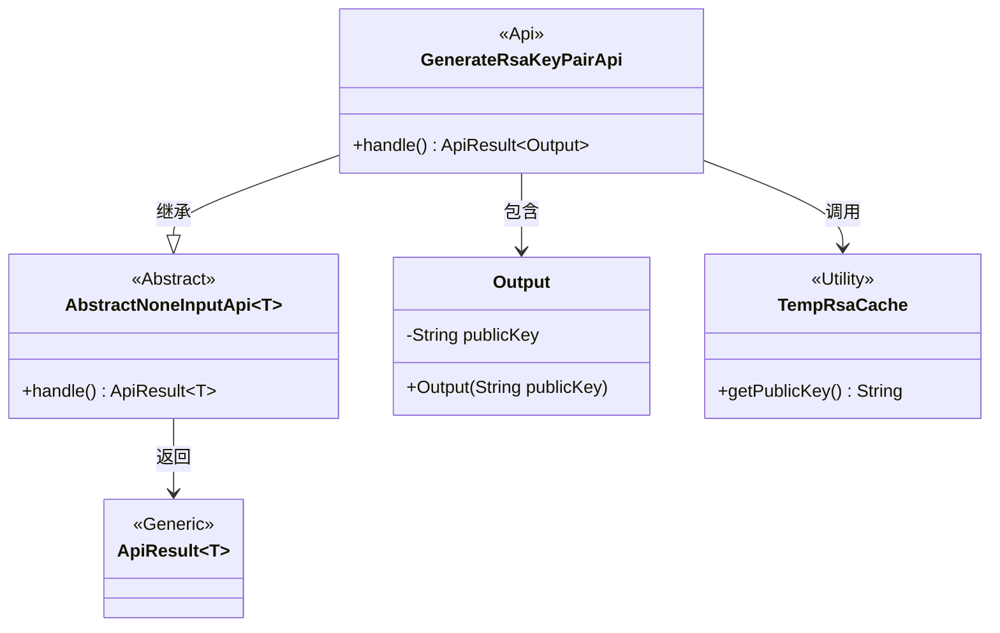
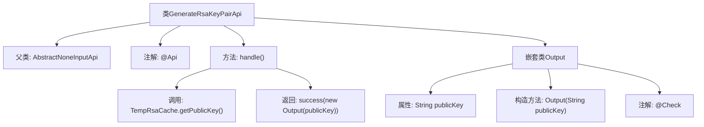

# 基础信息

|      |      |
|------|------|
| 名称 | GenerateRsaKeyPairApi |
| 编码语言 | .java |
| 代码路径 | WeFe/serving/serving-service/src/main/java/com/welab/wefe/serving/service/api/crypto/GenerateRsaKeyPairApi.java |
| 包名 | com.welab.wefe.serving.service.api.crypto |
| 依赖项 | ['com.welab.wefe.common.exception.StatusCodeWithException', 'com.welab.wefe.common.fieldvalidate.annotation.Check', 'com.welab.wefe.common.web.TempRsaCache', 'com.welab.wefe.common.web.api.base.AbstractNoneInputApi', 'com.welab.wefe.common.web.api.base.Api', 'com.welab.wefe.common.web.dto.ApiResult'] |
| 概述说明 | 生成RSA密钥对的API，返回公钥用于数据加密传输。 |

# 说明

该代码定义了一个名为GenerateRsaKeyPairApi的API类，用于生成RSA密钥对并返回公钥。API路径为crypto/generate_rsa_key_pair，功能是创建新的RSA密钥对并获取公钥。处理逻辑通过TempRsaCache获取公钥，封装在Output类中返回。Output类包含一个publicKey字段，标注为Rsa公钥，用于加密数据传输。整个API继承自AbstractNoneInputApi，不接收输入参数，直接返回包含公钥的结果。

# 类列表 Class Summary

| 名称   | 类型  | 说明 |
|-------|------|-------------|
| GenerateRsaKeyPairApi | class | 生成RSA密钥对API，返回公钥用于数据加密传输。处理逻辑为从缓存获取公钥并封装输出。输出类包含公钥字段及校验描述。 |

## 类 GenerateRsaKeyPairApi

|      |      |
|------|------|
| 访问范围 | @Api(path = "crypto/generate_rsa_key_pair", name = "创建一对新的 Rsa 密钥，并得到其中的公钥。");public |
| 类型 | class |
| 名称 | GenerateRsaKeyPairApi |
| 说明 | 生成RSA密钥对API，返回公钥用于数据加密传输。处理逻辑为从缓存获取公钥并封装输出。输出类包含公钥字段及校验描述。 |

### UML类图

这段类图展示了RSA密钥对生成API的结构关系。GenerateRsaKeyPairApi继承自泛型抽象类AbstractNoneInputApi，并指定其输出类型为内部类Output。该API通过调用TempRsaCache工具类获取公钥，最终返回包含公钥字符串的ApiResult包装对象。Output类作为数据传输对象，存储了用于加密传输的RSA公钥。整个设计体现了清晰的层级结构和职责分离，符合API接口的通用实现模式。

### 内部方法调用关系图

该流程图展示了GenerateRsaKeyPairApi类的结构及其关键组件。类继承自AbstractNoneInputApi，包含一个处理请求的handle方法，该方法通过TempRsaCache获取公钥并返回包含公钥的Output对象。Output作为嵌套类，具有公钥属性和构造方法，并带有@Check注解用于参数校验。整个流程清晰地呈现了从API调用到结果返回的完整路径。

### 字段列表 Field List

| 名称  | 类型  | 说明 |
|-------|-------|------|

### 方法列表

| 名称  | 类型  | 说明 |
|-------|-------|------|
| handle | ApiResult<Output> | 方法重写，获取临时RSA公钥并返回成功结果。 |

