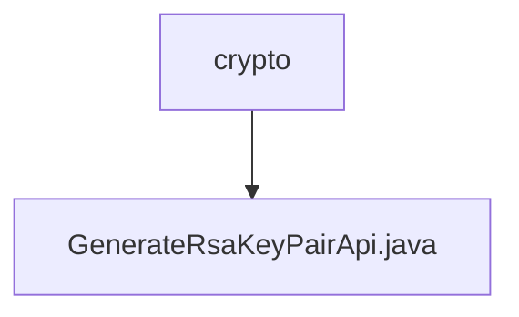

# 基础信息

|      |      |
|------|------|
| 名称 | crypto |
| 编码语言 | .java |
| 代码路径 | WeFe/serving/serving-service/src/main/java/com/welab/wefe/serving/service/api/crypto |
| 包名 | docs.serving.serving-service.src.main.java.com.welab.wefe.serving.service.api.crypto |
| 概述说明 | 生成RSA密钥对的API，返回公钥用于数据加密传输。 |

# 说明

该代码定义了一个名为GenerateRsaKeyPairApi的API类，用于生成RSA密钥对并返回公钥。API路径为crypto/generate_rsa_key_pair，功能是创建新的RSA密钥对并获取公钥。处理逻辑通过TempRsaCache获取公钥，封装在Output类中返回。Output类包含一个publicKey字段，标注为Rsa公钥，用于加密数据传输。整个API继承自AbstractNoneInputApi，不接收输入参数，直接返回包含公钥的结果。

### 包内部结构视图

该流程图展示了WeFe项目中加密模块的简单结构，其中crypto文件夹下包含一个名为GenerateRsaKeyPairApi.java的文件。这个结构清晰地反映了RSA密钥对生成功能的单一文件实现方式，属于服务层加密功能的基础组成部分。

# 文件列表

| 名称   | 类型  | 说明 |
|-------|------|-------------|
| [GenerateRsaKeyPairApi.java](GenerateRsaKeyPairApi.md) | file | 生成RSA密钥对的API，返回公钥用于数据加密传输。 |

