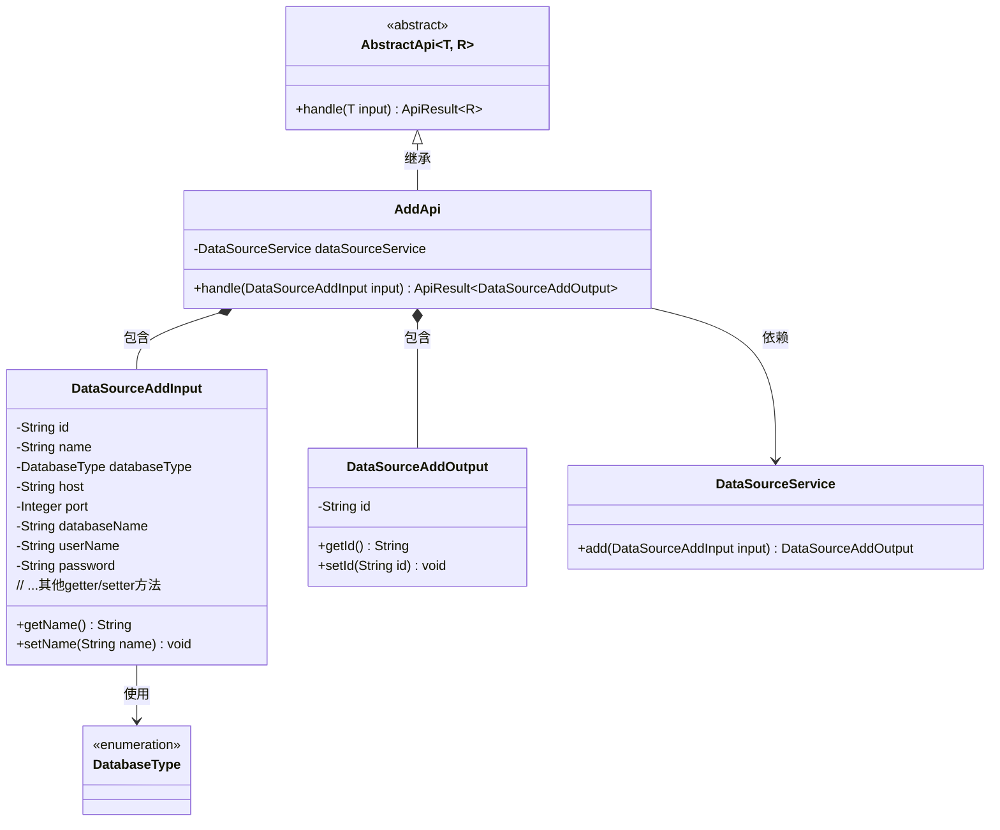
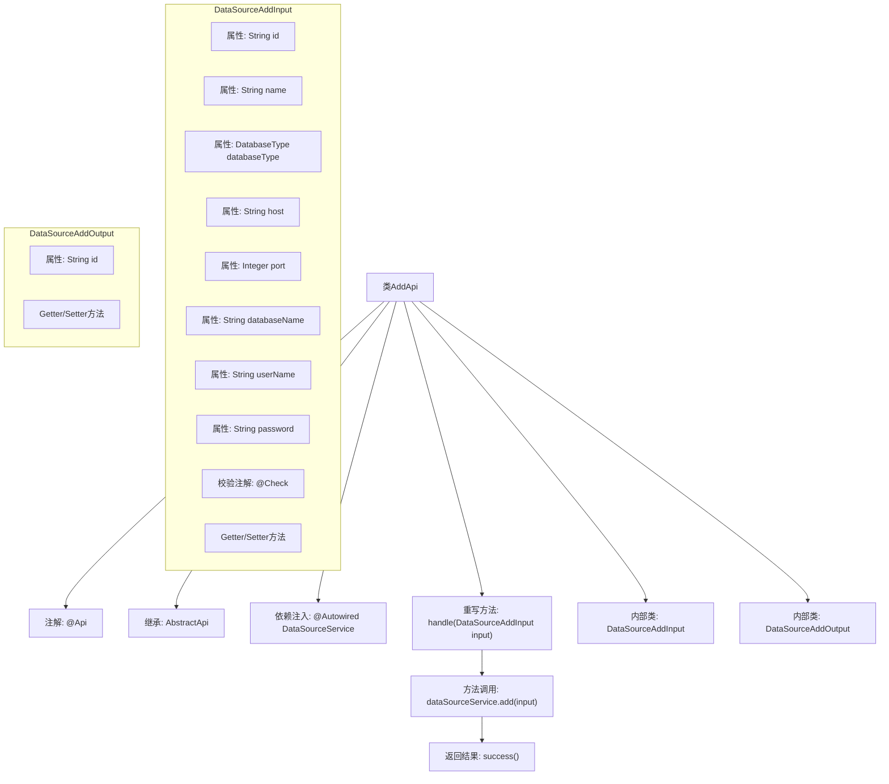

# 基础信息

|      |      |
|------|------|
| 名称 | AddApi |
| 编码语言 | .java |
| 代码路径 | WeFe/serving/serving-service/src/main/java/com/welab/wefe/serving/service/api/datasource/AddApi.java |
| 包名 | com.welab.wefe.serving.service.api.datasource |
| 依赖项 | ['com.welab.wefe.common.exception.StatusCodeWithException', 'com.welab.wefe.common.fieldvalidate.annotation.Check', 'com.welab.wefe.common.jdbc.base.DatabaseType', 'com.welab.wefe.common.web.api.base.AbstractApi', 'com.welab.wefe.common.web.api.base.Api', 'com.welab.wefe.common.web.dto.AbstractApiInput', 'com.welab.wefe.common.web.dto.AbstractApiOutput', 'com.welab.wefe.common.web.dto.ApiResult', 'com.welab.wefe.serving.service.service.DataSourceService', 'org.springframework.beans.factory.annotation.Autowired'] |
| 概述说明 | 新增数据源API类，处理输入参数如名称、类型、主机、端口等，调用服务添加数据源并返回ID。输入参数需校验，名称长度4-30。 |

# 说明

该代码定义了一个名为AddApi的API类，用于新增数据源。API路径为data_source/add，接受DataSourceAddInput输入参数，返回DataSourceAddOutput输出结果。输入参数包括必填的数据源名称、数据库类型、IP地址、端口、数据库名称、用户名和密码，其中名称需满足4-30字符长度限制。输出参数包含生成的ID。通过DataSourceService处理新增请求，返回操作结果。

# 类列表 Class Summary

| 名称   | 类型  | 说明 |
|-------|------|-------------|
| AddApi | class | 新增数据源API类，处理数据源添加请求。输入包含ID、名称、数据库类型、主机、端口、数据库名、用户名和密码等必填字段，输出返回生成的ID。通过DataSourceService实现添加逻辑。 |

## 类 AddApi

|      |      |
|------|------|
| 访问范围 | @Api(path = "data_source/add", name = "新增数据源");public |
| 类型 | class |
| 名称 | AddApi |
| 说明 | 新增数据源API类，处理数据源添加请求。输入包含ID、名称、数据库类型、主机、端口、数据库名、用户名和密码等必填字段，输出返回生成的ID。通过DataSourceService实现添加逻辑。 |

### UML类图

这段代码展示了一个新增数据源的API实现，采用分层架构设计。AddApi继承自泛型抽象类AbstractApi，处理DataSourceAddInput输入并返回DataSourceAddOutput输出。输入类包含数据源各项参数及校验注解，输出类简单封装生成的ID。核心业务逻辑通过依赖注入的DataSourceService完成，体现了清晰的职责分离和类型安全的设计理念。

### 内部方法调用关系图

这段代码展示了一个用于新增数据源的API类AddApi，它继承自抽象类AbstractApi并实现了核心处理方法handle。该API包含两个嵌套静态类：DataSourceAddInput定义了包含多个校验注解的输入参数结构，DataSourceAddOutput定义了简单的输出结构。流程图清晰呈现了类继承关系、依赖注入、方法调用链路以及内部类的属性结构，完整反映了数据从输入到输出的处理流程。

### 字段列表 Field List

| 名称  | 类型  | 说明 |
|-------|-------|------|
| dataSourceService | DataSourceService | 使用@Autowired自动注入DataSourceService实例。 |

### 方法列表

| 名称  | 类型  | 说明 |
|-------|-------|------|
| handle | ApiResult<DataSourceAddOutput> | Java方法重写，处理数据源添加请求，调用服务层方法并返回结果。 |

