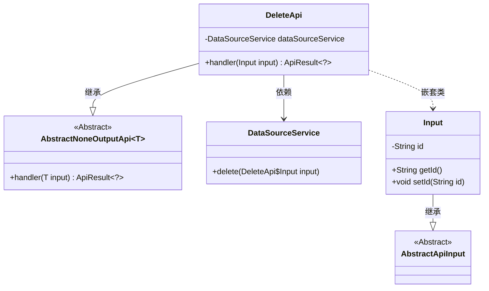
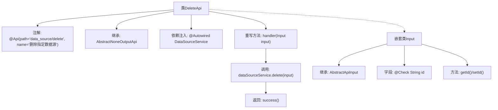

# 基础信息

|      |      |
|------|------|
| 名称 | DeleteApi |
| 编码语言 | .java |
| 代码路径 | WeFe/serving/serving-service/src/main/java/com/welab/wefe/serving/service/api/datasource/DeleteApi.java |
| 包名 | com.welab.wefe.serving.service.api.datasource |
| 依赖项 | ['org.springframework.beans.factory.annotation.Autowired', 'com.welab.wefe.common.exception.StatusCodeWithException', 'com.welab.wefe.common.fieldvalidate.annotation.Check', 'com.welab.wefe.common.web.api.base.AbstractNoneOutputApi', 'com.welab.wefe.common.web.api.base.Api', 'com.welab.wefe.common.web.dto.AbstractApiInput', 'com.welab.wefe.common.web.dto.ApiResult', 'com.welab.wefe.serving.service.service.DataSourceService'] |
| 概述说明 | 删除数据源API，需传入数据源ID，调用DataSourceService执行删除操作，无返回数据。 |

# 说明

该代码定义了一个名为DeleteApi的API类，用于删除指定数据源。该类继承自AbstractNoneOutputApi，泛型参数为内部类Input。API路径为"data_source/delete"，名称为"删除指定数据源"。通过Autowired注入了DataSourceService服务。handler方法处理输入参数，调用dataSourceService的delete方法完成删除操作，并返回成功结果。Input内部类继承AbstractApiInput，包含一个必填字段id，用于标识要删除的数据源，提供了getter和setter方法。整个API实现了删除数据源的核心功能。

# 类列表 Class Summary

| 名称   | 类型  | 说明 |
|-------|------|-------------|
| DeleteApi | class | 删除数据源API，需传入数据源ID，调用DataSourceService执行删除操作，无返回数据。 |

## 类 DeleteApi

|      |      |
|------|------|
| 访问范围 | @Api(path = "data_source/delete", name = "删除指定数据源");public |
| 类型 | class |
| 名称 | DeleteApi |
| 说明 | 删除数据源API，需传入数据源ID，调用DataSourceService执行删除操作，无返回数据。 |

### UML类图

类图描述：该图展示了DeleteApi类继承自泛型类AbstractNoneOutputApi<Input>，并依赖DataSourceService进行数据源删除操作。Input作为DeleteApi的嵌套类，继承自AbstractApiInput，包含id属性和对应的getter/setter方法。整体结构体现了API处理类的典型分层设计模式。

### 内部方法调用关系图

这段代码展示了一个Spring风格的API控制器类DeleteApi，用于删除数据源。流程图清晰地呈现了类结构：顶部是主类定义和注解，中间是核心业务逻辑handler方法调用服务层删除操作，底部嵌套了输入参数类Input的校验逻辑。箭头准确反映了类继承、方法调用和属性关联关系，突出了从API入口到数据删除的完整流程。

### 字段列表 Field List

| 名称  | 类型  | 说明 |
|-------|-------|------|
| dataSourceService | DataSourceService | 自动注入DataSourceService实例。 |

### 方法列表

| 名称  | 类型  | 说明 |
|-------|-------|------|
| handler | ApiResult<?> | 覆盖方法处理输入，调用数据源服务删除操作，成功返回结果。 |

