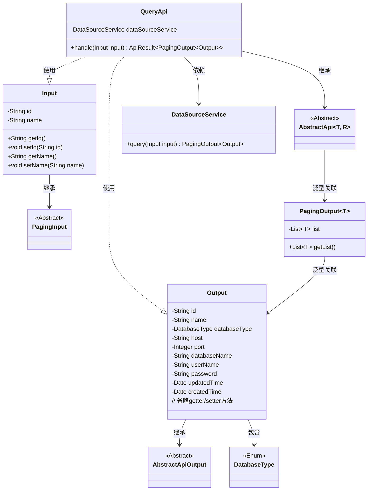

# 基础信息

|      |      |
|------|------|
| 名称 | QueryApi |
| 编码语言 | .java |
| 代码路径 | WeFe/serving/serving-service/src/main/java/com/welab/wefe/serving/service/api/datasource/QueryApi.java |
| 包名 | com.welab.wefe.serving.service.api.datasource |
| 依赖项 | ['com.welab.wefe.common.exception.StatusCodeWithException', 'com.welab.wefe.common.fieldvalidate.annotation.Check', 'com.welab.wefe.common.jdbc.base.DatabaseType', 'com.welab.wefe.common.web.api.base.AbstractApi', 'com.welab.wefe.common.web.api.base.Api', 'com.welab.wefe.common.web.dto.AbstractApiOutput', 'com.welab.wefe.common.web.dto.ApiResult', 'com.welab.wefe.serving.service.database.entity.DataSourceMySqlModel', 'com.welab.wefe.serving.service.dto.PagingInput', 'com.welab.wefe.serving.service.dto.PagingOutput', 'com.welab.wefe.serving.service.service.DataSourceService', 'org.springframework.beans.factory.annotation.Autowired', 'java.util.Date'] |
| 概述说明 | 查询数据源API，接收ID和名称参数，返回分页数据源列表，密码字段脱敏处理。 |

# 说明

该代码定义了一个名为QueryApi的API类，用于查询数据源信息。API路径为data_source/query，继承自AbstractApi，输入为Input类，输出为分页的Output类。Input类包含数据源ID和名称两个查询参数。Output类包含数据源的详细信息，如ID、名称、数据库类型、主机、端口、数据库名、用户名、密码（返回时会被掩码处理）以及创建和更新时间。处理逻辑中调用DataSourceService的query方法获取结果，并对密码字段进行掩码处理后返回。

# 类列表 Class Summary

| 名称   | 类型  | 说明 |
|-------|------|-------------|
| QueryApi | class | 查询数据源的API类，接收ID和名称作为输入，返回分页数据源列表，包含ID、名称、类型、连接信息等，密码字段会被屏蔽。 |

## 类 QueryApi

|      |      |
|------|------|
| 访问范围 | @Api(path = "data_source/query", name = "查询数据源");public |
| 类型 | class |
| 名称 | QueryApi |
| 说明 | 查询数据源的API类，接收ID和名称作为输入，返回分页数据源列表，包含ID、名称、类型、连接信息等，密码字段会被屏蔽。 |

### UML类图

这段代码描述了一个查询数据源的API类`QueryApi`，它继承自泛型抽象类`AbstractApi`，处理分页查询请求。类图展示了`QueryApi`与内部类`Input`（继承`PagingInput`）和`Output`（继承`AbstractApiOutput`）的关系，以及通过`DataSourceService`进行数据查询的核心流程。`Output`类包含数据库连接详细信息，其中密码字段会被特殊处理。整个结构体现了分层设计和泛型应用，支持分页查询功能。

### 内部方法调用关系图

```mermaid
graph TD
    A["类QueryApi"]
    B["注解: @Api(path='data_source/query', name='查询数据源')"]
    C["继承: AbstractApi<Input, PagingOutput<Output>>"]
    D["依赖注入: @Autowired DataSourceService"]
    E["重写方法: handle(Input input)"]
    F["内部类: Input extends PagingInput"]
    G["内部类: Output extends AbstractApiOutput"]
    H["Input属性: String id, String name"]
    I["Output属性: id, name, databaseType等12个字段"]
    J["方法调用: dataSourceService.query(input)"]
    K["数据处理: result.getList().forEach(...)"]
    L["返回结果: success(result)"]

    A --> B
    A --> C
    A --> D
    A --> E
    A --> F
    A --> G
    F --> H
    G --> I
    E --> J
    J --> K
    K --> L
```

该流程图展示了QueryApi类的完整结构，包含类注解、继承关系、依赖注入、核心处理方法以及两个内部类的结构。handle方法通过DataSourceService执行查询后，对结果进行密码脱敏处理，最后返回分页结果。Input类包含分页查询参数，Output类封装了数据源的详细信息，包含12个不同类型的字段。整个流程体现了从请求处理到结果返回的完整链路。

### 字段列表 Field List

| 名称  | 类型  | 说明 |
|-------|-------|------|
| dataSourceService | DataSourceService | 使用@Autowired自动注入DataSourceService实例。 |

### 方法列表

| 名称  | 类型  | 说明 |
|-------|-------|------|
| handle | ApiResult<PagingOutput<Output>> | 该方法重写父类逻辑，调用数据源服务查询输入参数，遍历结果列表并屏蔽密码字段，最后返回分页结果。 |

