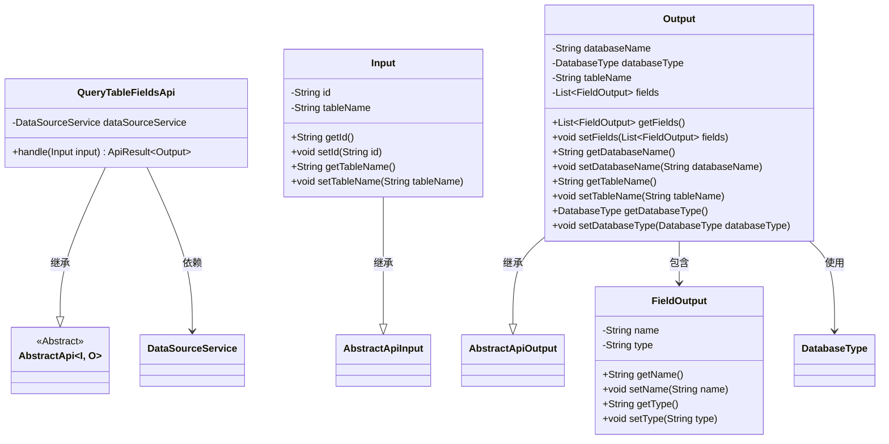
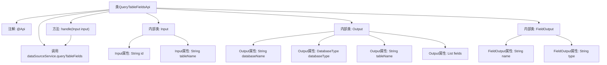

# 基础信息

|      |      |
|------|------|
| 名称 | QueryTableFieldsApi |
| 编码语言 | .java |
| 代码路径 | WeFe/serving/serving-service/src/main/java/com/welab/wefe/serving/service/api/datasource/QueryTableFieldsApi.java |
| 包名 | com.welab.wefe.serving.service.api.datasource |
| 依赖项 | ['com.welab.wefe.common.exception.StatusCodeWithException', 'com.welab.wefe.common.fieldvalidate.annotation.Check', 'com.welab.wefe.common.jdbc.base.DatabaseType', 'com.welab.wefe.common.web.api.base.AbstractApi', 'com.welab.wefe.common.web.api.base.Api', 'com.welab.wefe.common.web.dto.AbstractApiInput', 'com.welab.wefe.common.web.dto.AbstractApiOutput', 'com.welab.wefe.common.web.dto.ApiResult', 'com.welab.wefe.serving.service.service.DataSourceService', 'org.springframework.beans.factory.annotation.Autowired', 'java.util.List'] |
| 概述说明 | 查询数据源表字段的API，输入为数据源ID和表名，输出包含数据库名、类型、表名及字段列表。 |

# 说明

该代码定义了一个名为QueryTableFieldsApi的API类，用于查询数据源的表字段信息。API路径为data_source/query_table_fields，名称为查询数据源的所有表。输入参数包括数据源ID和表名称，输出包含数据库名称、数据库类型、表名称及字段列表。字段信息包括字段名和类型。通过DataSourceService处理查询请求，返回结果封装在ApiResult中。

# 类列表 Class Summary

| 名称   | 类型  | 说明 |
|-------|------|-------------|
| QueryTableFieldsApi | class | 查询数据源表字段的API，输入为数据源ID和表名，输出包含数据库名、类型、表名及字段列表。 |

## 类 QueryTableFieldsApi

|      |      |
|------|------|
| 访问范围 | @Api(path = "data_source/query_table_fields", name = "查询数据源的所有表");public |
| 类型 | class |
| 名称 | QueryTableFieldsApi |
| 说明 | 查询数据源表字段的API，输入为数据源ID和表名，输出包含数据库名、类型、表名及字段列表。 |

### UML类图

类图描述：该图展示了一个查询数据源表字段的API结构。QueryTableFieldsApi继承自泛型抽象类AbstractApi，处理Input输入并返回Output输出。Input包含数据源ID和表名，Output包含数据库信息、表名及字段列表(FieldOutput)。FieldOutput存储字段名称和类型。整体通过DataSourceService实现数据查询功能，体现了清晰的层级关系和依赖。

### 内部方法调用关系图

这段代码是一个API类，用于查询数据源的表字段信息。流程图展示了类结构，包括主类QueryTableFieldsApi及其内部类Input、Output和FieldOutput的层级关系，以及属性定义和方法调用路径。主类通过handle方法处理输入，调用DataSourceService查询表字段，最终返回包含数据库名、表名和字段列表的输出结果。

### 字段列表 Field List

| 名称  | 类型  | 说明 |
|-------|-------|------|
| dataSourceService | DataSourceService | 使用@Autowired自动注入DataSourceService实例。 |

### 方法列表

| 名称  | 类型  | 说明 |
|-------|-------|------|
| handle | ApiResult<Output> | 重写handle方法，调用dataSourceService.queryTableFields处理输入并返回成功结果。 |

