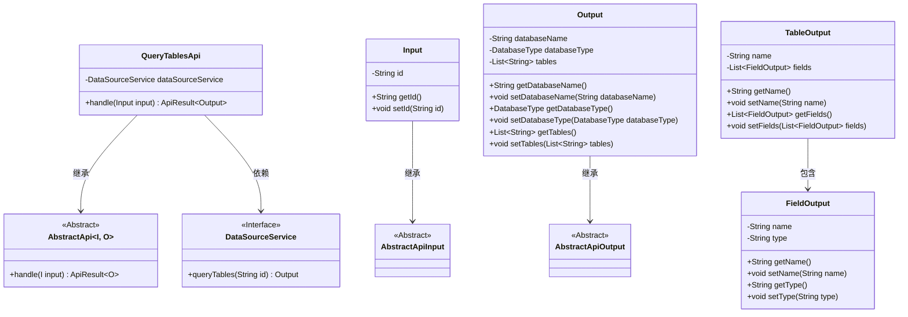

# 基础信息

|      |      |
|------|------|
| 名称 | QueryTablesApi |
| 编码语言 | .java |
| 代码路径 | WeFe/serving/serving-service/src/main/java/com/welab/wefe/serving/service/api/datasource/QueryTablesApi.java |
| 包名 | com.welab.wefe.serving.service.api.datasource |
| 依赖项 | ['com.welab.wefe.common.exception.StatusCodeWithException', 'com.welab.wefe.common.fieldvalidate.annotation.Check', 'com.welab.wefe.common.jdbc.base.DatabaseType', 'com.welab.wefe.common.web.api.base.AbstractApi', 'com.welab.wefe.common.web.api.base.Api', 'com.welab.wefe.common.web.dto.AbstractApiInput', 'com.welab.wefe.common.web.dto.AbstractApiOutput', 'com.welab.wefe.common.web.dto.ApiResult', 'com.welab.wefe.serving.service.service.DataSourceService', 'org.springframework.beans.factory.annotation.Autowired', 'java.util.List'] |
| 概述说明 | 查询数据源所有表的API，输入为数据源ID，输出包含数据库名、类型及表列表。表信息含表名和字段列表。 |

# 说明

该代码定义了一个名为QueryTablesApi的API类，用于查询数据源的所有表信息。API路径为"data_source/query_tables"，输入参数Input包含数据源ID，输出Output包含数据库名称、数据库类型和表列表。表信息TableOutput包含表名和字段列表，字段FieldOutput包含字段名和类型。通过DataSourceService处理查询请求，返回结果封装在ApiResult中。

# 类列表 Class Summary

| 名称   | 类型  | 说明 |
|-------|------|-------------|
| QueryTablesApi | class | 这是一个查询数据源所有表的API类，包含输入参数（数据源ID）和输出结果（数据库名、类型及表列表）。表信息包括表名和字段列表。 |

## 类 QueryTablesApi

|      |      |
|------|------|
| 访问范围 | @Api(path = "data_source/query_tables", name = "查询数据源的所有表");public |
| 类型 | class |
| 名称 | QueryTablesApi |
| 说明 | 这是一个查询数据源所有表的API类，包含输入参数（数据源ID）和输出结果（数据库名、类型及表列表）。表信息包括表名和字段列表。 |

### UML类图

这段代码展示了一个查询数据源表结构的API实现。QueryTablesApi继承自泛型抽象类AbstractApi，处理Input输入并返回Output输出。核心类包含嵌套的Input、Output结构，其中Output又关联到TableOutput和FieldOutput来描述表字段结构。DataSourceService作为接口提供实际查询功能，通过依赖注入方式使用。整个设计采用分层结构，基础输入输出通过抽象类定义，具体业务逻辑在子类实现。

### 内部方法调用关系图

```mermaid
graph TD
    A["类QueryTablesApi"]
    B["注解: @Api"]
    C["继承: AbstractApi<Input, Output>"]
    D["依赖注入: DataSourceService"]
    E["重写方法: handle(Input input)"]
    F["内部类: Input"]
    G["内部类: Output"]
    H["内部类: TableOutput"]
    I["内部类: FieldOutput"]
    J["Input属性: String id"]
    K["Input方法: getId/setId"]
    L["Output属性: databaseName/databaseType/tables"]
    M["Output方法: getters/setters"]
    N["TableOutput属性: name/fields"]
    O["TableOutput方法: getters/setters"]
    P["FieldOutput属性: name/type"]
    Q["FieldOutput方法: getters/setters"]

    A --> B
    A --> C
    A --> D
    A --> E
    A --> F
    A --> G
    A --> H
    A --> I
    F --> J
    F --> K
    G --> L
    G --> M
    H --> N
    H --> O
    I --> P
    I --> Q
    E --> D["调用dataSourceService.queryTables"]
```

这段代码定义了一个查询数据源表结构的API类，采用分层设计模式。核心是QueryTablesApi类，通过继承AbstractApi实现标准化接口，包含输入(Input)、输出(Output)两个嵌套类以及表结构(TableOutput)和字段(FieldOutput)的辅助类。主要流程是通过handle方法调用DataSourceService服务查询数据源表信息，输入参数为数据源ID，输出包含数据库名称、类型和表列表等元数据。所有内部类均实现完整的getter/setter方法，符合JavaBean规范。

### 字段列表 Field List

| 名称  | 类型  | 说明 |
|-------|-------|------|
| dataSourceService | DataSourceService | 自动注入DataSourceService实例。 |

### 方法列表

| 名称  | 类型  | 说明 |
|-------|-------|------|
| handle | ApiResult<Output> | Java方法重写，调用dataSourceService查询表数据并返回成功结果。 |

