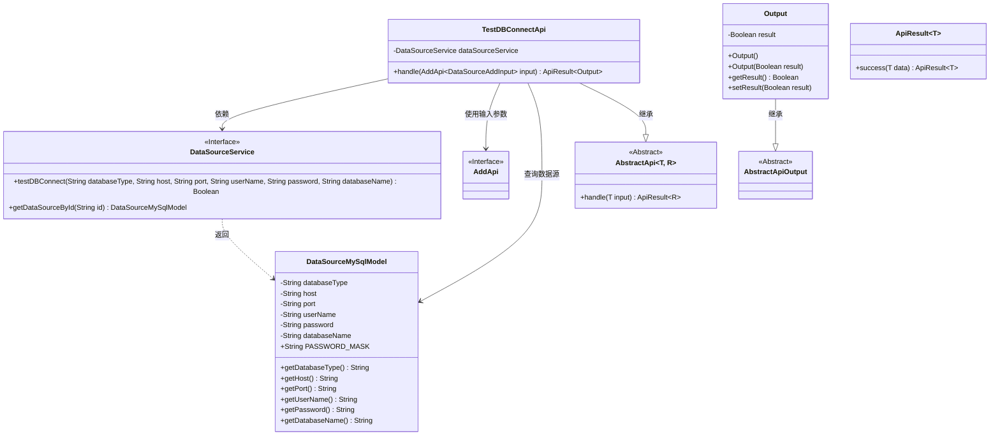
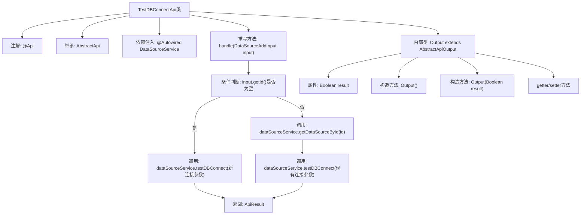

# 基础信息

|      |      |
|------|------|
| 名称 | TestDBConnectApi |
| 编码语言 | .java |
| 代码路径 | WeFe/serving/serving-service/src/main/java/com/welab/wefe/serving/service/api/datasource/TestDBConnectApi.java |
| 包名 | com.welab.wefe.serving.service.api.datasource |
| 依赖项 | ['org.apache.commons.lang3.StringUtils', 'org.springframework.beans.factory.annotation.Autowired', 'com.welab.wefe.common.exception.StatusCodeWithException', 'com.welab.wefe.common.web.api.base.AbstractApi', 'com.welab.wefe.common.web.api.base.Api', 'com.welab.wefe.common.web.dto.AbstractApiOutput', 'com.welab.wefe.common.web.dto.ApiResult', 'com.welab.wefe.serving.service.database.entity.DataSourceMySqlModel', 'com.welab.wefe.serving.service.service.DataSourceService'] |
| 概述说明 | 测试数据库连接API，通过输入参数或ID检查数据库连接状态，返回连接结果。 |

# 说明

这是一个用于测试数据库连接的API类，路径为"data_source/test_db_connect"。它继承自AbstractApi，处理DataSourceAddInput输入并返回包含布尔结果的Output。主要功能是通过DataSourceService测试数据库连接，支持两种方式：直接使用输入参数或通过ID获取已存在的数据源配置。当使用ID方式时，会检查密码是否为掩码，如果是则使用存储的密码。最终返回的Output对象包含连接测试结果。

# 类列表 Class Summary

| 名称   | 类型  | 说明 |
|-------|------|-------------|
| TestDBConnectApi | class | 测试数据库连接API，通过输入参数或ID检查数据库连接状态，返回连接结果。 |

## 类 TestDBConnectApi

|      |      |
|------|------|
| 访问范围 | @Api(path = "data_source/test_db_connect", name = "测试数据库是否能正常连接");public |
| 类型 | class |
| 名称 | TestDBConnectApi |
| 说明 | 测试数据库连接API，通过输入参数或ID检查数据库连接状态，返回连接结果。 |

### UML类图

这段代码描述了一个测试数据库连接的API类`TestDBConnectApi`，它继承自`AbstractApi`泛型抽象类，处理两种数据库连接测试场景：直接使用输入参数或通过ID查询已有数据源配置。类图中展示了核心依赖关系，包括与数据源服务`DataSourceService`的交互、输入参数类型`AddApi.DataSourceAddInput`的使用，以及输出结果`Output`的结构。该API通过`dataSourceService`执行实际的数据库连接测试，并根据不同输入路径返回包含布尔结果的`ApiResult`包装对象。

### 内部方法调用关系图

这段代码是一个测试数据库连接的API类，主要功能是通过输入参数或数据源ID来测试数据库连接是否正常。流程图展示了类的结构、方法调用关系和逻辑流程。当输入参数ID为空时，直接使用输入参数测试连接；当ID存在时，先获取存储的数据源信息再测试连接。最终返回包含测试结果的ApiResult对象。内部类Output用于封装布尔型的测试结果。整个流程包含条件分支、服务调用和数据封装等关键步骤。

### 字段列表 Field List

| 名称  | 类型  | 说明 |
|-------|-------|------|
| dataSourceService | DataSourceService | 使用@Autowired自动注入DataSourceService实例。 |

### 方法列表

| 名称  | 类型  | 说明 |
|-------|-------|------|
| handle | ApiResult<Output> | 处理数据源连接测试请求，若ID为空则直接测试连接，否则获取数据源信息后测试连接，密码掩码时使用原密码。 |

