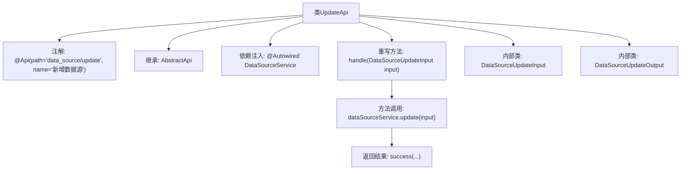

# 基础信息

|      |      |
|------|------|
| 名称 | UpdateApi |
| 编码语言 | .java |
| 代码路径 | WeFe/serving/serving-service/src/main/java/com/welab/wefe/serving/service/api/datasource/UpdateApi.java |
| 包名 | com.welab.wefe.serving.service.api.datasource |
| 依赖项 | ['com.welab.wefe.common.exception.StatusCodeWithException', 'com.welab.wefe.common.fieldvalidate.annotation.Check', 'com.welab.wefe.common.jdbc.base.DatabaseType', 'com.welab.wefe.common.web.api.base.AbstractApi', 'com.welab.wefe.common.web.api.base.Api', 'com.welab.wefe.common.web.dto.AbstractApiInput', 'com.welab.wefe.common.web.dto.AbstractApiOutput', 'com.welab.wefe.common.web.dto.ApiResult', 'com.welab.wefe.serving.service.service.DataSourceService', 'org.springframework.beans.factory.annotation.Autowired'] |
| 概述说明 | 更新数据源的API类，包含输入输出参数。输入需验证ID、名称、数据库类型、IP、端口、数据库名、用户名和密码。输出返回ID。 |

# 说明

该代码定义了一个名为UpdateApi的API类，用于新增数据源。它继承自AbstractApi，处理DataSourceUpdateInput输入并返回DataSourceUpdateOutput输出。输入参数包括数据源ID、名称、数据库类型、主机地址、端口、数据库名、用户名和密码，均进行非空校验，其中名称需满足4-30字符长度。输出包含数据源ID。通过注入的DataSourceService调用update方法处理请求。

# 类列表 Class Summary

| 名称   | 类型  | 说明 |
|-------|------|-------------|
| UpdateApi | class | UpdateApi类用于更新数据源，包含必填字段如ID、名称、数据库类型、主机、端口、数据库名、用户名和密码，并调用dataSourceService.update方法处理。 |


## 类 UpdateApi

|      |      |
|------|------|
| 访问范围 | @Api(path = "data_source/update", name = "新增数据源");public |
| 类型 | class |
| 名称 | UpdateApi |
| 说明 | UpdateApi类用于更新数据源，包含必填字段如ID、名称、数据库类型、主机、端口、数据库名、用户名和密码，并调用dataSourceService.update方法处理。 |


### UML类图

```mermaid
classDiagram
    class UpdateApi {
        -DataSourceService dataSourceService
        +handle(DataSourceUpdateInput input) ApiResult~DataSourceUpdateOutput~
    }
    <<Interface>> UpdateApi.AbstractApi
    UpdateApi --|> AbstractApi : 继承
    UpdateApi --> DataSourceService : 依赖

    class DataSourceUpdateInput {
        -String id
        -String name
        -DatabaseType databaseType
        -String host
        -Integer port
        -String databaseName
        -String userName
        -String password
        +getId() String
        +setId(String id) void
        // ...其他getter/setter省略
    }
    DataSourceUpdateInput --|> AbstractApiInput : 继承

    class DataSourceUpdateOutput {
        -String id
        +getId() String
        +setId(String id) void
    }
    DataSourceUpdateOutput --|> AbstractApiOutput : 继承

    class DataSourceService {
        +update(DataSourceUpdateInput input) DataSourceUpdateOutput
    }
```

类图描述：该图展示了UpdateApi及其相关类的结构关系。UpdateApi继承自泛型类AbstractApi，处理DataSourceUpdateInput并返回ApiResult<DataSourceUpdateOutput>。DataSourceUpdateInput和DataSourceUpdateOutput分别继承自AbstractApiInput和AbstractApiOutput，包含数据源更新所需的字段。UpdateApi通过依赖DataSourceService来完成数据源更新操作。


### 内部方法调用关系图



这段代码展示了一个用于更新数据源的API类UpdateApi，继承自抽象基类AbstractApi。主要流程是通过handle方法接收输入参数，调用DataSourceService的update方法执行更新操作，最后返回成功结果。包含两个静态内部类：DataSourceUpdateInput定义了带校验规则的输入参数，DataSourceUpdateOutput定义了输出数据结构。整个流程体现了典型的API控制器模式，包含参数校验、业务处理、结果封装等环节。

### 字段列表 Field List

| 名称  | 类型  | 说明 |
|-------|-------|------|
| dataSourceService | DataSourceService | 使用@Autowired自动注入DataSourceService实例。 |

### 方法列表

| 名称  | 类型  | 说明 |
|-------|-------|------|
| handle | ApiResult<DataSourceUpdateOutput> | 该方法重写父类逻辑，调用数据源服务更新输入参数并返回成功结果。 |


