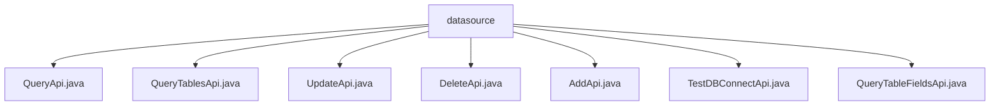

# 基础信息

|      |      |
|------|------|
| 名称 | datasource |
| 编码语言 | .java |
| 代码路径 | WeFe/serving/serving-service/src/main/java/com/welab/wefe/serving/service/api/datasource |
| 包名 | docs.serving.serving-service.src.main.java.com.welab.wefe.serving.service.api.datasource |
| 概述说明 | QueryApi查询数据源信息，Input含ID和名称，Output含详情。QueryTablesApi查询数据源表信息，Input含ID，Output含表和字段。UpdateApi更新数据源，Input含ID等参数，Output含ID。DeleteApi删除数据源，Input含ID。AddApi新增数据源，Input含名称等参数，Output含ID。TestDBConnectApi测试数据库连接，Input含参数或ID，Output含结果。QueryTableFieldsApi查询表字段，Input含ID和表名，Output含字段信息。 |

# 说明

## 概述  
该模块核心职责是提供数据源的CRUD操作及元数据查询功能，类似数据库管理系统的服务层。接口规范统一采用RESTful风格，路径前缀为`data_source/`，输入输出均封装为特定类，例如QueryApi使用分页Output，UpdateApi进行非空校验。关键数据结构包括DataSourceAddInput（含连接信息）、TableOutput（表结构）和FieldOutput（字段属性）。外部依赖仅DataSourceService，用于业务逻辑处理。例如密码字段返回时自动掩码，表查询支持字段级元数据获取。

## 主要业务场景  
模块支持数据源全生命周期管理：通过AddApi/UpdateApi维护连接信息，DeleteApi清理数据源，TestDBConnectApi验证连通性。元数据查询场景包括QueryApi获取基础信息，QueryTablesApi/QueryTableFieldsApi探查表结构。交互模式均为请求-响应式，例如输入ID查询表列表，或指定表名获取字段类型。典型应用如配置数据源时，先测试连接，再持久化存储，最后通过API查询验证。集成案例覆盖从新增到删除的完整链路。

### 包内部结构视图

该流程图展示了serving-service项目中datasource目录下的API文件结构。根节点为datasource文件夹，包含7个直接子文件：QueryApi、QueryTablesApi、UpdateApi、DeleteApi、AddApi、TestDBConnectApi和QueryTableFieldsApi。所有API文件均位于同一层级，没有更深层次的嵌套关系，形成了扁平化的文件组织结构。

# 文件列表

| 名称   | 类型  | 说明 |
|-------|------|-------------|
| [QueryApi.java](QueryApi.md) | file | 查询数据源API，接收ID和名称参数，返回分页数据源列表，密码字段脱敏处理。 |
| [QueryTablesApi.java](QueryTablesApi.md) | file | 查询数据源所有表的API，输入为数据源ID，输出包含数据库名、类型及表列表。表信息含表名和字段列表。 |
| [UpdateApi.java](UpdateApi.md) | file | 更新数据源的API类，包含输入输出参数。输入需验证ID、名称、数据库类型、IP、端口、数据库名、用户名和密码。输出返回ID。 |
| [DeleteApi.java](DeleteApi.md) | file | 删除数据源API，需传入数据源ID，调用DataSourceService执行删除操作，无返回数据。 |
| [AddApi.java](AddApi.md) | file | 新增数据源API类，处理输入参数如名称、类型、主机、端口等，调用服务添加数据源并返回ID。输入参数需校验，名称长度4-30。 |
| [TestDBConnectApi.java](TestDBConnectApi.md) | file | 测试数据库连接API，通过输入参数或ID检查数据库连接状态，返回连接结果。 |
| [QueryTableFieldsApi.java](QueryTableFieldsApi.md) | file | 查询数据源表字段的API，输入为数据源ID和表名，输出包含数据库名、类型、表名及字段列表。 |

