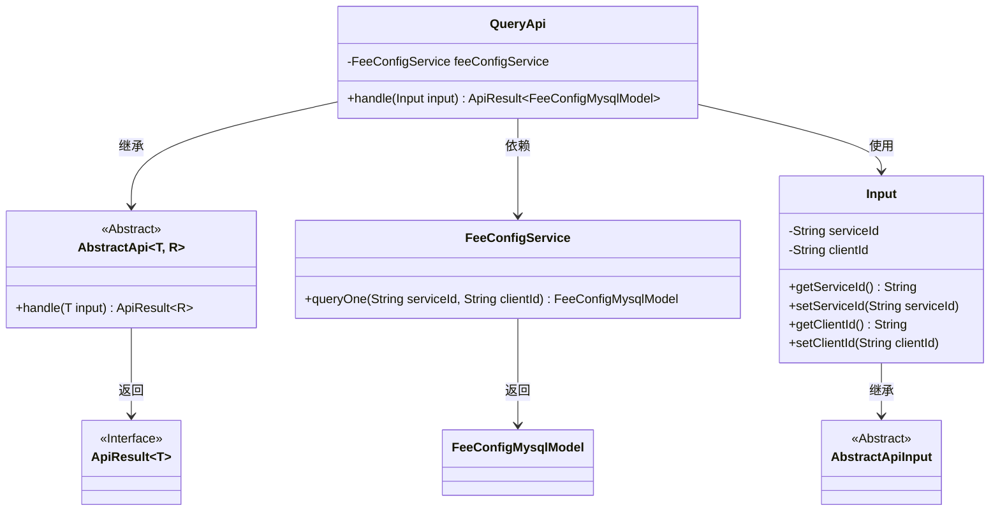

# 基础信息

|      |      |
|------|------|
| 名称 | QueryApi |
| 编码语言 | .java |
| 代码路径 | WeFe/serving/serving-service/src/main/java/com/welab/wefe/serving/service/api/feeconfig/QueryApi.java |
| 包名 | com.welab.wefe.serving.service.api.feeconfig |
| 依赖项 | ['com.welab.wefe.common.web.api.base.AbstractApi', 'com.welab.wefe.common.web.api.base.Api', 'com.welab.wefe.common.web.dto.AbstractApiInput', 'com.welab.wefe.common.web.dto.ApiResult', 'com.welab.wefe.serving.service.database.entity.FeeConfigMysqlModel', 'com.welab.wefe.serving.service.service.FeeConfigService', 'org.springframework.beans.factory.annotation.Autowired'] |
| 概述说明 | QueryApi类用于查询费用配置，接收serviceId和clientId参数，调用feeConfigService.queryOne方法返回结果。 |

# 说明

这是一个名为QueryApi的Java类，用于查询费用配置。它继承自AbstractApi类，泛型参数指定输入类型为内部类Input，返回类型为FeeConfigMysqlModel。类上标注了API路径"feeconfig/query-one"和名称"query fee config"。通过自动注入的FeeConfigService调用queryOne方法，传入serviceId和clientId参数进行查询。内部类Input定义了这两个字符串类型的请求参数，并提供了对应的getter和setter方法。处理逻辑封装在handle方法中，成功时返回包含查询结果的ApiResult对象。

# 类列表 Class Summary

| 名称   | 类型  | 说明 |
|-------|------|-------------|
| QueryApi | class | QueryApi类通过feeConfigService查询单条费用配置，输入参数为serviceId和clientId，返回FeeConfigMysqlModel结果。 |

## 类 QueryApi

|      |      |
|------|------|
| 访问范围 | @Api(path = "feeconfig/query-one", name = "query fee config");public |
| 类型 | class |
| 名称 | QueryApi |
| 说明 | QueryApi类通过feeConfigService查询单条费用配置，输入参数为serviceId和clientId，返回FeeConfigMysqlModel结果。 |

### UML类图

这段代码展示了一个查询API的实现结构。QueryApi继承自泛型抽象类AbstractApi，处理Input参数并返回包含FeeConfigMysqlModel的ApiResult。Input类继承AbstractApiInput，包含serviceId和clientId字段。QueryApi通过依赖注入的FeeConfigService执行实际查询操作，体现了清晰的层次结构和职责分离。

### 内部方法调用关系图

```mermaid
graph TD
    A["类QueryApi"]
    B["注解: @Api(path='feeconfig/query-one', name='query fee config')"]
    C["继承: AbstractApi<Input, FeeConfigMysqlModel>"]
    D["依赖注入: @Autowired FeeConfigService"]
    E["重写方法: handle(Input input)"]
    F["内部类: Input"]
    G["属性: String serviceId"]
    H["属性: String clientId"]
    I["方法: getServiceId()/setServiceId()"]
    J["方法: getClientId()/setClientId()"]
    K["调用: feeConfigService.queryOne()"]
    L["返回: ApiResult<FeeConfigMysqlModel>"]

    A --> B
    A --> C
    A --> D
    A --> E
    E --> K
    K --> L
    A -.-> F
    F --> G
    F --> H
    F --> I
    F --> J
```

该流程图展示了QueryApi类的完整结构，从类注解、继承关系、依赖注入到核心业务逻辑处理流程。重点描述了handle方法通过feeConfigService查询数据并返回结果的调用链，同时详细映射了内部类Input的属性与方法结构。整个流程体现了从API入口到数据库查询的完整数据流转路径，层级关系清晰。

### 字段列表 Field List

| 名称  | 类型  | 说明 |
|-------|-------|------|
| feeConfigService | FeeConfigService | 自动注入FeeConfigService服务实例。 |

### 方法列表

| 名称  | 类型  | 说明 |
|-------|-------|------|
| handle | ApiResult<FeeConfigMysqlModel> | 重写handle方法，调用feeConfigService.queryOne查询服务配置，返回ApiResult封装结果。 |

