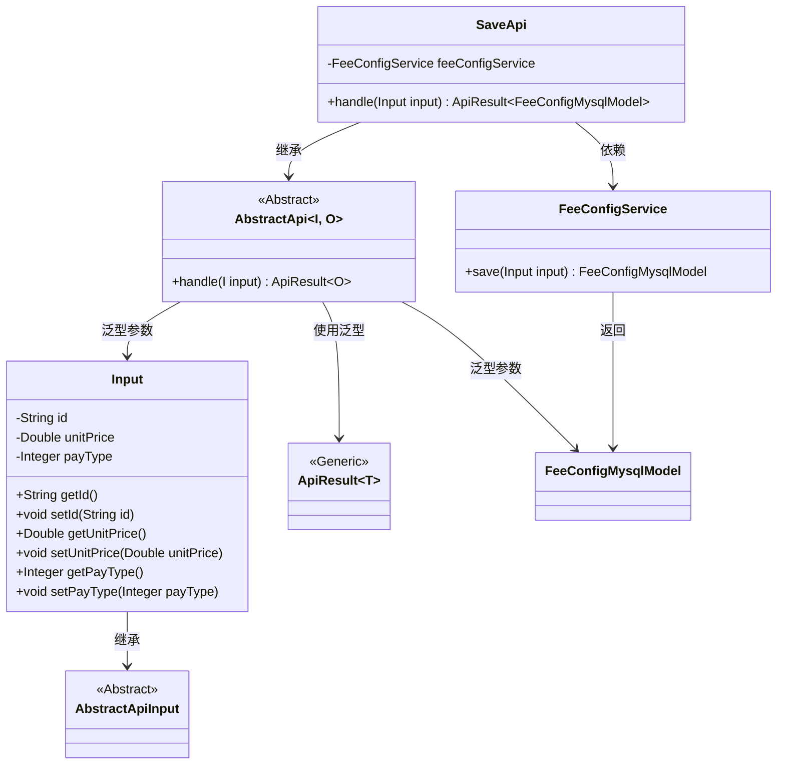

# 基础信息

|      |      |
|------|------|
| 名称 | SaveApi |
| 编码语言 | .java |
| 代码路径 | WeFe/serving/serving-service/src/main/java/com/welab/wefe/serving/service/api/feeconfig/SaveApi.java |
| 包名 | com.welab.wefe.serving.service.api.feeconfig |
| 依赖项 | ['com.welab.wefe.common.exception.StatusCodeWithException', 'com.welab.wefe.common.fieldvalidate.annotation.Check', 'com.welab.wefe.common.web.api.base.AbstractApi', 'com.welab.wefe.common.web.api.base.Api', 'com.welab.wefe.common.web.dto.AbstractApiInput', 'com.welab.wefe.common.web.dto.ApiResult', 'com.welab.wefe.serving.service.database.entity.FeeConfigMysqlModel', 'com.welab.wefe.serving.service.service.FeeConfigService', 'org.springframework.beans.factory.annotation.Autowired', 'java.io.IOException'] |
| 概述说明 | 保存计费配置的API类，包含必填单价和可选ID及付费方式，调用服务层保存数据并返回结果。 |

# 说明

这是一个名为SaveApi的Java类，用于保存计费配置。它继承自AbstractApi，处理输入类型为Input，输出类型为FeeConfigMysqlModel。类中注入了FeeConfigService服务，通过handle方法调用feeConfigService.save保存输入数据。Input内部类包含三个字段：id（计费配置ID）、unitPrice（必填的计费单价）和payType（付费方式），每个字段都有对应的getter和setter方法。

# 类列表 Class Summary

| 名称   | 类型  | 说明 |
|-------|------|-------------|
| SaveApi | class | 这是一个保存计费配置的API类，包含必填的计费单价和可选的计费配置ID、付费方式字段，调用服务层保存数据并返回结果。 |

## 类 SaveApi

|      |      |
|------|------|
| 访问范围 | @Api(path = "feeconfig/save", name = "save fee config");public |
| 类型 | class |
| 名称 | SaveApi |
| 说明 | 这是一个保存计费配置的API类，包含必填的计费单价和可选的计费配置ID、付费方式字段，调用服务层保存数据并返回结果。 |

### UML类图

该类图展示了SaveApi及其相关类的结构关系。SaveApi继承自泛型类AbstractApi，指定Input作为输入类型、FeeConfigMysqlModel作为输出类型。Input类继承自AbstractApiInput，包含id、unitPrice和payType三个私有字段及对应的getter/setter方法。FeeConfigService被SaveApi依赖，提供保存功能并返回FeeConfigMysqlModel实例。整体结构体现了基于抽象类的API实现模式，通过泛型参数实现类型安全的数据处理流程。

### 内部方法调用关系图

```mermaid
graph TD
    A["类SaveApi"]
    B["注解: @Api(path='feeconfig/save', name='save fee config')"]
    C["继承: AbstractApi<Input, FeeConfigMysqlModel>"]
    D["依赖注入: @Autowired FeeConfigService"]
    E["重写方法: handle(Input input)"]
    F["内部类: Input"]
    G["属性: @Check String id"]
    H["属性: @Check Double unitPrice"]
    I["属性: @Check Integer payType"]
    J["方法: getter/setter"]

    A --> B
    A --> C
    A --> D
    A --> E
    A --> F
    F --> G
    F --> H
    F --> I
    F --> J
    E --> D
    E -->|调用| F
```

流程图展示了SaveApi类的结构，包含API注解、父类继承、服务注入和输入参数处理逻辑。核心是handle方法通过feeConfigService保存输入数据，其中Input内部类定义了带校验注解的计费配置参数，并通过getter/setter方法暴露属性。整个流程体现了从API接收到数据库存储的完整调用链路。

### 字段列表 Field List

| 名称  | 类型  | 说明 |
|-------|-------|------|
| feeConfigService | FeeConfigService | 自动注入FeeConfigService服务实例。 |

### 方法列表

| 名称  | 类型  | 说明 |
|-------|-------|------|
| handle | ApiResult<FeeConfigMysqlModel> | 这段代码重写了一个方法，用于处理输入并调用服务保存数据，返回成功结果或异常。 |

