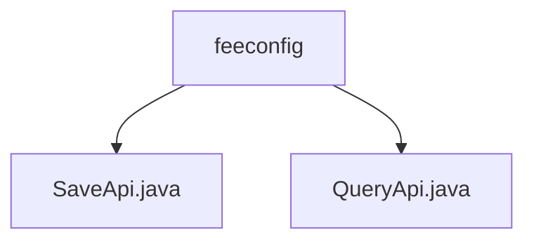

# 基础信息

|      |      |
|------|------|
| 名称 | feeconfig |
| 编码语言 | .java |
| 代码路径 | WeFe/serving/serving-service/src/main/java/com/welab/wefe/serving/service/api/feeconfig |
| 包名 | docs.serving.serving-service.src.main.java.com.welab.wefe.serving.service.api.feeconfig |
| 概述说明 | SaveApi是保存计费配置的Java类，继承AbstractApi，处理Input数据并调用FeeConfigService保存。QueryApi是查询费用配置的类，继承AbstractApi，通过FeeConfigService查询并返回结果。两者均包含内部类Input定义请求参数。 |

# 说明

## 概述  
该模块核心职责是管理计费配置，提供保存与查询功能。接口规范包含两个API：SaveApi通过POST保存配置，QueryApi通过GET查询配置，均返回FeeConfigMysqlModel数据结构。关键数据结构包括Input（含id、unitPrice、payType字段）和FeeConfigMysqlModel。外部依赖仅为FeeConfigService服务。例如SaveApi调用feeConfigService.save，QueryApi使用queryOne方法。

## 主要业务场景  
模块支持配置全生命周期管理，类似CRUD模式。业务流程包括：客户端提交单价和付费方式保存配置，或通过serviceId/clientId查询记录。交互模式统一继承AbstractApi，采用"请求-服务-响应"模型。典型应用如计费系统初始化或动态调价场景。API类型涵盖写操作（SaveApi）和读操作（QueryApi），例如配置更新后即时查询验证。

### 包内部结构视图

该流程图展示了feeconfig目录下的两个Java文件：SaveApi.java和QueryApi.java。这两个文件都直接隶属于feeconfig目录，没有更深层次的嵌套结构。图表清晰地呈现了feeconfig作为父节点与两个API文件之间的简单层级关系。

# 文件列表

| 名称   | 类型  | 说明 |
|-------|------|-------------|
| [SaveApi.java](SaveApi.md) | file | 保存计费配置的API类，包含必填单价和可选ID及付费方式，调用服务层保存数据并返回结果。 |
| [QueryApi.java](QueryApi.md) | file | QueryApi类用于查询费用配置，接收serviceId和clientId参数，调用feeConfigService.queryOne方法返回结果。 |

