# 基础信息

|      |      |
|------|------|
| 名称 | QueryListApi |
| 编码语言 | .java |
| 代码路径 | WeFe/serving/serving-service/src/main/java/com/welab/wefe/serving/service/api/feedetail/QueryListApi.java |
| 包名 | com.welab.wefe.serving.service.api.feedetail |
| 依赖项 | ['com.welab.wefe.common.web.api.base.AbstractApi', 'com.welab.wefe.common.web.api.base.Api', 'com.welab.wefe.common.web.dto.ApiResult', 'com.welab.wefe.serving.service.dto.PagingInput', 'com.welab.wefe.serving.service.dto.PagingOutput', 'com.welab.wefe.serving.service.service.FeeDetailService', 'org.springframework.beans.factory.annotation.Autowired', 'java.math.BigDecimal', 'java.util.Date'] |
| 概述说明 | 费用明细查询API，输入含服务名、客户名、类型、时间范围等，输出分页结果包含服务详情、调用次数、总费用等。 |

# 说明

该代码定义了一个名为QueryListApi的API类，用于查询费用明细列表。API路径为feedetail/query-list，继承自AbstractApi，输入为Input类，输出为分页的Output类。Input类包含分页参数及查询条件如服务名称、客户名称、服务类型、统计类型和时间范围。Output类包含分页结果及费用明细信息如服务ID、客户ID、服务名称、客户名称、服务类型、单价、付费类型、总调用次数、总费用和统计日期。处理逻辑通过FeeDetailService的queryList方法实现。

# 类列表 Class Summary

| 名称   | 类型  | 说明 |
|-------|------|-------------|
| QueryListApi | class | 费用明细查询API，支持分页查询，输入包含服务名称、客户名称、服务类型、时间范围等，输出包含服务信息、客户信息、调用次数、总费用等。 |


## 类 QueryListApi

|      |      |
|------|------|
| 访问范围 | @Api(path = "feedetail/query-list", name = "fee detail query");public |
| 类型 | class |
| 名称 | QueryListApi |
| 说明 | 费用明细查询API，支持分页查询，输入包含服务名称、客户名称、服务类型、时间范围等，输出包含服务信息、客户信息、调用次数、总费用等。 |


### UML类图

```mermaid
classDiagram
    class QueryListApi {
        -FeeDetailService feeDetailService
        +handle(Input input) ApiResult~PagingOutput~Output~~
    }
    <<Interface>> PagingInput
    <<Interface>> PagingOutput
    class Input {
        -String serviceName
        -String clientName
        -String serviceType
        -Integer queryDateType
        -Date startTime
        -Date endTime
        +getter/setter methods
    }
    class Output {
        -String id
        -String serviceId
        -String clientId
        -String serviceName
        -String clientName
        -String serviceType
        -BigDecimal unitPrice
        -Integer payType
        -Long totalRequestTimes
        -BigDecimal totalFee
        -String queryDate
        +getter/setter methods
    }
    QueryListApi --> Input : 使用
    QueryListApi --> Output : 生成
    QueryListApi --> FeeDetailService : 依赖
    Input --|> PagingInput : 继承
    Output --|> PagingOutput : 继承
```

该图展示了费用明细查询API的类结构。QueryListApi继承自AbstractApi，处理Input参数并返回PagingOutput<Output>结果。Input和Output作为静态内部类分别继承分页基类，包含各类业务字段。FeeDetailService被注入用于实际查询操作，形成完整的费用明细查询处理链。


### 内部方法调用关系图

```mermaid
graph TD
    A["类QueryListApi"]
    B["继承: AbstractApi<Input, PagingOutput<Output>>"]
    C["依赖: FeeDetailService"]
    D["方法: handle(Input input)"]
    E["嵌套类: Input"]
    F["嵌套类: Output"]
    G["Input属性: serviceName/clientName/serviceType/queryDateType/startTime/endTime"]
    H["Output属性: id/serviceId/clientId/serviceName/clientName/serviceType/unitPrice/payType/totalRequestTimes/totalFee/queryDate"]
    I["调用链: handle --> feeDetailService.queryList"]

    A --> B
    A --> C
    A --> D
    A --> E
    A --> F
    E --> G
    F --> H
    D --> I
```



该流程图展示了QueryListApi类的核心结构和数据流向。该类继承自AbstractApi泛型类，包含两个嵌套静态类Input和Output，分别用于封装查询参数和分页结果数据。主要业务逻辑通过handle方法委托给FeeDetailService的queryList方法实现，Input类包含服务名称、客户名称等6个查询条件字段，Output类则扩展了分页结果并包含12个业务字段。整体设计符合分层架构，通过清晰的类关系实现了费用明细查询功能。

### 字段列表 Field List

| 名称  | 类型  | 说明 |
|-------|-------|------|
| feeDetailService | FeeDetailService | 使用@Autowired自动注入FeeDetailService实例。 |

### 方法列表

| 名称  | 类型  | 说明 |
|-------|-------|------|
| handle | ApiResult<PagingOutput<Output>> | Java方法重写，调用feeDetailService查询列表并返回分页结果。 |


