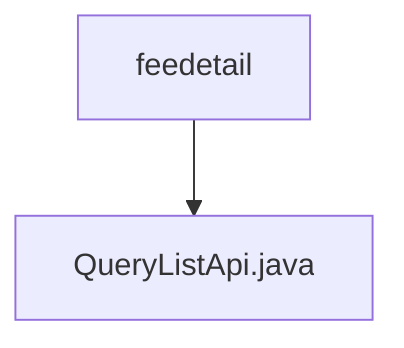

# 基础信息

|      |      |
|------|------|
| 名称 | feedetail |
| 编码语言 | .java |
| 代码路径 | WeFe/serving/serving-service/src/main/java/com/welab/wefe/serving/service/api/feedetail |
| 包名 | docs.serving.serving-service.src.main.java.com.welab.wefe.serving.service.api.feedetail |
| 概述说明 | 费用明细查询API，输入含服务名、客户名、类型、时间范围等，输出分页结果包含服务详情、调用次数、总费用等。 |

# 说明

该代码定义了一个名为QueryListApi的API类，用于查询费用明细列表。API路径为feedetail/query-list，继承自AbstractApi，输入为Input类，输出为分页的Output类。Input类包含分页参数及查询条件如服务名称、客户名称、服务类型、统计类型和时间范围。Output类包含分页结果及费用明细信息如服务ID、客户ID、服务名称、客户名称、服务类型、单价、付费类型、总调用次数、总费用和统计日期。处理逻辑通过FeeDetailService的queryList方法实现。

### 包内部结构视图

该流程图展示了一个简单的Java项目结构，其中feedetail作为父目录包含一个子文件QueryListApi.java。这种结构常见于微服务架构中的API接口实现层，通常用于存放特定业务模块的接口实现类。图中清晰地呈现了单层级的包含关系，符合典型的分层代码组织方式。

# 文件列表

| 名称   | 类型  | 说明 |
|-------|------|-------------|
| [QueryListApi.java](QueryListApi.md) | file | 费用明细查询API，输入含服务名、客户名、类型、时间范围等，输出分页结果包含服务详情、调用次数、总费用等。 |

