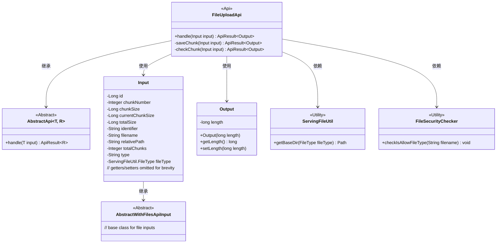
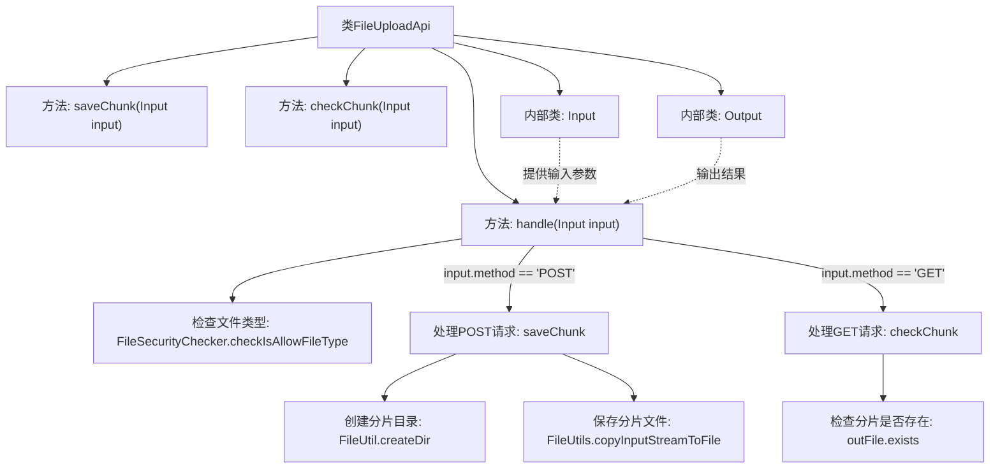

# 基础信息

|      |      |
|------|------|
| 名称 | FileUploadApi |
| 编码语言 | .java |
| 代码路径 | WeFe/serving/serving-service/src/main/java/com/welab/wefe/serving/service/api/file/FileUploadApi.java |
| 包名 | com.welab.wefe.serving.service.api.file |
| 依赖项 | ['com.welab.wefe.common.StatusCode', 'com.welab.wefe.common.exception.StatusCodeWithException', 'com.welab.wefe.common.fieldvalidate.annotation.Check', 'com.welab.wefe.common.util.FileUtil', 'com.welab.wefe.common.web.api.base.AbstractApi', 'com.welab.wefe.common.web.api.base.Api', 'com.welab.wefe.common.web.dto.AbstractWithFilesApiInput', 'com.welab.wefe.common.web.dto.ApiResult', 'com.welab.wefe.serving.service.api.file.security.FileSecurityChecker', 'com.welab.wefe.serving.service.utils.ServingFileUtil', 'org.apache.commons.io.FileUtils', 'org.springframework.web.multipart.MultipartFile', 'java.io.File', 'java.io.IOException', 'java.io.InputStream', 'java.nio.file.Path'] |
| 概述说明 | 文件上传API，支持分片上传与检查。POST方法保存分片，GET方法检查分片是否存在。包含文件类型校验、分片编号处理及目录管理功能。输入含文件信息及分片参数，输出文件长度。 |

# 说明

FileUploadApi是一个处理文件上传的API类，支持分块上传和检查。它继承自AbstractApi，输入为Input类，输出为Output类。API路径为file/upload，无需登录。主要功能包括检查文件类型、保存文件分块和检查分块是否存在。Input类包含文件相关参数如分块编号、大小、标识符等。Output类返回文件长度。处理逻辑根据HTTP方法调用不同方法：POST保存分块，GET检查分块。保存分块时创建目录并将分块写入文件，检查分块时验证分块是否存在并返回相应状态码。

# 类列表 Class Summary

| 名称   | 类型  | 说明 |
|-------|------|-------------|
| FileUploadApi | class | 文件上传API，支持分片上传和检查。POST方法保存分片，GET方法检查分片是否存在。包含文件类型检查、分片处理和状态返回功能。输入参数包括分片编号、大小、标识等，输出返回文件长度。 |

## 类 FileUploadApi

|      |      |
|------|------|
| 访问范围 | @Api(path = "file/upload", name = "上传文件", desc = "上传文件", login = false);public |
| 类型 | class |
| 名称 | FileUploadApi |
| 说明 | 文件上传API，支持分片上传和检查。POST方法保存分片，GET方法检查分片是否存在。包含文件类型检查、分片处理和状态返回功能。输入参数包括分片编号、大小、标识等，输出返回文件长度。 |

### UML类图

该图展示了文件上传API的核心结构。FileUploadApi继承自泛型抽象类AbstractApi，处理Input/Output数据传输对象。Input类继承自AbstractWithFilesApiInput，包含文件分块上传所需的各种参数。Output类简单封装文件长度信息。FileUploadApi依赖ServingFileUtil和FileSecurityChecker两个工具类进行目录操作和文件安全检查。整体设计采用分层架构，通过继承实现代码复用，通过工具类封装通用功能。

### 内部方法调用关系图

这段代码实现了一个文件上传API，支持分片上传和检查。主要流程包括：1) 检查文件类型合法性；2) 根据HTTP方法(POST/GET)分别处理分片保存或检查；3) POST请求会创建目录并保存分片文件；4) GET请求会检查分片是否存在。代码通过Input类封装上传参数，Output类返回处理结果，采用异常处理机制确保健壮性，并支持分片续传功能。

### 字段列表 Field List

| 名称  | 类型  | 说明 |
|-------|-------|------|

### 方法列表

| 名称  | 类型  | 说明 |
|-------|-------|------|
| saveChunk | ApiResult<Output> | 方法saveChunk接收输入参数，处理分块文件保存。检查分块号，创建目录，将输入流写入文件。出错时记录日志并抛出异常。成功返回文件大小。 |
| handle | ApiResult<Output> | 方法处理文件上传请求，先检查文件类型是否支持，失败返回599错误码。根据请求方法调用不同逻辑：POST保存分块，GET检查分块，其他方法抛出异常。 |
| checkChunk | ApiResult<Output> | 检查文件分片是否存在。若分片号为空则设为0，根据文件类型和标识符构建路径。存在返回成功消息，不存在返回299状态码及提示。 |

