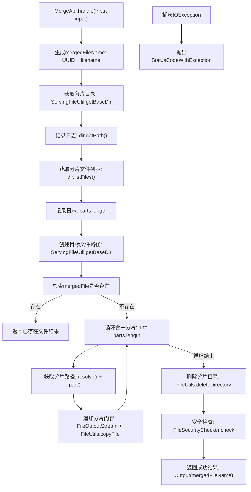
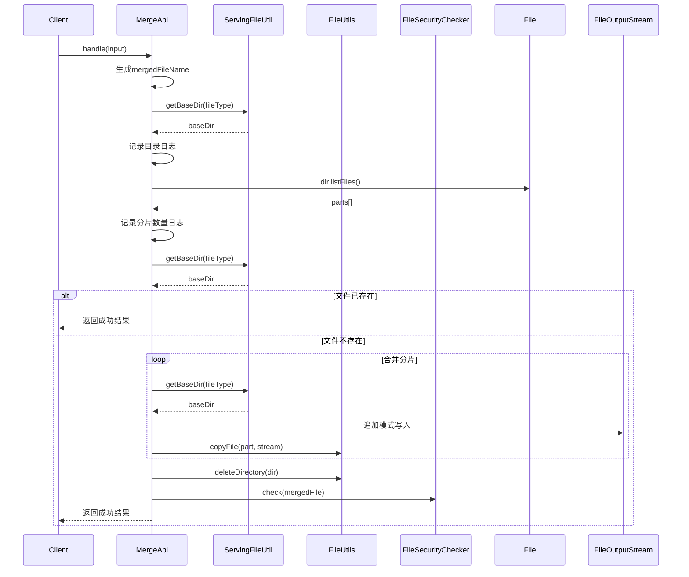

# 基础信息

|      |      |
|------|------|
| 名称 | MergeApi |
| 编码语言 | .java |
| 代码路径 | WeFe/serving/serving-service/src/main/java/com/welab/wefe/serving/service/api/file/MergeApi.java |
| 包名 | com.welab.wefe.serving.service.api.file |
| 依赖项 | ['com.welab.wefe.common.StatusCode', 'com.welab.wefe.common.exception.StatusCodeWithException', 'com.welab.wefe.common.fieldvalidate.annotation.Check', 'com.welab.wefe.common.web.api.base.AbstractApi', 'com.welab.wefe.common.web.api.base.Api', 'com.welab.wefe.common.web.dto.AbstractApiInput', 'com.welab.wefe.common.web.dto.ApiResult', 'com.welab.wefe.serving.service.api.file.security.FileSecurityChecker', 'com.welab.wefe.serving.service.utils.ServingFileUtil', 'org.apache.commons.io.FileUtils', 'java.io.File', 'java.io.FileOutputStream', 'java.io.IOException', 'java.util.UUID'] |
| 概述说明 | MergeApi类用于合并上传的文件分块，生成唯一文件名，合并分块后检查文件安全性并返回结果。 |

# 说明

该代码定义了一个文件合并API，用于将分块上传的文件合并为完整文件。API路径为"file/merge"，接收文件名、唯一标识符和文件类型作为输入。处理流程包括生成合并后的文件名，获取分块文件目录，按顺序将分块文件追加到目标文件，删除临时分块目录，并进行文件安全检查。输出包含合并后的文件名。异常处理包括系统错误和IO异常。

# 类列表 Class Summary

| 名称   | 类型  | 说明 |
|-------|------|-------------|
| MergeApi | class | 文件分块上传合并接口，接收文件名、唯一标识和文件类型，合并分块文件后返回合并文件名，包含安全检查。 |


## 类 MergeApi

|      |      |
|------|------|
| 访问范围 | @Api(path = "file/merge", name = "Merge the chunks after the file is uploaded");public |
| 类型 | class |
| 名称 | MergeApi |
| 说明 | 文件分块上传合并接口，接收文件名、唯一标识和文件类型，合并分块文件后返回合并文件名，包含安全检查。 |


### UML类图

```mermaid
classDiagram
    class AbstractApi~T, R~ {
        <<Abstract>>
        +handle(T input) ApiResult~R~
    }

    class MergeApi {
        +handle(Input input) ApiResult~Output~
    }
    MergeApi --|> AbstractApi~Input, Output~ : 继承

    class MergeApi$Input {
        -String filename
        -String uniqueIdentifier
        -ServingFileUtil.FileType fileType
        +getFilename() String
        +setFilename(String filename)
        +getUniqueIdentifier() String
        +setUniqueIdentifier(String uniqueIdentifier)
        +getFileType() ServingFileUtil.FileType
        +setFileType(ServingFileUtil.FileType fileType)
    }
    MergeApi$Input --|> AbstractApiInput : 继承

    class MergeApi$Output {
        -String filename
        +Output(String filename)
        +getFilename() String
        +setFilename(String filename)
    }

    class ServingFileUtil {
        <<Utility>>
        +getBaseDir(FileType fileType) Path
    }
    MergeApi --> ServingFileUtil : 使用

    class FileSecurityChecker {
        <<Utility>>
        +check(File file)
    }
    MergeApi --> FileSecurityChecker : 使用

    class AbstractApiInput {
        <<Abstract>>
    }
```

类图描述：该图展示了文件合并API的核心结构。MergeApi继承自泛型抽象类AbstractApi，处理Input和Output类型。Input类继承自AbstractApiInput，包含文件名、唯一标识符和文件类型字段；Output类包含合并后的文件名。MergeApi依赖ServingFileUtil进行目录操作，依赖FileSecurityChecker进行文件安全检查，共同完成分片文件合并功能。


### 内部方法调用关系图





流程图描述：该流程图展示了文件分片合并的完整过程，从生成目标文件名开始，检查分片目录，遍历合并所有分片文件，最后进行安全检查和结果返回。包含异常处理分支和文件存在性检查的优化路径，体现了完整的文件操作逻辑和安全控制机制。

时序图描述：时序图清晰呈现了客户端调用MergeApi后，与服务端组件ServingFileUtil、FileUtils和FileSecurityChecker的交互过程，重点展示了分片合并的循环操作和异常处理流程，反映了系统各层级的协作关系。

### 字段列表 Field List

| 名称  | 类型  | 说明 |
|-------|-------|------|

### 方法列表

| 名称  | 类型  | 说明 |
|-------|-------|------|
| handle | ApiResult<Output> | 处理输入文件，合并分块文件为单一文件，检查安全性后返回结果。异常时抛出系统错误。 |


