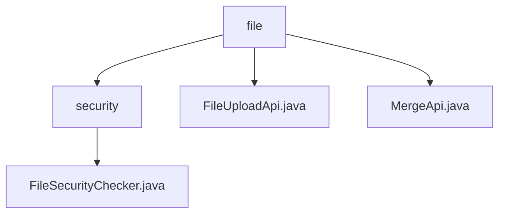

# 基础信息

|      |      |
|------|------|
| 名称 | file |
| 编码语言 | .java |
| 代码路径 | WeFe/serving/serving-service/src/main/java/com/welab/wefe/serving/service/api/file |
| 包名 | docs.serving.serving-service.src.main.java.com.welab.wefe.serving.service.api.file |
| 概述说明 | FileSecurityChecker是检查文件安全的抽象类，定义允许类型为json、zip、txt，提供验证方法。FileUploadApi处理分块上传，支持检查分块和保存。MergeApi合并分块文件，处理异常并安全检查。 |

# 说明

## 概述  
该模块核心职责是提供安全可控的文件上传与合并服务，通过类型校验和分块处理保障文件完整性。接口规范包含三个关键API：文件上传（file/upload）、分块检查（GET）和文件合并（file/merge），均采用REST风格设计。关键数据结构包括Input类（含分块编号/标识符等元数据）和Output类（返回文件状态）。外部依赖仅涉及基础Java IO库。例如FileSecurityChecker通过白名单（json/zip/txt）校验文件类型，异常时自动删除危险文件。

## 主要业务场景  
模块支持分块上传-合并的完整流程：客户端先通过FileUploadApi分片传输文件（类似断点续传），再调用MergeApi触发合并，期间自动执行安全校验。典型交互模式为：POST上传分块→GET验证分块→触发合并→返回最终文件名。功能完整性体现在分块管理、类型过滤、异常回滚等环节，例如合并后自动清理临时目录。API集成案例包括前端大文件上传场景，通过分块降低网络中断风险。

### 包内部结构视图

该流程图展示了文件服务模块的层级结构，根节点为file目录，包含三个子节点：security目录（内含安全检查器实现）、文件上传接口和合并接口。安全目录下仅包含一个文件安全检查器类，整体结构清晰体现了文件服务功能的分层设计。

# 文件列表

| 名称   | 类型  | 说明 |
|-------|------|-------------|
| [FileUploadApi.java](FileUploadApi.md) | file | 文件上传API，支持分片上传与检查。POST方法保存分片，GET方法检查分片是否存在。包含文件类型校验、分片编号处理及目录管理功能。输入含文件信息及分片参数，输出文件长度。 |
| [MergeApi.java](MergeApi.md) | file | MergeApi类用于合并上传的文件分块，生成唯一文件名，合并分块后检查文件安全性并返回结果。 |
| [security](security/_module.md) | package | 抽象类FileSecurityChecker用于检查文件安全性，包含允许的文件类型列表和关键字数组，提供文件类型检查和异常处理功能。 |

