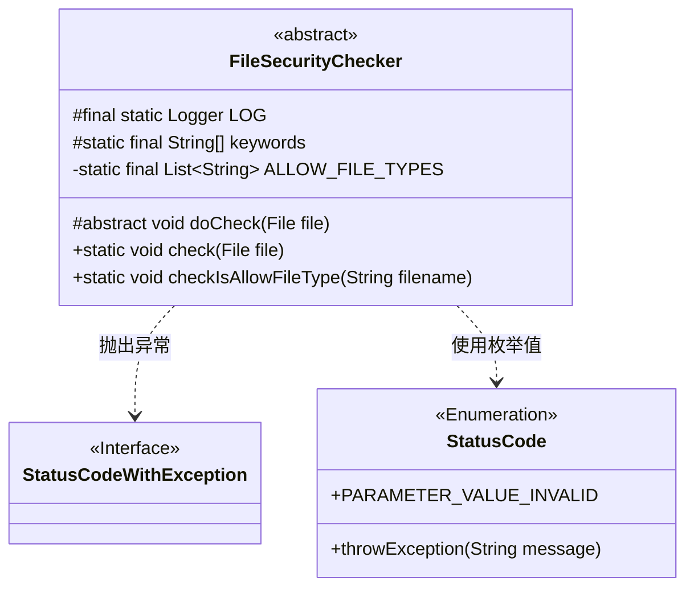
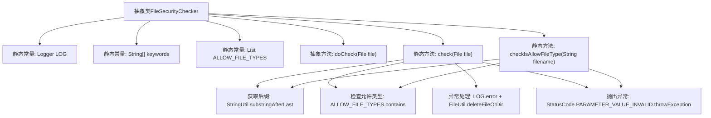

# 基础信息

|      |      |
|------|------|
| 名称 | FileSecurityChecker |
| 编码语言 | .java |
| 代码路径 | WeFe/serving/serving-service/src/main/java/com/welab/wefe/serving/service/api/file/security/FileSecurityChecker.java |
| 包名 | com.welab.wefe.serving.service.api.file.security |
| 依赖项 | ['com.welab.wefe.common.StatusCode', 'com.welab.wefe.common.exception.StatusCodeWithException', 'com.welab.wefe.common.util.FileUtil', 'com.welab.wefe.common.util.StringUtil', 'org.slf4j.Logger', 'org.slf4j.LoggerFactory', 'java.io.File', 'java.io.IOException', 'java.util.Arrays', 'java.util.List'] |
| 概述说明 | 抽象类FileSecurityChecker用于检查文件安全性，包含允许的文件类型列表和关键字数组，提供文件类型检查和异常处理功能。 |

# 说明

FileSecurityChecker是一个抽象类，用于检查文件安全性。包含日志记录器和关键词数组。定义允许的文件类型为json、zip、txt。提供抽象方法doCheck供子类实现。静态方法check验证文件类型，仅允许zip和txt，否则抛出异常并删除文件。checkIsAllowFileType方法检查文件名后缀是否在允许列表中，空文件名或无效后缀会触发异常。异常处理时会记录错误日志。

# 类列表 Class Summary

| 名称   | 类型  | 说明 |
|-------|------|-------------|
| FileSecurityChecker | class | 抽象类FileSecurityChecker用于文件安全检查，包含允许的文件类型列表和关键字检查，支持json、zip、txt格式，异常时删除文件并记录日志。 |

## 类 FileSecurityChecker

|      |      |
|------|------|
| 访问范围 | public abstract |
| 类型 | class |
| 名称 | FileSecurityChecker |
| 说明 | 抽象类FileSecurityChecker用于文件安全检查，包含允许的文件类型列表和关键字检查，支持json、zip、txt格式，异常时删除文件并记录日志。 |

### UML类图

类图描述：
FileSecurityChecker是一个抽象类，主要用于文件安全检查，包含静态日志记录器、关键词列表和允许的文件类型列表。它提供了检查文件类型是否允许的静态方法checkIsAllowFileType，以及抽象方法doCheck供子类实现具体检查逻辑。该类会抛出StatusCodeWithException异常，并使用StatusCode枚举来处理参数无效的情况。整个设计体现了对文件安全性的严格控制和异常处理机制。

### 内部方法调用关系图

流程图描述：该流程图展示了FileSecurityChecker抽象类的结构，包含静态常量定义、抽象方法和两个核心静态方法。check方法通过获取文件后缀、验证文件类型、处理异常三个主要步骤实现安全检查，其中调用了工具类StringUtil和FileUtil。checkIsAllowFileType方法独立完成文件名后缀验证，两者共享相同的异常抛出机制和基础校验逻辑，形成完整的文件安全校验流程。

### 字段列表 Field List

| 名称  | 类型  | 说明 |
|-------|-------|------|
| LOG = LoggerFactory.getLogger(FileSecurityChecker.class) | Logger | FileSecurityChecker类的静态日志对象LOG，用于记录日志信息。 |
| keywords = {"<", ">", "\\"} | String[] | 定义受保护静态常量字符串数组keywords，包含三个特殊字符：<、>和\。 |
| ALLOW_FILE_TYPES = Arrays.asList(            "json", "zip", "txt"    ) | List<String> | 允许的文件类型为json、zip和txt。 |

### 方法列表

| 名称  | 类型  | 说明 |
|-------|-------|------|
| doCheck | void | 抽象方法doCheck，接收File参数，可能抛出IOException异常。 |
| check | void | 检查上传文件类型是否允许，仅支持zip和txt，否则抛出异常并删除文件。 |
| checkIsAllowFileType | void | 检查文件类型是否允许：文件名非空，必须有后缀且后缀在允许列表中，否则抛出异常。 |

