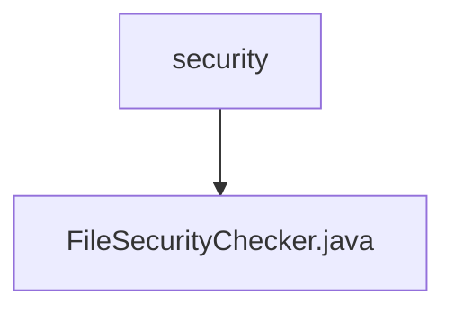

# 基础信息

|      |      |
|------|------|
| 名称 | security |
| 编码语言 | .java |
| 代码路径 | WeFe/serving/serving-service/src/main/java/com/welab/wefe/serving/service/api/file/security |
| 包名 | docs.serving.serving-service.src.main.java.com.welab.wefe.serving.service.api.file.security |
| 概述说明 | 抽象类FileSecurityChecker用于检查文件安全性，包含允许的文件类型列表和关键字数组，提供文件类型检查和异常处理功能。 |

# 说明

FileSecurityChecker是一个抽象类，用于检查文件安全性。包含日志记录器和关键词数组。定义允许的文件类型为json、zip、txt。提供抽象方法doCheck供子类实现。静态方法check验证文件类型，仅允许zip和txt，否则抛出异常并删除文件。checkIsAllowFileType方法检查文件名后缀是否在允许列表中，空文件名或无效后缀会触发异常。异常处理时会记录错误日志。

### 包内部结构视图

该流程图展示了文件安全检查模块的层级结构。顶层节点"security"表示安全相关代码目录，其下包含一个具体的实现文件"FileSecurityChecker.java"。这个结构清晰地反映了安全检查功能的单一实现方式，符合最小化设计原则。

# 文件列表

| 名称   | 类型  | 说明 |
|-------|------|-------------|
| [FileSecurityChecker.java](FileSecurityChecker.md) | file | 抽象类FileSecurityChecker用于检查文件安全性，包含允许的文件类型列表和关键字数组，提供文件类型检查和异常处理功能。 |

