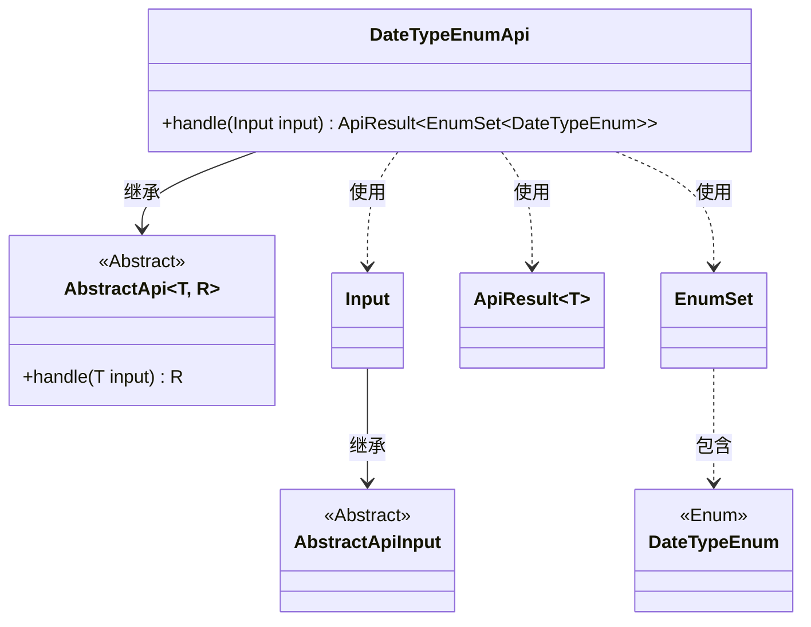

# 基础信息

|      |      |
|------|------|
| 名称 | DateTypeEnumApi |
| 编码语言 | .java |
| 代码路径 | WeFe/serving/serving-service/src/main/java/com/welab/wefe/serving/service/api/logger/DateTypeEnumApi.java |
| 包名 | com.welab.wefe.serving.service.api.logger |
| 依赖项 | ['com.welab.wefe.common.web.api.base.AbstractApi', 'com.welab.wefe.common.web.api.base.Api', 'com.welab.wefe.common.web.dto.AbstractApiInput', 'com.welab.wefe.common.web.dto.ApiResult', 'com.welab.wefe.serving.service.enums.DateTypeEnum', 'java.util.EnumSet'] |
| 概述说明 | DateTypeEnumApi接口，路径"log/date_type"，无需登录，返回DateTypeEnum枚举集合。输入类为空。 |

# 说明

这是一个名为DateTypeEnumApi的API类，路径为log/date_type，无需登录即可访问。它继承自AbstractApi，输入类型为DateTypeEnumApi.Input，返回类型为EnumSet<DateTypeEnum>。handle方法处理输入并返回包含所有DateTypeEnum枚举值的集合。Input类继承自AbstractApiInput，目前未定义具体属性。该API主要用于获取日期类型枚举的所有可能值。

# 类列表 Class Summary

| 名称   | 类型  | 说明 |
|-------|------|-------------|
| DateTypeEnumApi | class | 这是一个API类，路径为"log/date_type"，无需登录，返回DateTypeEnum枚举的所有值。输入类为空，处理逻辑直接返回枚举全集。 |

## 类 DateTypeEnumApi

|      |      |
|------|------|
| 访问范围 | @Api(path = "log/date_type", name = "Date type", login = false);public |
| 类型 | class |
| 名称 | DateTypeEnumApi |
| 说明 | 这是一个API类，路径为"log/date_type"，无需登录，返回DateTypeEnum枚举的所有值。输入类为空，处理逻辑直接返回枚举全集。 |

### UML类图

该代码展示了一个基于抽象API框架的枚举类型查询接口实现。DateTypeEnumApi继承自泛型抽象类AbstractApi，处理Input参数并返回包含DateTypeEnum枚举集的ApiResult。核心功能是通过handle方法获取DateTypeEnum的所有枚举值，Input作为空参数类继承自AbstractApiInput。类图清晰地展示了继承关系、泛型参数传递和枚举集合的使用方式，体现了标准的API接口实现模式。

### 内部方法调用关系图

```mermaid
graph TD
    A["类DateTypeEnumApi"]
    B["注解: @Api(path='log/date_type', name='Date type', login=false)"]
    C["父类: AbstractApi<Input, EnumSet<DateTypeEnum>>"]
    D["方法: handle(Input input)"]
    E["内部类: Input extends AbstractApiInput"]
    F["创建EnumSet: EnumSet.allOf(DateTypeEnum.class)"]
    G["返回结果: success(type)"]

    A --> B
    A --> C
    A --> D
    D --> F
    F --> G
    A --> E
```

该流程图展示了DateTypeEnumApi类的结构和主要逻辑流程。该类继承自AbstractApi泛型类，通过@Api注解定义API路径和名称。核心方法handle()会获取DateTypeEnum的所有枚举值并封装为成功结果返回，内部类Input用于接收请求参数。整体流程清晰展现了从请求处理到结果返回的完整链路。

### 字段列表 Field List

| 名称  | 类型  | 说明 |
|-------|-------|------|

### 方法列表

| 名称  | 类型  | 说明 |
|-------|-------|------|
| handle | ApiResult<EnumSet<DateTypeEnum>> | 该方法重写父类逻辑，接收输入参数后返回包含所有日期类型枚举值的成功结果。 |

