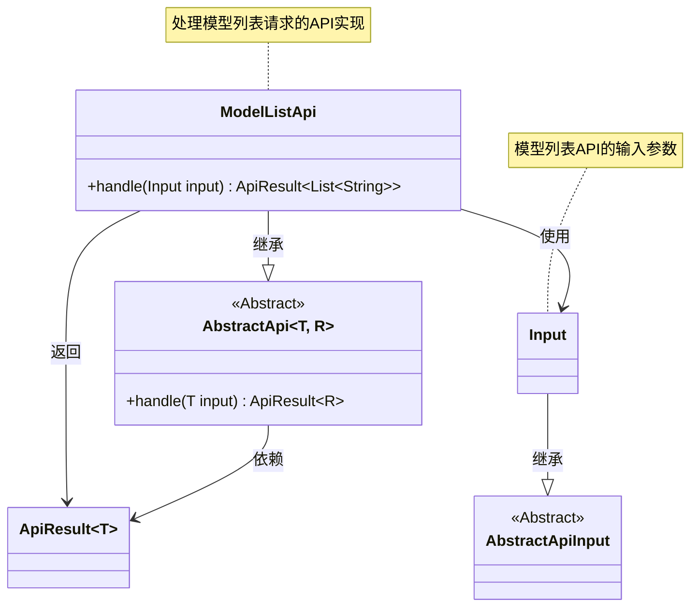

# 基础信息

|      |      |
|------|------|
| 名称 | ModelListApi |
| 编码语言 | .java |
| 代码路径 | WeFe/serving/serving-service/src/main/java/com/welab/wefe/serving/service/api/logger/ModelListApi.java |
| 包名 | com.welab.wefe.serving.service.api.logger |
| 依赖项 | ['com.welab.wefe.common.web.api.base.AbstractApi', 'com.welab.wefe.common.web.api.base.Api', 'com.welab.wefe.common.web.dto.AbstractApiInput', 'com.welab.wefe.common.web.dto.ApiResult', 'java.util.List'] |
| 概述说明 | 这是一个Java API类，路径为"log/model_list"，无需登录，用于处理模型列表请求，输入为ModelListApi.Input，输出为字符串列表。 |

# 说明

这段代码定义了一个名为ModelListApi的API类，继承自AbstractApi基类。该API路径为"log/model_list"，名称为"model list"，且不需要登录即可访问。它使用泛型指定输入类型为内部类Input（继承自AbstractApiInput）和返回类型为字符串列表List<String>。类中包含一个未实现的handle方法用于处理请求，返回类型为ApiResult包装的字符串列表。Input内部类目前仅包含空的getter/setter区域，没有定义具体字段。整个API设计遵循抽象基类的模板模式。

# 类列表 Class Summary

| 名称   | 类型  | 说明 |
|-------|------|-------------|
| ModelListApi | class | Java API类ModelListApi，路径"log/model_list"，无需登录，处理输入返回字符串列表。 |

## 类 ModelListApi

|      |      |
|------|------|
| 访问范围 | @Api(path = "log/model_list", name = "model list", login = false);public |
| 类型 | class |
| 名称 | ModelListApi |
| 说明 | Java API类ModelListApi，路径"log/model_list"，无需登录，处理输入返回字符串列表。 |

### UML类图

这段代码展示了一个处理模型列表请求的API实现结构。ModelListApi继承自泛型抽象类AbstractApi，指定输入类型为内部类Input，返回类型为字符串列表。Input类继承自AbstractApiInput基类，目前未包含具体字段。整个结构体现了典型的API分层设计模式，通过抽象基类规范接口，具体API实现业务逻辑。注解表明这是一个无需登录的公开API接口。

### 内部方法调用关系图

```mermaid
graph TD
    A["类ModelListApi"]
    B["注解: @Api"]
    C["父类: AbstractApi<Input, List<String>>"]
    D["方法: handle(Input input)"]
    E["嵌套类: Input"]
    F["父类: AbstractApiInput"]

    A --> B
    A --> C
    A --> D
    A --> E
    E --> F
```

这段代码展示了一个基于抽象API框架的ModelListApi类实现，通过@Api注解定义接口路径和名称，并继承泛型化的AbstractApi基类。核心结构包含处理请求的handle方法和一个嵌套的Input输入类，后者继承自AbstractApiInput基类。流程图清晰地呈现了类继承关系和关键组件，体现了API接口的典型分层设计模式。

### 字段列表 Field List

| 名称  | 类型  | 说明 |
|-------|-------|------|

### 方法列表

| 名称  | 类型  | 说明 |
|-------|-------|------|
| handle | ApiResult<List<String>> | 重写方法返回空，处理输入返回字符串列表的API结果。 |

