# 基础信息

|      |      |
|------|------|
| 名称 | QueryApi |
| 编码语言 | .java |
| 代码路径 | WeFe/serving/serving-service/src/main/java/com/welab/wefe/serving/service/api/logger/QueryApi.java |
| 包名 | com.welab.wefe.serving.service.api.logger |
| 依赖项 | ['com.welab.wefe.common.fieldvalidate.annotation.Check', 'com.welab.wefe.common.web.api.base.AbstractApi', 'com.welab.wefe.common.web.api.base.Api', 'com.welab.wefe.common.web.dto.AbstractApiInput', 'com.welab.wefe.common.web.dto.ApiResult', 'com.welab.wefe.common.wefe.enums.Algorithm', 'com.welab.wefe.common.wefe.enums.FederatedLearningType', 'com.welab.wefe.common.wefe.enums.JobMemberRole', 'com.welab.wefe.serving.service.dto.PagingInput', 'com.welab.wefe.serving.service.dto.PagingOutput', 'com.welab.wefe.serving.service.service.PredictLogService', 'org.springframework.beans.factory.annotation.Autowired', 'java.util.Date'] |
| 概述说明 | QueryApi是查询日志的接口，输入包含流水号、成员ID等参数，输出包含日志ID、请求响应等信息，通过predictLogService处理查询请求。 |

# 说明

这是一个名为QueryApi的日志查询API类，继承自AbstractApi，处理分页查询请求。输入类Input包含流水号、成员ID、模型ID、算法类型、联邦学习类型、参与角色及时间范围等查询条件，均带有校验注解。输出类Output包含日志ID、流水号、成员信息、模型信息、算法类型、联邦学习类型、角色、创建时间、请求内容、响应内容及耗时等字段。该API通过predictLogService处理查询请求，返回分页结果。所有字段均提供getter和setter方法。

# 类列表 Class Summary

| 名称   | 类型  | 说明 |
|-------|------|-------------|
| QueryApi | class | QueryApi类提供日志查询接口，输入包含流水号、成员ID等参数，输出包含日志详情，如请求、响应及耗时。 |


## 类 QueryApi

|      |      |
|------|------|
| 访问范围 | @Api(path = "log/query", name = "query log");public |
| 类型 | class |
| 名称 | QueryApi |
| 说明 | QueryApi类提供日志查询接口，输入包含流水号、成员ID等参数，输出包含日志详情，如请求、响应及耗时。 |


### UML类图

```mermaid
classDiagram
    class QueryApi {
        -PredictLogService predictLogService
        +handle(Input input) ApiResult~PagingOutput~Output~~
    }
    class PagingInput {
        <<Abstract>>
    }
    class AbstractApiInput {
        <<Abstract>>
    }
    class PredictLogService {
        <<Interface>>
        +query(Input input) PagingOutput~Output~
    }
    class Input {
        -String seqNo
        -String memberId
        -String modelId
        -Algorithm algorithm
        -FederatedLearningType flType
        -JobMemberRole myRole
        -Date startTime
        -Date endTime
        // getters/setters
    }
    class Output {
        -String id
        -String seqNo
        -String memberId
        -String modelId
        -Algorithm algorithm
        -FederatedLearningType flType
        -JobMemberRole myRole
        -Date createdTime
        -String request
        -String response
        -long spend
        // getters/setters
    }
    class PagingOutput~T~ {
        +Generic type T
    }
    class ApiResult~T~ {
        +Generic type T
    }

    QueryApi --> PredictLogService : 依赖
    QueryApi ..|> AbstractApi~Input, PagingOutput~Output~~ : 实现
    Input --|> PagingInput : 继承
    Output --|> AbstractApiInput : 继承
    PredictLogService ..> Input : 使用
    PredictLogService ..> Output : 使用
```

这段代码描述了一个查询日志的API类`QueryApi`，它继承自泛型抽象类`AbstractApi`，处理输入`Input`和分页输出`PagingOutput<Output>`。`Input`类包含多个查询条件字段，继承自`PagingInput`；`Output`类包含日志详情字段，继承自`AbstractApiInput`。`QueryApi`通过`PredictLogService`接口进行实际查询操作，返回分页结果。整体结构展示了典型的API层设计模式，包含请求参数、响应数据和业务逻辑处理的分层。


### 内部方法调用关系图

```mermaid
graph TD
    A["类QueryApi"]
    B["注解: @Api(path='log/query', name='query log')"]
    C["继承: AbstractApi<Input, PagingOutput<Output>>"]
    D["依赖注入: @Autowired PredictLogService"]
    E["重写方法: handle(Input input)"]
    F["内部类: Input"]
    G["内部类: Output"]
    H["Input属性: String seqNo等8个字段"]
    I["Output属性: String id等11个字段"]
    J["Input方法: getter/setter"]
    K["Output方法: getter/setter"]

    A --> B
    A --> C
    A --> D
    A --> E
    A --> F
    A --> G
    F --> H
    F --> J
    G --> I
    G --> K
    E --> D
```



该流程图展示了QueryApi类的完整结构，它是一个带有@Api注解的REST接口类，继承自AbstractApi泛型类。核心包含两个静态内部类Input和Output，分别作为请求参数和响应数据的载体。Input类继承PagingInput并包含8个带校验注解的查询条件字段，Output类继承AbstractApiInput包含11个日志详情字段。主类通过handle方法调用predictLogService完成查询，所有内部类均实现完整的getter/setter方法。

### 字段列表 Field List

| 名称  | 类型  | 说明 |
|-------|-------|------|
| predictLogService | PredictLogService | 代码片段使用@Autowired自动注入PredictLogService实例。 |

### 方法列表

| 名称  | 类型  | 说明 |
|-------|-------|------|
| handle | ApiResult<PagingOutput<Output>> | Java方法重写，调用predictLogService查询输入并返回分页结果。 |


