# 基础信息

|      |      |
|------|------|
| 名称 | StatisticsApi |
| 编码语言 | .java |
| 代码路径 | WeFe/serving/serving-service/src/main/java/com/welab/wefe/serving/service/api/logger/StatisticsApi.java |
| 包名 | com.welab.wefe.serving.service.api.logger |
| 依赖项 | ['com.welab.wefe.common.fieldvalidate.annotation.Check', 'com.welab.wefe.common.web.api.base.AbstractApi', 'com.welab.wefe.common.web.api.base.Api', 'com.welab.wefe.common.web.dto.AbstractApiInput', 'com.welab.wefe.common.web.dto.ApiResult', 'com.welab.wefe.common.wefe.enums.Algorithm', 'com.welab.wefe.common.wefe.enums.FederatedLearningType', 'com.welab.wefe.common.wefe.enums.JobMemberRole', 'com.welab.wefe.serving.service.service.PredictStatisticsService', 'org.springframework.beans.factory.annotation.Autowired', 'java.util.List'] |
| 概述说明 | StatisticsApi类提供日志统计功能，输入包含成员ID、模型ID、日期类型和查询间隔，输出包含统计结果如成功/失败次数等。通过PredictStatisticsService处理查询请求。 |

# 说明

该内容描述了一个名为StatisticsApi的Java类，用于获取日志统计信息。该类继承自AbstractApi，处理输入为Input类，输出为Output类的列表。Input类包含成员ID、模型ID、日期类型和查询间隔等字段，均带有校验注解。Output类包含成员ID、模型ID、算法类型、联邦学习类型、角色、时间粒度字段及成功/失败次数统计。通过PredictStatisticsService的query方法处理请求，返回统计结果。所有字段均提供getter/setter方法。

# 类列表 Class Summary

| 名称   | 类型  | 说明 |
|-------|------|-------------|
| StatisticsApi | class | 日志统计API类，路径为log/statistics，输入含成员ID、模型ID、日期类型和查询间隔，输出包含成员ID、模型ID、算法类型、联邦学习类型、角色、时间粒度及成功失败总数。 |


## 类 StatisticsApi

|      |      |
|------|------|
| 访问范围 | @Api(path = "log/statistics", name = "Get log statistics");public |
| 类型 | class |
| 名称 | StatisticsApi |
| 说明 | 日志统计API类，路径为log/statistics，输入含成员ID、模型ID、日期类型和查询间隔，输出包含成员ID、模型ID、算法类型、联邦学习类型、角色、时间粒度及成功失败总数。 |


### UML类图

```mermaid
classDiagram
    class AbstractApi~T, R~ {
        <<Abstract>>
        +handle(T input) R
    }

    class StatisticsApi {
        -PredictStatisticsService predictStatisticsService
        +handle(Input input) ApiResult~List~Output~~
    }

    class AbstractApiInput {
        <<Abstract>>
    }

    class StatisticsApi$Input {
        -String memberId
        -String modelId
        -String dateType
        -Integer interval
        +getMemberId() String
        +setMemberId(String memberId)
        +getModelId() String
        +setModelId(String modelId)
        +getDateType() String
        +setDateType(String dateType)
        +getInterval() Integer
        +setInterval(Integer interval)
    }

    class StatisticsApi$Output {
        -String memberId
        -String modelId
        -Algorithm algorithm
        -FederatedLearningType flType
        -JobMemberRole myRole
        -String month
        -String day
        -String hour
        -String minute
        -long total
        -long success
        -long fail
        // 省略getter/setter方法
    }

    class PredictStatisticsService {
        <<Interface>>
        +query(Input input) List~Output~
    }

    AbstractApi <|-- StatisticsApi
    AbstractApiInput <|-- StatisticsApi$Input
    AbstractApiInput <|-- StatisticsApi$Output
    StatisticsApi --> PredictStatisticsService : 依赖
    StatisticsApi o-- StatisticsApi$Input
    StatisticsApi o-- StatisticsApi$Output
```

这段代码描述了一个统计API的实现结构。StatisticsApi继承自泛型抽象类AbstractApi，处理Input输入并返回List<Output>结果。Input和Output都是继承自AbstractApiInput的内部类，包含多个带校验注解的字段。StatisticsApi通过依赖注入的PredictStatisticsService接口实现核心查询逻辑。类图清晰地展示了继承关系、组合关系和依赖关系，体现了分层设计和接口隔离原则。


### 内部方法调用关系图

```mermaid
graph TD
    A["类StatisticsApi"]
    B["继承: AbstractApi<Input, List<Output>>"]
    C["依赖: PredictStatisticsService"]
    D["方法: handle(Input input)"]
    E["内部类: Input"]
    F["内部类: Output"]
    G["Input属性: memberId, modelId, dateType, interval"]
    H["Input方法: getter/setter"]
    I["Output属性: memberId, modelId, algorithm等"]
    J["Output方法: getter/setter"]
    K["注解: @Api"]
    L["注解: @Autowired"]
    M["注解: @Check"]

    A --> B
    A --> C
    A --> D
    A --> E
    A --> F
    E --> G
    E --> H
    E --> M
    F --> I
    F --> J
    A -.-> K
    C -.-> L
    D --> C
```



这段代码定义了一个名为StatisticsApi的API类，用于获取日志统计信息。该类继承自AbstractApi，包含输入(Input)和输出(Output)两个内部类，通过@Autowired注入PredictStatisticsService服务。主要流程是通过handle方法调用predictStatisticsService.query处理输入参数并返回统计结果列表。Input类包含成员ID、模型ID等带校验的查询参数，Output类则包含详细的统计结果字段如算法类型、时间维度数据和成功/失败计数等。整个结构体现了典型的API层设计模式，包含清晰的输入输出定义和业务逻辑处理流程。

### 字段列表 Field List

| 名称  | 类型  | 说明 |
|-------|-------|------|
| predictStatisticsService | PredictStatisticsService | 自动注入预测统计服务实例。 |

### 方法列表

| 名称  | 类型  | 说明 |
|-------|-------|------|
| handle | ApiResult<List<Output>> | 这段代码重写了handle方法，调用predictStatisticsService的query方法处理输入，并返回成功结果。 |


