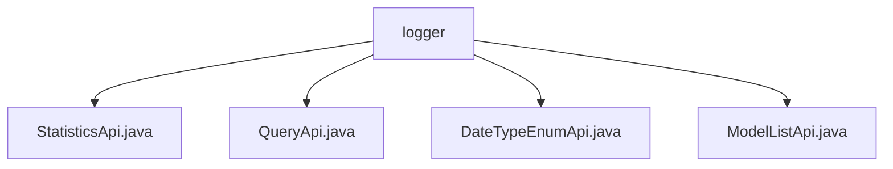

# 基础信息

|      |      |
|------|------|
| 名称 | logger |
| 编码语言 | .java |
| 代码路径 | WeFe/serving/serving-service/src/main/java/com/welab/wefe/serving/service/api/logger |
| 包名 | docs.serving.serving-service.src.main.java.com.welab.wefe.serving.service.api.logger |
| 概述说明 | StatisticsApi类继承AbstractApi，处理日志统计请求，输入含校验字段，输出统计结果列表。QueryApi类处理分页日志查询，输入含多种查询条件，输出详细日志信息。DateTypeEnumApi类返回日期类型枚举值集合。ModelListApi类返回模型列表字符串，无需登录。 |

# 说明

## 概述  
该模块核心职责为提供日志统计与查询功能，包括获取统计指标、分页查询日志记录及枚举值辅助接口。接口规范遵循统一模板，输入输出类均继承自AbstractApiInput/AbstractApi，字段带校验注解，例如StatisticsApi处理统计请求，QueryApi支持分页查询。关键数据结构包含日志ID、成员/模型信息、时间粒度及统计指标等，例如Output类记录成功/失败次数。外部依赖包括PredictStatisticsService和predictLogService。  

## 主要业务场景  
模块支持联邦学习日志全生命周期管理，类似审计系统。典型场景包括：1) 按条件查询日志明细（如时间范围、角色），2) 聚合统计预测次数（如按模型/成员分组），3) 获取枚举辅助数据（如日期类型）。API类型涵盖数据查询（QueryApi）、统计聚合（StatisticsApi）和元数据获取（DateTypeEnumApi）。例如ModelListApi提供模型列表，DateTypeEnumApi返回枚举集合。交互模式均采用请求-响应式，输出标准化为ApiResult包装结构。

### 包内部结构视图

该流程图展示了logger目录下的文件层级关系，包含StatisticsApi.java、QueryApi.java、DateTypeEnumApi.java和ModelListApi.java四个文件，它们都直接隶属于logger目录，没有更深层的嵌套结构。这种扁平化的目录结构便于快速定位和访问相关API文件。

# 文件列表

| 名称   | 类型  | 说明 |
|-------|------|-------------|
| [StatisticsApi.java](StatisticsApi.md) | file | StatisticsApi类提供日志统计功能，输入包含成员ID、模型ID、日期类型和查询间隔，输出包含统计结果如成功/失败次数等。通过PredictStatisticsService处理查询请求。 |
| [QueryApi.java](QueryApi.md) | file | QueryApi是查询日志的接口，输入包含流水号、成员ID等参数，输出包含日志ID、请求响应等信息，通过predictLogService处理查询请求。 |
| [DateTypeEnumApi.java](DateTypeEnumApi.md) | file | DateTypeEnumApi接口，路径"log/date_type"，无需登录，返回DateTypeEnum枚举集合。输入类为空。 |
| [ModelListApi.java](ModelListApi.md) | file | 这是一个Java API类，路径为"log/model_list"，无需登录，用于处理模型列表请求，输入为ModelListApi.Input，输出为字符串列表。 |

