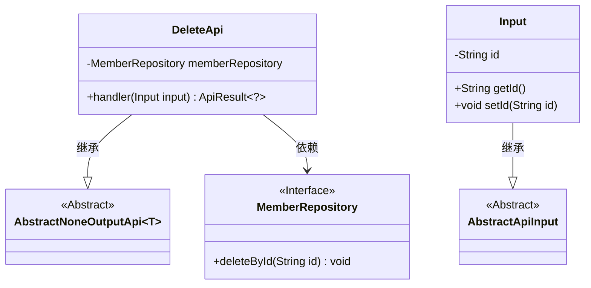
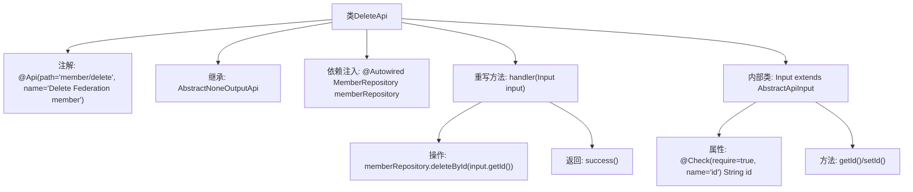

# 基础信息

|      |      |
|------|------|
| 名称 | DeleteApi |
| 编码语言 | .java |
| 代码路径 | WeFe/serving/serving-service/src/main/java/com/welab/wefe/serving/service/api/member/DeleteApi.java |
| 包名 | com.welab.wefe.serving.service.api.member |
| 依赖项 | ['com.welab.wefe.common.fieldvalidate.annotation.Check', 'com.welab.wefe.common.web.api.base.AbstractNoneOutputApi', 'com.welab.wefe.common.web.api.base.Api', 'com.welab.wefe.common.web.dto.AbstractApiInput', 'com.welab.wefe.common.web.dto.ApiResult', 'com.welab.wefe.serving.service.database.repository.MemberRepository', 'org.springframework.beans.factory.annotation.Autowired'] |
| 概述说明 | 删除联盟成员的API，接收ID参数，调用memberRepository删除对应记录，无返回数据。 |

# 说明

该代码定义了一个名为DeleteApi的API类，用于删除联邦成员。类路径为member/delete，继承自AbstractNoneOutputApi，输入类型为内部类Input。通过MemberRepository的deleteById方法根据输入ID删除成员，操作成功返回ApiResult。Input类继承AbstractApiInput，包含必须的字符串类型id字段，并提供getter和setter方法。

# 类列表 Class Summary

| 名称   | 类型  | 说明 |
|-------|------|-------------|
| DeleteApi | class | 删除联盟成员的API，接收成员ID，调用repository删除数据，无返回结果。 |

## 类 DeleteApi

|      |      |
|------|------|
| 访问范围 | @Api(path = "member/delete", name = "Delete Federation member");public |
| 类型 | class |
| 名称 | DeleteApi |
| 说明 | 删除联盟成员的API，接收成员ID，调用repository删除数据，无返回结果。 |

### UML类图

这段代码展示了一个删除成员的API实现，包含DeleteApi类及其嵌套的Input类。DeleteApi继承自泛型类AbstractNoneOutputApi，依赖MemberRepository接口执行删除操作。Input类继承自AbstractApiInput，包含一个必填的id字段。类图清晰地展示了类之间的继承关系和依赖关系，其中MemberRepository作为接口被标记，AbstractNoneOutputApi和AbstractApiInput作为抽象类存在。

### 内部方法调用关系图

该流程图描述了DeleteApi类的结构和工作流程。这是一个用于删除联盟成员的API类，继承自AbstractNoneOutputApi基类，通过MemberRepository执行删除操作。内部类Input包含带校验的id字段及其访问方法。主要处理逻辑在handler方法中，先调用deleteById删除指定ID的成员，然后返回成功结果。注解定义了API路径和名称，体现了Spring Boot的依赖注入和参数校验机制。

### 字段列表 Field List

| 名称  | 类型  | 说明 |
|-------|-------|------|
| memberRepository | MemberRepository | 自动注入MemberRepository成员变量。 |

### 方法列表

| 名称  | 类型  | 说明 |
|-------|-------|------|
| handler | ApiResult<?> | 该方法通过输入ID删除成员数据并返回成功结果。 |

