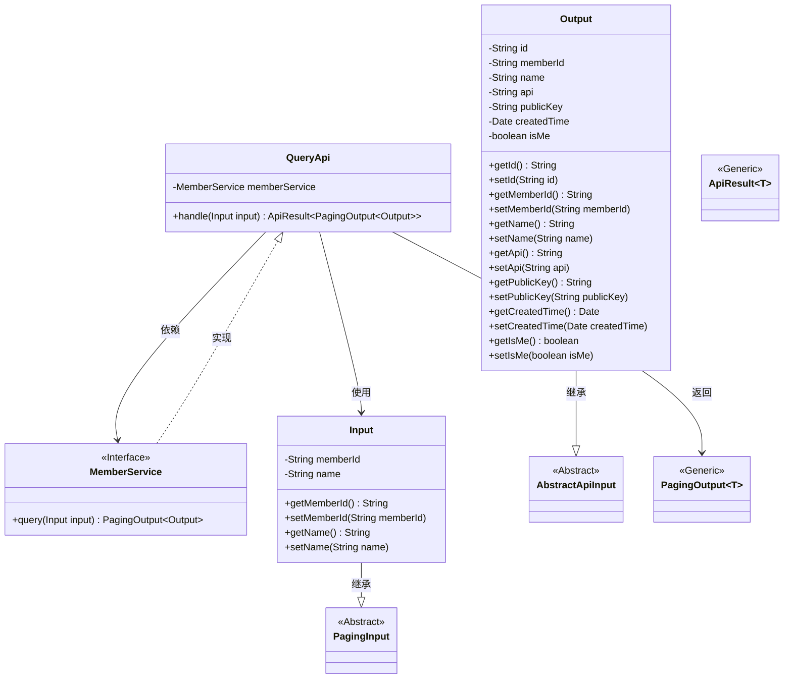

# 基础信息

|      |      |
|------|------|
| 名称 | QueryApi |
| 编码语言 | .java |
| 代码路径 | WeFe/serving/serving-service/src/main/java/com/welab/wefe/serving/service/api/member/QueryApi.java |
| 包名 | com.welab.wefe.serving.service.api.member |
| 依赖项 | ['com.welab.wefe.common.fieldvalidate.annotation.Check', 'com.welab.wefe.common.web.api.base.AbstractApi', 'com.welab.wefe.common.web.api.base.Api', 'com.welab.wefe.common.web.dto.AbstractApiInput', 'com.welab.wefe.common.web.dto.ApiResult', 'com.welab.wefe.serving.service.dto.PagingInput', 'com.welab.wefe.serving.service.dto.PagingOutput', 'com.welab.wefe.serving.service.service.MemberService', 'org.springframework.beans.factory.annotation.Autowired', 'java.util.Date'] |
| 概述说明 | 查询联盟成员信息的API，包含成员ID和名称输入，返回分页结果，含成员ID、名称、API、公钥、创建时间及是否本人标识。 |

# 说明

该代码定义了一个名为QueryApi的API类，用于获取联邦成员信息。API路径为member/query，继承自AbstractApi，处理Input输入并返回分页的Output输出。Input包含成员ID和名称两个可校验字段，支持分页。Output包含成员ID、名称、API地址、公钥、创建时间及是否当前用户标识等详细信息。通过MemberService的query方法处理请求并返回结果。所有字段均通过getter/setter方法访问。

# 类列表 Class Summary

| 名称   | 类型  | 说明 |
|-------|------|-------------|
| QueryApi | class | 查询联盟成员信息的API，包含分页输入参数memberId和name，返回成员ID、名称、API、公钥、创建时间及是否当前用户等信息。 |

## 类 QueryApi

|      |      |
|------|------|
| 访问范围 | @Api(path = "member/query", name = "Get Federation member information");public |
| 类型 | class |
| 名称 | QueryApi |
| 说明 | 查询联盟成员信息的API，包含分页输入参数memberId和name，返回成员ID、名称、API、公钥、创建时间及是否当前用户等信息。 |

### UML类图

类图描述：该图展示了查询API的核心结构，QueryApi类继承自AbstractApi并依赖MemberService接口处理成员查询。Input类继承PagingInput用于分页参数，Output类继承AbstractApiInput包含成员详细信息。PagingOutput和ApiResult是泛型类，分别用于分页结果和API响应封装。整体设计体现了分层和泛型编程思想，Input/Output作为DTO隔离内外数据交互。

### 内部方法调用关系图

```mermaid
graph TD
    A["类QueryApi"]
    B["注解: @Api"]
    C["依赖: MemberService memberService"]
    D["方法: handle(Input input)"]
    E["嵌套类: Input"]
    F["嵌套类: Output"]
    G["Input属性: String memberId"]
    H["Input属性: String name"]
    I["Input方法: getter/setter"]
    J["Output属性: String id等7个字段"]
    K["Output方法: getter/setter"]
    L["继承关系: AbstractApi<Input,PagingOutput<Output>>"]
    M["Input继承: PagingInput"]
    N["Output继承: AbstractApiInput"]

    A --> B
    A --> C
    A --> D
    A --> E
    A --> F
    E --> G
    E --> H
    E --> I
    F --> J
    F --> K
    A -.-> L
    E -.-> M
    F -.-> N
    D --> C
```

这段代码展示了一个基于Spring框架的REST API实现类QueryApi，用于查询联邦成员信息。该类继承AbstractApi并定义了输入输出数据结构，通过MemberService处理业务逻辑。流程图清晰呈现了类结构、属性方法、继承关系和依赖注入，特别是嵌套类Input和Output的详细属性及getter/setter方法，体现了分层设计的清晰边界和Spring的依赖注入特性。

### 字段列表 Field List

| 名称  | 类型  | 说明 |
|-------|-------|------|
| memberService | MemberService | 使用@Autowired自动注入MemberService实例。 |

### 方法列表

| 名称  | 类型  | 说明 |
|-------|-------|------|
| handle | ApiResult<PagingOutput<Output>> | 处理输入并返回成员查询的分页结果。 |

