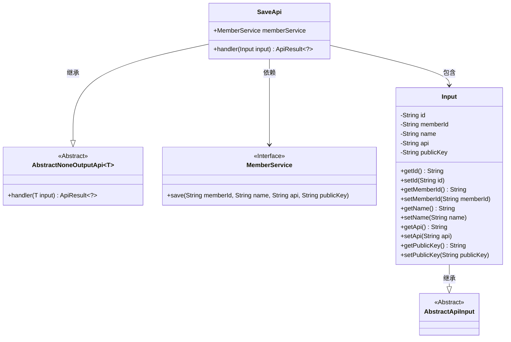
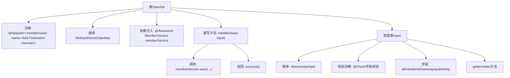

# 基础信息

|      |      |
|------|------|
| 名称 | SaveApi |
| 编码语言 | .java |
| 代码路径 | WeFe/serving/serving-service/src/main/java/com/welab/wefe/serving/service/api/member/SaveApi.java |
| 包名 | com.welab.wefe.serving.service.api.member |
| 依赖项 | ['com.welab.wefe.common.fieldvalidate.annotation.Check', 'com.welab.wefe.common.web.api.base.AbstractNoneOutputApi', 'com.welab.wefe.common.web.api.base.Api', 'com.welab.wefe.common.web.dto.AbstractApiInput', 'com.welab.wefe.common.web.dto.ApiResult', 'com.welab.wefe.serving.service.service.MemberService', 'org.springframework.beans.factory.annotation.Autowired'] |
| 概述说明 | SaveApi类用于添加联盟成员，接收成员ID、名称、预测接口地址和公钥，调用memberService保存数据。输入参数需校验非空。 |

# 说明

该代码定义了一个名为SaveApi的API类，用于添加联邦成员。API路径为"member/save"，继承自AbstractNoneOutputApi，输入参数为Input类。Input类包含五个字段：id、memberId、name、api和publicKey，其中后四个为必填项。handler方法调用memberService的save方法保存成员信息，参数来自Input对象。每个字段都有getter和setter方法，并通过@Check注解进行校验。

# 类列表 Class Summary

| 名称   | 类型  | 说明 |
|-------|------|-------------|
| SaveApi | class | SaveApi类用于添加联盟成员，通过memberService保存成员ID、名称、预测接口地址和公钥。输入参数包括必填的成员ID、名称、接口地址和公钥。 |

## 类 SaveApi

|      |      |
|------|------|
| 访问范围 | @Api(path = "member/save", name = "Add Federation member");public |
| 类型 | class |
| 名称 | SaveApi |
| 说明 | SaveApi类用于添加联盟成员，通过memberService保存成员ID、名称、预测接口地址和公钥。输入参数包括必填的成员ID、名称、接口地址和公钥。 |

### UML类图

这段代码展示了一个保存联邦成员的API实现结构。SaveApi继承自AbstractNoneOutputApi，处理包含成员信息的Input对象，并通过MemberService完成数据持久化。Input类继承自AbstractApiInput，包含成员ID、名称、API地址和公钥等字段，并提供了完整的getter/setter方法。MemberService作为接口提供save方法实现。整个设计体现了清晰的层次结构和职责分离，输入验证通过注解实现。

### 内部方法调用关系图

该流程图展示了SaveApi类的完整结构，包含API注解、服务注入、请求处理流程和嵌套输入类。主要流程是handler方法接收Input参数后调用memberService保存数据，最后返回成功结果。Input类包含5个带校验注解的字段及其访问方法，继承自AbstractApiInput基类。整个设计实现了成员保存的API功能，通过分层结构清晰分离了请求处理和数据验证逻辑。

### 字段列表 Field List

| 名称  | 类型  | 说明 |
|-------|-------|------|
| memberService | MemberService | 自动注入MemberService实例。 |

### 方法列表

| 名称  | 类型  | 说明 |
|-------|-------|------|
| handler | ApiResult<?> | 处理输入并保存成员信息，返回成功结果。 |

