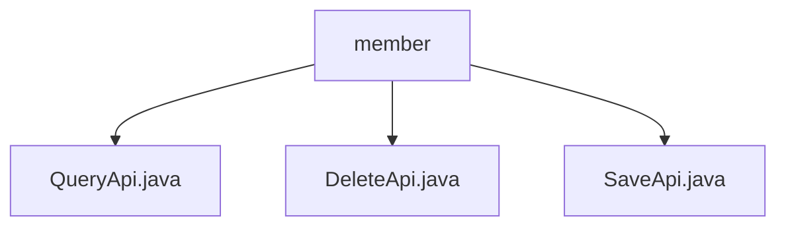

# 基础信息

|      |      |
|------|------|
| 名称 | member |
| 编码语言 | .java |
| 代码路径 | WeFe/serving/serving-service/src/main/java/com/welab/wefe/serving/service/api/member |
| 包名 | docs.serving.serving-service.src.main.java.com.welab.wefe.serving.service.api.member |
| 概述说明 | QueryApi类处理成员查询，路径member/query，输入含ID和名称，输出分页成员信息。DeleteApi类处理成员删除，路径member/delete，输入需ID。SaveApi类处理成员添加，路径member/save，输入含必填字段。 |

# 说明

## 概述  
该模块提供联邦成员管理功能，核心职责包括成员信息查询、新增和删除。接口规范遵循RESTful风格，统一继承AbstractApi基类，路径前缀为`member/`。关键数据结构包含Input类（含ID、名称等字段）和分页Output类（含API地址、公钥等）。外部依赖包括MemberService和MemberRepository。例如QueryApi通过MemberService.query实现分页查询，DeleteApi调用Repository直接删除数据。

## 主要业务场景  
模块支持完整的CRUD操作流程：通过SaveApi添加成员（类似注册中心）、QueryApi分页查询（类似目录服务）、DeleteApi移除成员。交互模式均为请求-响应式，Input参数通过注解校验。典型应用如联邦学习节点管理，例如新增参与方时调用SaveApi，需校验公钥等必填字段。API类型涵盖数据操作（增删查）和状态查询，集成案例可见于分布式协作场景。

### 包内部结构视图

该流程图展示了WeFe项目中serving-service模块下member目录中的三个Java文件：QueryApi.java、DeleteApi.java和SaveApi.java。这些文件都直接隶属于member目录，没有更深层次的嵌套结构，清晰地反映了该路径下API接口文件的平级关系。

# 文件列表

| 名称   | 类型  | 说明 |
|-------|------|-------------|
| [QueryApi.java](QueryApi.md) | file | 查询联盟成员信息的API，包含成员ID和名称输入，返回分页结果，含成员ID、名称、API、公钥、创建时间及是否本人标识。 |
| [DeleteApi.java](DeleteApi.md) | file | 删除联盟成员的API，接收ID参数，调用memberRepository删除对应记录，无返回数据。 |
| [SaveApi.java](SaveApi.md) | file | SaveApi类用于添加联盟成员，接收成员ID、名称、预测接口地址和公钥，调用memberService保存数据。输入参数需校验非空。 |

