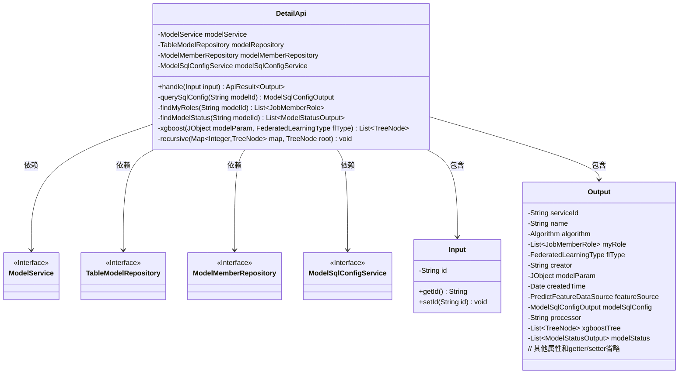
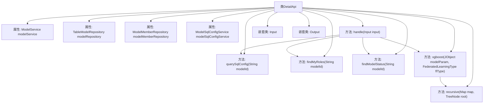
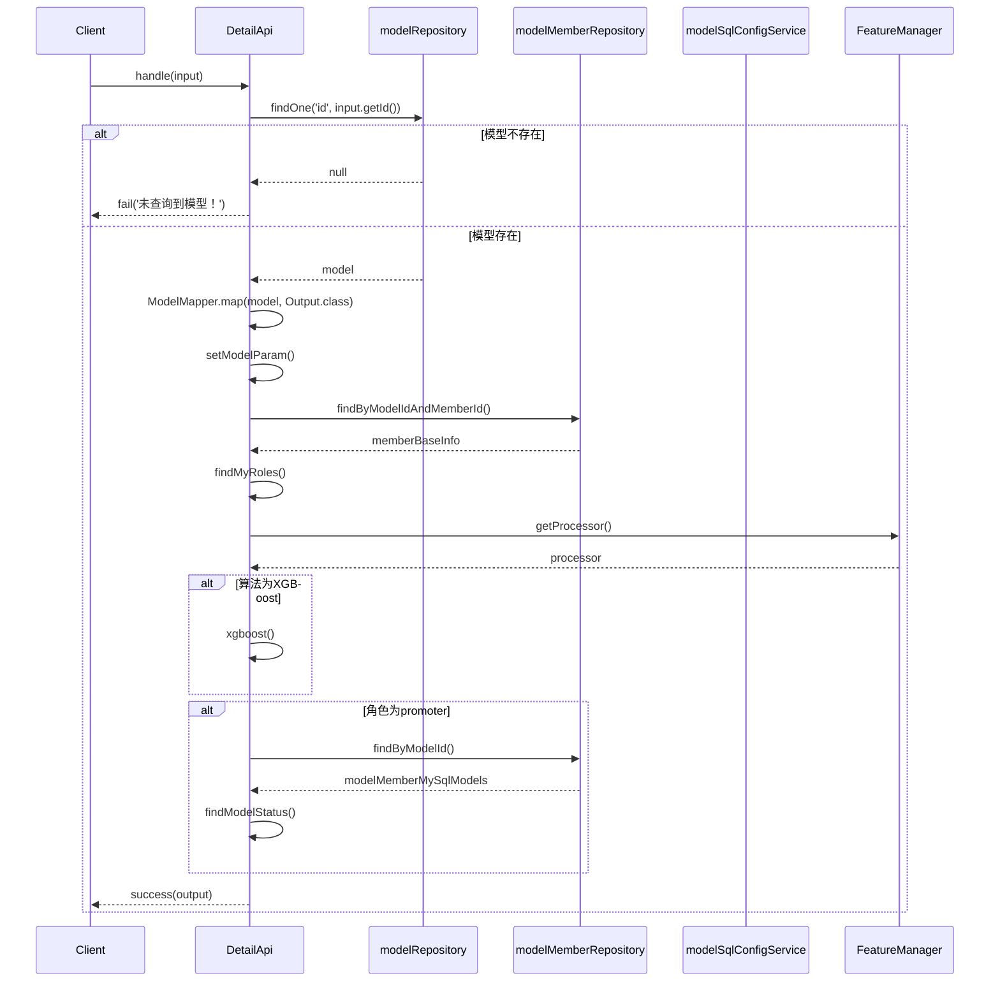

# 基础信息

|      |      |
|------|------|
| 名称 | DetailApi |
| 编码语言 | .java |
| 代码路径 | WeFe/serving/serving-service/src/main/java/com/welab/wefe/serving/service/api/model/DetailApi.java |
| 包名 | com.welab.wefe.serving.service.api.model |
| 依赖项 | ['java.util.ArrayList', 'java.util.Date', 'java.util.HashMap', 'java.util.List', 'java.util.Map', 'java.util.stream.Collectors', 'org.apache.commons.collections4.CollectionUtils', 'org.springframework.beans.factory.annotation.Autowired', 'com.welab.wefe.common.fieldvalidate.annotation.Check', 'com.welab.wefe.common.util.JObject', 'com.welab.wefe.common.web.api.base.AbstractApi', 'com.welab.wefe.common.web.api.base.Api', 'com.welab.wefe.common.web.dto.AbstractApiOutput', 'com.welab.wefe.common.web.dto.ApiResult', 'com.welab.wefe.common.web.util.ModelMapper', 'com.welab.wefe.common.wefe.enums.Algorithm', 'com.welab.wefe.common.wefe.enums.FederatedLearningType', 'com.welab.wefe.common.wefe.enums.JobMemberRole', 'com.welab.wefe.common.wefe.enums.PredictFeatureDataSource', 'com.welab.wefe.serving.sdk.model.xgboost.XgboostDecisionTreeModel', 'com.welab.wefe.serving.sdk.model.xgboost.XgboostModel', 'com.welab.wefe.serving.sdk.model.xgboost.XgboostNodeModel', 'com.welab.wefe.serving.service.database.entity.ModelMemberMySqlModel', 'com.welab.wefe.serving.service.database.entity.ModelSqlConfigMySqlModel', 'com.welab.wefe.serving.service.database.entity.TableModelMySqlModel', 'com.welab.wefe.serving.service.database.repository.ModelMemberRepository', 'com.welab.wefe.serving.service.database.repository.TableModelRepository', 'com.welab.wefe.serving.service.dto.ModelSqlConfigOutput', 'com.welab.wefe.serving.service.dto.ModelStatusOutput', 'com.welab.wefe.serving.service.dto.PagingInput', 'com.welab.wefe.serving.service.dto.TreeNode', 'com.welab.wefe.serving.service.dto.TreeNodeData', 'com.welab.wefe.serving.service.manager.FeatureManager', 'com.welab.wefe.serving.service.service.CacheObjects', 'com.welab.wefe.serving.service.service.ModelService', 'com.welab.wefe.serving.service.service.ModelSqlConfigService'] |
| 概述说明 | DetailApi类通过ID查询模型详情，包含模型参数、角色、状态等信息，支持XGBoost树结构处理。 |

# 说明

DetailApi是一个用于获取模型详情的API类，继承自AbstractApi，处理输入Input和输出Output。通过注入的ModelService、TableModelRepository等组件查询模型数据。主要逻辑包括：根据输入ID查询模型，若不存在则返回失败；映射模型数据到输出对象；设置模型参数、用户角色、处理器、XGBoost树结构及模型状态等信息。XGBoost树通过递归构建，包含特征、节点、权重等数据。输出对象包含服务ID、算法类型、创建者、创建时间、特征源、SQL配置等详细信息。输入类包含主键ID校验，输出类扩展了AbstractApiOutput，提供模型相关属性的getter和setter方法。

# 类列表 Class Summary

| 名称   | 类型  | 说明 |
|-------|------|-------------|
| DetailApi | class | DetailApi类处理模型详情查询，通过输入ID获取模型信息，包括参数、角色、状态等，并支持XGBoost树结构处理。 |

## 类 DetailApi

|      |      |
|------|------|
| 访问范围 | @Api(path = "model/detail", name = "Get model");public |
| 类型 | class |
| 名称 | DetailApi |
| 说明 | DetailApi类处理模型详情查询，通过输入ID获取模型信息，包括参数、角色、状态等，并支持XGBoost树结构处理。 |

### UML类图

这段类图展示了DetailApi类及其相关组件的关系。DetailApi继承自AbstractApi，包含Input和Output两个静态内部类，并依赖四个服务接口（ModelService、TableModelRepository等）。主要功能是通过handle方法处理模型详情请求，涉及模型查询、角色查找、状态获取等操作，最终返回包含模型详细信息的Output对象。类图清晰地反映了代码的层级结构和依赖关系，其中接口用<<Interface>>标记，私有成员用"-"前缀，公有方法用"+"前缀。

### 内部方法调用关系图

该流程图展示了DetailApi类的结构和主要方法调用关系，包含4个自动注入的服务组件和6个核心方法。时序图详细描述了handle方法的执行过程，包括模型查询、角色验证、XGBoost树构建等关键步骤，涵盖了正常和异常两种处理路径。代码主要实现模型详情查询功能，涉及多个数据源的协同操作和复杂的业务逻辑判断。

### 字段列表 Field List

| 名称  | 类型  | 说明 |
|-------|-------|------|
| modelMemberRepository | ModelMemberRepository | 使用@Autowired自动注入ModelMemberRepository实例。 |
| modelRepository | TableModelRepository | 使用@Autowired自动注入TableModelRepository实例。 |
| modelSqlConfigService | ModelSqlConfigService | 使用@Autowired自动注入ModelSqlConfigService实例。 |
| modelService | ModelService | 自动注入ModelService实例。 |

### 方法列表

| 名称  | 类型  | 说明 |
|-------|-------|------|
| querySqlConfig | ModelSqlConfigOutput | 查询指定模型ID的SQL配置，并映射为输出对象。 |
| xgboost | List<TreeNode> | 该方法解析XGBoost模型参数，构建树结构节点列表。主要步骤：获取特征映射和模型参数，遍历每棵树生成节点，设置节点属性（特征、左右子节点、权重等），递归处理节点关系，最终返回树结构列表。支持纵向联邦学习类型。 |
| findModelStatus | List<ModelStatusOutput> | 该方法根据模型ID查询成员状态，筛选提供者角色，返回包含成员ID、合作方名称和状态的列表。 |
| handle | ApiResult<DetailApi.Output> | 方法处理输入，查询模型数据，映射输出并设置参数，根据角色和算法类型补充信息，最后返回结果。若模型不存在则返回失败。 |
| findMyRoles | List<JobMemberRole> | 该方法通过模型ID查询当前用户的角色列表，从数据库获取成员信息后提取角色并返回列表。 |
| recursive | void | 递归方法处理树结构，若节点为叶子则返回。获取左右子树节点，递归处理左右子树，最后将左右子树设为当前节点的子节点。 |

