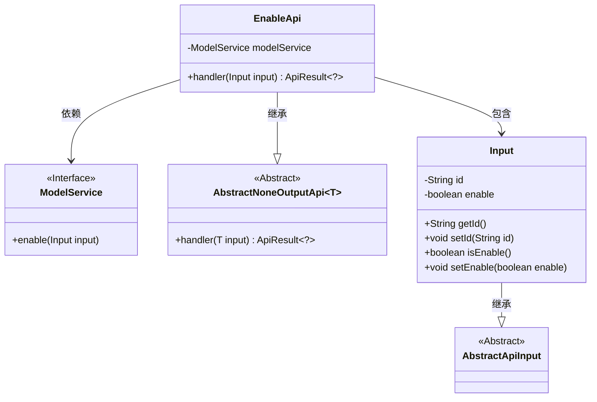
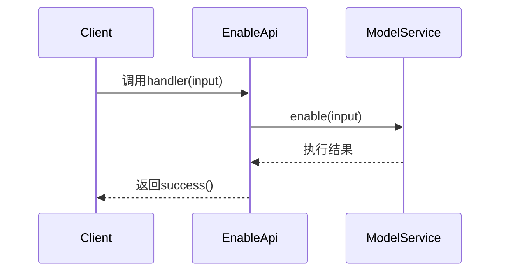

# 基础信息

|      |      |
|------|------|
| 名称 | EnableApi |
| 编码语言 | .java |
| 代码路径 | WeFe/serving/serving-service/src/main/java/com/welab/wefe/serving/service/api/model/EnableApi.java |
| 包名 | com.welab.wefe.serving.service.api.model |
| 依赖项 | ['org.springframework.beans.factory.annotation.Autowired', 'com.welab.wefe.common.web.api.base.AbstractNoneOutputApi', 'com.welab.wefe.common.web.api.base.Api', 'com.welab.wefe.common.web.dto.AbstractApiInput', 'com.welab.wefe.common.web.dto.ApiResult', 'com.welab.wefe.serving.service.service.ModelService'] |
| 概述说明 | EnableApi用于更新模型启用状态，接收id和enable参数，调用modelService.enable方法处理，返回成功结果。 |

# 说明

这是一个名为EnableApi的Java类，用于处理模型上线和下线操作。该类继承自AbstractNoneOutputApi，使用泛型Input作为输入参数。类上标注了Api注解，指定路径为model/enable，名称为Model online and offline，描述为Update model enable field。类中注入了ModelService服务，重写了handler方法，调用modelService的enable方法处理输入参数并返回成功结果。Input内部类继承自AbstractApiInput，包含两个属性：字符串类型的id和布尔类型的enable，分别提供了getter和setter方法。

# 类列表 Class Summary

| 名称   | 类型  | 说明 |
|-------|------|-------------|
| EnableApi | class | EnableApi用于更新模型启用状态，接收id和enable参数，调用modelService.enable处理并返回成功结果。 |

## 类 EnableApi

|      |      |
|------|------|
| 访问范围 | @Api(path = "model/enable", name = "Model online and offline", desc = "Update model enable field");public |
| 类型 | class |
| 名称 | EnableApi |
| 说明 | EnableApi用于更新模型启用状态，接收id和enable参数，调用modelService.enable处理并返回成功结果。 |

### UML类图

这段代码展示了一个模型启用/禁用API的实现结构。EnableApi继承自AbstractNoneOutputApi，处理Input参数并调用ModelService的enable方法。Input类继承AbstractApiInput，包含id和enable字段用于控制模型状态。类图清晰地呈现了继承关系(EnableApi→AbstractNoneOutputApi、Input→AbstractApiInput)、组合关系(EnableApi包含Input)以及依赖关系(EnableApi使用ModelService接口)。整体设计符合面向对象原则，通过抽象基类和接口实现了良好的扩展性。

### 内部方法调用关系图

```mermaid
graph TD
    A["类EnableApi"]
    B["注解: @Api"]
    C["继承: AbstractNoneOutputApi<Input>"]
    D["依赖注入: @Autowired ModelService"]
    E["重写方法: handler(Input input)"]
    F["内部类: Input"]
    G["属性: String id"]
    H["属性: boolean enable"]
    I["方法: getId/setId"]
    J["方法: isEnable/setEnable"]
    K["调用: modelService.enable(input)"]
    L["返回: success()"]

    A --> B
    A --> C
    A --> D
    A --> E
    E --> K
    E --> L
    A --> F
    F --> G
    F --> H
    F --> I
    F --> J
```

这段代码定义了一个EnableApi类，用于处理模型启用/禁用操作。流程图展示了类结构关系，包含注解、继承、依赖注入和内部类Input的定义。时序图描述了客户端调用handler方法时，依次触发ModelService的enable操作并返回成功响应的过程。核心功能是通过ModelService更新模型的enable字段状态，Input类封装了模型ID和启用状态参数。

### 字段列表 Field List

| 名称  | 类型  | 说明 |
|-------|-------|------|
| modelService | ModelService | 使用@Autowired自动注入ModelService实例。 |

### 方法列表

| 名称  | 类型  | 说明 |
|-------|-------|------|
| handler | ApiResult<?> | Java方法重写，调用modelService启用输入并返回成功结果。 |

