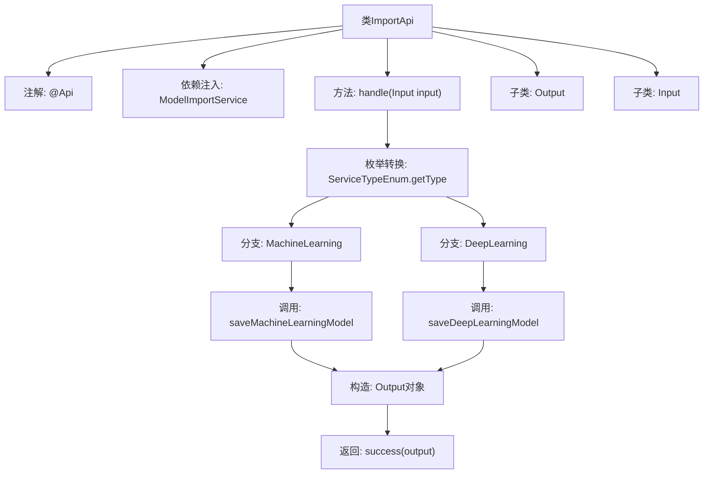

# 基础信息

|      |      |
|------|------|
| 名称 | ImportApi |
| 编码语言 | .java |
| 代码路径 | WeFe/serving/serving-service/src/main/java/com/welab/wefe/serving/service/api/model/ImportApi.java |
| 包名 | com.welab.wefe.serving.service.api.model |
| 依赖项 | ['com.welab.wefe.common.fieldvalidate.annotation.Check', 'com.welab.wefe.common.web.api.base.AbstractApi', 'com.welab.wefe.common.web.api.base.Api', 'com.welab.wefe.common.web.dto.AbstractApiInput', 'com.welab.wefe.common.web.dto.ApiResult', 'com.welab.wefe.serving.service.enums.ServiceTypeEnum', 'com.welab.wefe.serving.service.service.model.ModelImportService', 'org.springframework.beans.factory.annotation.Autowired'] |
| 概述说明 | 导入模型文件的API类，根据服务类型调用不同方法保存模型，返回模型ID。输入需文件名、服务类型和模型名称。 |

# 说明

该代码定义了一个名为ImportApi的API类，用于导入模型文件。它继承自AbstractApi，接受Input参数并返回Output结果。Input包含必填字段：文件名、服务类型和模型名称。根据服务类型（机器学习或深度学习），调用不同的modelImportService方法保存模型，并返回生成的ID。Output包含一个ID字段。API路径为"model/import"，名称为"导入模型文件"。

# 类列表 Class Summary

| 名称   | 类型  | 说明 |
|-------|------|-------------|
| ImportApi | class | 导入模型文件的API类，根据服务类型调用不同方法保存模型，返回模型ID。输入需文件名、服务类型和名称。 |


## 类 ImportApi

|      |      |
|------|------|
| 访问范围 | @Api(path = "model/import", name = "导入模型文件", desc = "导入模型文件");public |
| 类型 | class |
| 名称 | ImportApi |
| 说明 | 导入模型文件的API类，根据服务类型调用不同方法保存模型，返回模型ID。输入需文件名、服务类型和名称。 |


### UML类图

```mermaid
classDiagram
    class ImportApi {
        -ModelImportService modelImportService
        +handle(Input input) ApiResult~Output~
    }
    <<Interface>> ImportApi
    ImportApi --> ModelImportService : 依赖

    class AbstractApi~Input, Output~ {
        <<Abstract>>
    }
    ImportApi --|> AbstractApi~Input, Output~

    class ModelImportService {
        +saveMachineLearningModel(String name, String filename) String
        +saveDeepLearningModel(String name, String filename) String
    }

    class ImportApi$Output {
        -String id
        +getId() String
        +setId(String id) void
    }

    class AbstractApiInput {
        <<Abstract>>
    }
    class ImportApi$Input {
        -String filename
        -int serviceType
        -String name
        +getFilename() String
        +setFilename(String filename) void
        +getServiceType() int
        +setServiceType(int serviceType) void
        +getName() String
        +setName(String name) void
    }
    ImportApi$Input --|> AbstractApiInput

    class ServiceTypeEnum {
        <<Enumeration>>
        +MachineLearning
        +DeepLearning
        +getType(int type) ServiceTypeEnum
    }
    ImportApi --> ServiceTypeEnum : 依赖
```

类图描述：该图展示了ImportApi类及其相关组件的结构。ImportApi继承自泛型类AbstractApi<Input, Output>，包含内部类Input和Output，其中Input继承自AbstractApiInput。ImportApi依赖ModelImportService进行模型导入操作，并通过ServiceTypeEnum枚举判断服务类型。整体结构清晰地展现了API处理流程中的类关系与数据流转。


### 内部方法调用关系图



流程图描述了ImportApi类的核心处理流程。首先通过@Api注解定义接口元数据，注入ModelImportService服务。handle方法根据输入参数的服务类型枚举，分别调用不同的模型保存方法，构造输出对象后返回成功结果。Input子类包含三个必填校验字段，Output子类仅包含id字段。整个过程实现了模型文件导入的分类型处理逻辑。

### 字段列表 Field List

| 名称  | 类型  | 说明 |
|-------|-------|------|
| modelImportService | ModelImportService | 使用@Autowired自动注入ModelImportService实例。 |

### 方法列表

| 名称  | 类型  | 说明 |
|-------|-------|------|
| handle | ApiResult<Output> | 该方法根据输入的服务类型调用不同模型保存方法，返回包含生成ID的成功结果。 |


