# 基础信息

|      |      |
|------|------|
| 名称 | ModelStatusCheckApi |
| 编码语言 | .java |
| 代码路径 | WeFe/serving/serving-service/src/main/java/com/welab/wefe/serving/service/api/model/ModelStatusCheckApi.java |
| 包名 | com.welab.wefe.serving.service.api.model |
| 依赖项 | ['com.welab.wefe.common.fieldvalidate.annotation.Check', 'com.welab.wefe.common.web.api.base.AbstractApi', 'com.welab.wefe.common.web.api.base.Api', 'com.welab.wefe.common.web.dto.AbstractApiInput', 'com.welab.wefe.common.web.dto.AbstractApiOutput', 'com.welab.wefe.common.web.dto.ApiResult', 'com.welab.wefe.serving.service.dto.ModelStatusOutput', 'com.welab.wefe.serving.service.enums.MemberModelStatusEnum', 'com.welab.wefe.serving.service.service.ModelMemberService', 'org.springframework.beans.factory.annotation.Autowired', 'java.util.List'] |
| 概述说明 | 该API用于检查模型状态，接收模型ID和成员ID参数，调用ModelMemberService返回模型可用性结果。 |

# 说明

该代码定义了一个名为ModelStatusCheckApi的API类，用于检查模型状态。API路径为"model/status/check"，接收包含模型ID和成员ID的输入参数，通过ModelMemberService服务检查指定模型和成员的可用性，并返回状态结果列表。输入类Input继承自AbstractApiInput，包含两个字段：必填的serviceId和可选的memberId，均提供getter和setter方法。处理逻辑在handle方法中实现，调用服务并返回成功结果。

# 类列表 Class Summary

| 名称   | 类型  | 说明 |
|-------|------|-------------|
| ModelStatusCheckApi | class | 检查模型状态的API接口，接收模型ID和成员ID参数，调用服务返回模型可用状态列表。 |


## 类 ModelStatusCheckApi

|      |      |
|------|------|
| 访问范围 | @Api(path = "model/status/check", name = "检查模型状态");public |
| 类型 | class |
| 名称 | ModelStatusCheckApi |
| 说明 | 检查模型状态的API接口，接收模型ID和成员ID参数，调用服务返回模型可用状态列表。 |


### UML类图

```mermaid
classDiagram
    class ModelStatusCheckApi {
        -ModelMemberService modelMemberService
        +handle(Input input) ApiResult~List~ModelStatusOutput~~
    }
    
    class AbstractApi~T, R~ {
        <<Abstract>>
        +handle(T input) ApiResult~R~
    }
    
    class ModelStatusOutput {
    }
    
    class ModelMemberService {
        +checkAvailableByModelIdAndMemberId(String serviceId, String memberId) List~ModelStatusOutput~
    }
    
    class Input {
        -String serviceId
        -String memberId
        +getServiceId() String
        +setServiceId(String serviceId)
        +getMemberId() String
        +setMemberId(String memberId)
    }
    
    class AbstractApiInput {
    }
    
    class ApiResult~T~ {
    }
    
    ModelStatusCheckApi --> AbstractApi~Input, List~ModelStatusOutput~~ : 继承
    ModelStatusCheckApi --> ModelMemberService : 依赖
    ModelStatusCheckApi ..> Input : 嵌套类
    Input --> AbstractApiInput : 继承
    ModelMemberService --> ModelStatusOutput : 返回
    AbstractApi~T, R~ --> ApiResult~R~ : 返回
```

该代码展示了一个模型状态检查API的实现结构。ModelStatusCheckApi继承自泛型抽象类AbstractApi，处理Input参数并返回包含ModelStatusOutput列表的ApiResult。核心业务通过ModelMemberService的checkAvailableByModelIdAndMemberId方法实现，Input类作为嵌套类继承AbstractApiInput并包含模型ID和成员ID字段。整体设计采用分层架构，通过依赖注入实现服务调用，符合标准的API开发模式。


### 内部方法调用关系图

```mermaid
graph TD
    A["类ModelStatusCheckApi"]
    B["注解: @Api(path='model/status/check', name='检查模型状态')"]
    C["继承: AbstractApi<Input, List<ModelStatusOutput>>"]
    D["依赖注入: @Autowired ModelMemberService"]
    E["重写方法: handle(Input input)"]
    F["调用: modelMemberService.checkAvailableByModelIdAndMemberId"]
    G["返回: ApiResult<List<ModelStatusOutput>>"]
    H["嵌套类Input"]
    I["属性: @Check String serviceId"]
    J["属性: @Check String memberId"]
    K["Getter/Setter方法"]

    A --> B
    A --> C
    A --> D
    A --> E
    E --> F
    F --> G
    A --> H
    H --> I
    H --> J
    H --> K
```



该流程图展示了ModelStatusCheckApi类的结构，包括类注解、继承关系、依赖注入的服务、核心处理方法及其内部调用链，以及嵌套输入类Input的组成。handle方法通过调用ModelMemberService的服务方法实现业务逻辑，最终返回封装后的结果。嵌套类Input包含两个带校验注解的属性和对应的访问器方法。

### 字段列表 Field List

| 名称  | 类型  | 说明 |
|-------|-------|------|
| modelMemberService | ModelMemberService | 使用@Autowired自动注入ModelMemberService实例。 |

### 方法列表

| 名称  | 类型  | 说明 |
|-------|-------|------|
| handle | ApiResult<List<ModelStatusOutput>> | 方法重写，调用服务检查模型和成员可用性，返回结果。 |


