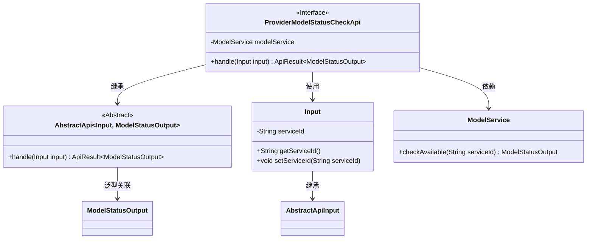
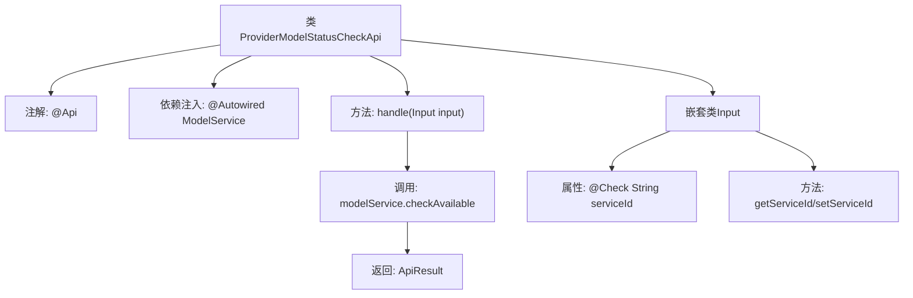

# 基础信息

|      |      |
|------|------|
| 名称 | ProviderModelStatusCheckApi |
| 编码语言 | .java |
| 代码路径 | WeFe/serving/serving-service/src/main/java/com/welab/wefe/serving/service/api/model/ProviderModelStatusCheckApi.java |
| 包名 | com.welab.wefe.serving.service.api.model |
| 依赖项 | ['com.welab.wefe.common.fieldvalidate.annotation.Check', 'com.welab.wefe.common.web.api.base.AbstractApi', 'com.welab.wefe.common.web.api.base.Api', 'com.welab.wefe.common.web.api.base.Caller', 'com.welab.wefe.common.web.dto.AbstractApiInput', 'com.welab.wefe.common.web.dto.ApiResult', 'com.welab.wefe.serving.service.dto.ModelStatusOutput', 'com.welab.wefe.serving.service.service.ModelService', 'org.springframework.beans.factory.annotation.Autowired'] |
| 概述说明 | 这是一个协作方提供的API，用于检查模型状态。路径为model/provider/status/check，需要签名访问，调用方为Customer。输入参数为必填的模型id，输出为模型状态。 |

# 说明

该代码定义了一个名为ProviderModelStatusCheckApi的API类，用于检查模型状态。API路径为model/provider/status/check，允许带签名的访问，调用方为Customer。该API继承自AbstractApi，输入参数为包含必填字段serviceId的Input类，输出为ModelStatusOutput。核心逻辑通过调用modelService的checkAvailable方法实现，传入serviceId参数并返回结果。整个API封装了模型状态检查功能，供协作方调用。

# 类列表 Class Summary

| 名称   | 类型  | 说明 |
|-------|------|-------------|
| ProviderModelStatusCheckApi | class | 协作方提供的模型状态检查接口，需传入模型ID，返回模型可用状态。支持签名访问，调用方为Customer。 |

## 类 ProviderModelStatusCheckApi

|      |      |
|------|------|
| 访问范围 | @Api(path = "model/provider/status/check", name = "检查模型状态（协作方提供接口）", allowAccessWithSign = true, domain = Caller.Customer);public |
| 类型 | class |
| 名称 | ProviderModelStatusCheckApi |
| 说明 | 协作方提供的模型状态检查接口，需传入模型ID，返回模型可用状态。支持签名访问，调用方为Customer。 |

### UML类图

该代码是一个用于检查模型状态的API接口实现，继承自AbstractApi抽象类。ProviderModelStatusCheckApi通过依赖注入的ModelService来执行实际的状态检查，输入参数封装在内部类Input中，包含必填的serviceId字段。类图展示了继承关系、依赖注入和泛型参数的使用，体现了清晰的职责分离和模块化设计。

### 内部方法调用关系图

该流程图展示了ProviderModelStatusCheckApi类的核心结构，包含API注解配置、依赖注入的ModelService、主要请求处理方法handle及其内部对modelService.checkAvailable的调用，以及嵌套输入参数类Input的定义。Input类包含带校验注解的serviceId字段及其getter/setter方法，整体构成一个典型的Spring Boot API控制器结构。

### 字段列表 Field List

| 名称  | 类型  | 说明 |
|-------|-------|------|
| modelService | ModelService | 自动注入ModelService实例。 |

### 方法列表

| 名称  | 类型  | 说明 |
|-------|-------|------|
| handle | ApiResult<ModelStatusOutput> | 该方法重写父类逻辑，调用模型服务检查指定服务ID的可用性，并返回封装为ApiResult的成功结果。 |

