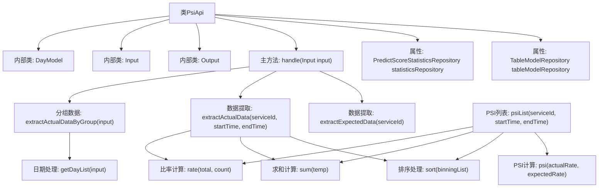

# 基础信息

|      |      |
|------|------|
| 名称 | PsiApi |
| 编码语言 | .java |
| 代码路径 | WeFe/serving/serving-service/src/main/java/com/welab/wefe/serving/service/api/model/PsiApi.java |
| 包名 | com.welab.wefe.serving.service.api.model |
| 依赖项 | ['com.welab.wefe.common.fieldvalidate.annotation.Check', 'com.welab.wefe.common.util.DateUtil', 'com.welab.wefe.common.util.JObject', 'com.welab.wefe.common.web.api.base.AbstractApi', 'com.welab.wefe.common.web.api.base.Api', 'com.welab.wefe.common.web.dto.AbstractApiInput', 'com.welab.wefe.common.web.dto.AbstractApiOutput', 'com.welab.wefe.common.web.dto.ApiResult', 'com.welab.wefe.serving.service.database.entity.StatisticsSumModel', 'com.welab.wefe.serving.service.database.entity.TableModelMySqlModel', 'com.welab.wefe.serving.service.database.repository.PredictScoreStatisticsRepository', 'com.welab.wefe.serving.service.database.repository.TableModelRepository', 'org.apache.commons.compress.utils.Lists', 'org.springframework.beans.factory.annotation.Autowired', 'java.math.BigDecimal', 'java.util', 'java.util.stream.Collectors'] |
| 概述说明 | 模型稳定性指标API类，处理输入输出数据，计算PSI值，包含预期与实际数据提取及分组统计功能。 |

# 说明

该代码定义了一个名为PsiApi的类，用于计算和返回模型稳定性指标（PSI）。该类继承自AbstractApi，处理输入参数并生成包含预期数据、实际数据和分组数据的输出结果。主要功能包括从数据库提取分箱信息、计算实际与预期分布比率、排序数据、格式化日期以及计算PSI值。输入参数包括服务ID、时间范围和周期步长，输出包含预期分布、实际分布和按时间分组的数据。代码还包含辅助方法用于数据处理、排序、比率计算和日期格式化。

# 类列表 Class Summary

| 名称   | 类型  | 说明 |
|-------|------|-------------|
| PsiApi | class | PsiApi类用于计算模型稳定性指标，处理输入数据并返回预期与实际结果对比。包含数据提取、排序、分组及PSI计算功能。 |


## 类 PsiApi

|      |      |
|------|------|
| 访问范围 | @Api(path = "model/psi", name = "模型稳定性指标", desc = "模型稳定性指标");public |
| 类型 | class |
| 名称 | PsiApi |
| 说明 | PsiApi类用于计算模型稳定性指标，处理输入数据并返回预期与实际结果对比。包含数据提取、排序、分组及PSI计算功能。 |


### UML类图

```mermaid
classDiagram
    class PsiApi {
        -TableModelRepository tableModelRepository
        -PredictScoreStatisticsRepository statisticsRepository
        +handle(PsiApi~Input~ input) ApiResult~PsiApi~Output~~
        -extractActualData(String serviceId, Date startTime, Date endTime) List~List~Object~~
        -sort(List~StatisticsSumModel~ count) List~StatisticsSumModel~
        -getBinningInfo(String serviceId, Date startTime, Date endTime) List~StatisticsSumModel~
        -extractActualDataByGroup(PsiApi~Input~ input) List~Object~
        -rate(int total, double count) double
        +psiList(String serviceId, Date startTime, Date endTime) List~List~Object~~
        -psi(double actual, double expected) double
        -subtract(double actual, double expected) double
        -ln(double actual, double expected) double
        -sum(List~StatisticsSumModel~ count) int
        -formatDate(Date date) String
        -getDayList(PsiApi~Input~ input) List~DayModel~
        -extractExpectedData(String serviceId) List~List~Object~~
        -extractYAxis2(JObject result, String key) double
        -extractYAxis(JObject result, String key) int
        -extractXAxis(List~Double~ dataKey, int i, Double key) String
        -extractXAxis2(List~StatisticsSumModel~ dataKey, int i, Double key) String
        -newScale(double value, int scale) double
    }

    class PsiApi~Input~ {
        -String serviceId
        -Date startTime
        -Date endTime
        -int step
        +getServiceId() String
        +setServiceId(String serviceId)
        +getStartTime() Date
        +setStartTime(Date startTime)
        +getEndTime() Date
        +setEndTime(Date endTime)
        +getStep() int
        +setStep(int step)
    }

    class PsiApi~Output~ {
        -Object expected
        -Object actual
        -Object dataGrid
        +getExpected() Object
        +setExpected(Object expected)
        +getActual() Object
        +setActual(Object actual)
        +getDataGrid() Object
        +setDataGrid(Object dataGrid)
        +create(Object expected, Object actual, Object dataGrid) PsiApi~Output~
    }

    class DayModel {
        -Date startTime
        -Date endTime
        +getStartTime() Date
        +setStartTime(Date startTime)
        +getEndTime() Date
        +setEndTime(Date endTime)
        +of(Date beginTime, Date endTime) DayModel
    }

    class AbstractApi~T~Input~, ~R~Output~~ {
        <<Interface>>
    }

    class AbstractApiOutput {
        <<Interface>>
    }

    class AbstractApiInput {
        <<Interface>>
    }

    class TableModelRepository {
        <<Interface>>
        +findOne(String field, String value, Class~T~ clazz) T
    }

    class PredictScoreStatisticsRepository {
        <<Interface>>
        +countBy(String serviceId, Date startTime, Date endTime) List~StatisticsSumModel~
    }

    PsiApi --> AbstractApi : 实现
    PsiApi~Input~ --> AbstractApiInput : 实现
    PsiApi~Output~ --> AbstractApiOutput : 实现
    PsiApi --> TableModelRepository : 依赖
    PsiApi --> PredictScoreStatisticsRepository : 依赖
    PsiApi --> DayModel : 使用
```

这段代码实现了一个计算模型稳定性指标(PSI)的API服务。PsiApi类继承自AbstractApi，处理输入(Input)和输出(Output)数据，主要功能包括：从数据库提取预期数据(extractExpectedData)和实际数据(extractActualData)，计算PSI值(psi)，并按时间分组处理数据(extractActualDataByGroup)。类图中展示了核心类及其关系，包括输入输出数据结构、工具类DayModel，以及与数据库交互的Repository接口。


### 内部方法调用关系图



这段代码实现了一个模型稳定性指标(PSI)计算服务，主要功能包括：通过handle方法处理输入参数，分别提取预期数据(extractExpectedData)、实际数据(extractActualData)和分组数据(extractActualDataByGroup)。核心计算逻辑涉及数据排序、求和、比率计算以及PSI值计算，其中PSI值通过实际比率和预期比率的差异和对数运算得出。代码还包含日期处理、数据格式化等辅助功能，并通过三个内部类(Output/Input/DayModel)封装数据结构和参数。整体采用流式处理和函数式编程风格，结构清晰但计算逻辑较为复杂。

### 字段列表 Field List

| 名称  | 类型  | 说明 |
|-------|-------|------|
| tableModelRepository | TableModelRepository | 自动注入TableModelRepository实例。 |
| statisticsRepository | PredictScoreStatisticsRepository | 自动注入预测分数统计仓库实例。 |

### 方法列表

| 名称  | 类型  | 说明 |
|-------|-------|------|
| extractExpectedData | List<List<Object>> | 方法从数据库按serviceId查询模型数据，若无数据或空则返回空列表。解析JSON中的bin_result，提取排序后的数值键，遍历生成包含X轴、Y轴1、Y轴2数据的二维列表返回。 |
| subtract | double | 该方法计算两个双精度浮点数的差值，返回实际值减去期望值的结果。 |
| psiList | List<List<Object>> | 方法psiList根据服务ID和时间范围获取分箱数据，排序并计算总和。查询模型数据后，遍历分箱结果，计算实际比率、预期比率及PSI值，最终返回包含分箱点、计数、比率和PSI的列表。 |
| rate | double | 计算比率，若总数total为0则返回0，否则返回count除以total的结果。 |
| getDayList | List<DayModel> | 该方法根据输入参数生成日期列表。从起始时间开始，按指定步长循环增加天数，生成包含起止时间的DayModel对象列表，直到超过结束时间。返回结果列表。 |
| extractActualData | List<List<Object>> | 方法提取指定服务在时间段内的统计数据，排序后计算总数，生成包含X轴、计数和比率的列表。 |
| handle | ApiResult<Output> | 重写handle方法，处理输入并返回包含预期数据、实际数据和分组数据的输出结果。 |
| sum | int | 该方法接收一个StatisticsSumModel列表，使用流处理将每个元素的count值转为整数并求和，返回总和。 |
| extractYAxis | int | 该方法从JSON对象中提取指定键的值，并返回其"count"字段的整数值。 |
| ln | double | 计算实际值与期望值的自然对数比值，忽略零值处理。 |
| sort | List<StatisticsSumModel> | 该方法对输入的统计模型列表按分割点排序，并返回排序后的列表。 |
| main | void | Java代码片段：计算实际值与期望值的差值乘以对数比。若实际值为0则设为0.1，输出(temp * ln)结果。 |
| extractActualDataByGroup | List<Object> | 该方法通过输入参数获取日期列表，将每个日期转换为包含格式化起始时间和对应PSI列表的映射，最终返回映射列表。 |
| extractYAxis2 | double | 该方法从JSON对象中提取指定键的值，获取其中的"count_rate"字段并转换为双精度数，最后调用newScale方法保留两位小数后返回。 |
| extractXAxis2 | String | 提取X轴范围字符串，基于前一点和当前点生成格式化区间，保留3位小数。 |
| newScale | double | 方法newScale将double值按指定小数位四舍五入，使用BigDecimal的ROUND_HALF_UP模式。 |
| getBinningInfo | List<StatisticsSumModel> | 获取指定服务ID和时间范围内的统计汇总数据列表。 |
| psi | double | 计算实际值与期望值的差异乘以两者的自然对数结果。 |
| formatDate | String | 该方法将Date对象转换为指定格式的日期字符串，使用YYYY-MM-DD格式。 |
| extractXAxis | String | 提取X轴范围字符串：根据数据列表和索引，生成前一个值到当前值的格式化区间（保留3位小数）。若为首项，前值默认为0.0。 |


