# 基础信息

|      |      |
|------|------|
| 名称 | QueryApi |
| 编码语言 | .java |
| 代码路径 | WeFe/serving/serving-service/src/main/java/com/welab/wefe/serving/service/api/model/QueryApi.java |
| 包名 | com.welab.wefe.serving.service.api.model |
| 依赖项 | ['java.util.Date', 'org.springframework.beans.factory.annotation.Autowired', 'com.welab.wefe.common.fieldvalidate.annotation.Check', 'com.welab.wefe.common.web.api.base.AbstractApi', 'com.welab.wefe.common.web.api.base.Api', 'com.welab.wefe.common.web.dto.AbstractApiInput', 'com.welab.wefe.common.web.dto.ApiResult', 'com.welab.wefe.common.wefe.enums.Algorithm', 'com.welab.wefe.common.wefe.enums.FederatedLearningType', 'com.welab.wefe.common.wefe.enums.JobMemberRole', 'com.welab.wefe.common.wefe.enums.PredictFeatureDataSource', 'com.welab.wefe.serving.service.dto.PagingInput', 'com.welab.wefe.serving.service.dto.PagingOutput', 'com.welab.wefe.serving.service.service.ModelService'] |
| 概述说明 | QueryApi类用于分页查询模型数据，包含输入参数模型ID、算法类型、联邦学习类型、创建者和名称，输出模型详细信息如ID、服务ID、名称、算法等。 |

# 说明

该代码定义了一个名为QueryApi的API类，用于查询模型信息。API路径为"model/query"，继承自AbstractApi，输入为QueryApi.Input，输出为分页的QueryApi.Output。Input类包含模型ID、算法类型、联邦学习类型、创建者和模型名称等查询参数，均带有校验注解。Output类包含模型ID、服务ID、名称、算法类型、联邦学习类型、创建者、模型参数、创建时间、更新时间、用户角色、特征数据源和启用状态等详细信息。API通过注入的ModelService处理查询请求，返回分页结果。所有字段均提供getter和setter方法。

# 类列表 Class Summary

| 名称   | 类型  | 说明 |
|-------|------|-------------|
| QueryApi | class | QueryApi类用于查询模型信息，包含输入参数（模型ID、算法类型、联邦学习类型等）和输出结果（模型ID、服务ID、名称、算法类型等）。通过ModelService处理查询请求并返回分页结果。 |


## 类 QueryApi

|      |      |
|------|------|
| 访问范围 | @Api(path = "model/query", name = "Get model");public |
| 类型 | class |
| 名称 | QueryApi |
| 说明 | QueryApi类用于查询模型信息，包含输入参数（模型ID、算法类型、联邦学习类型等）和输出结果（模型ID、服务ID、名称、算法类型等）。通过ModelService处理查询请求并返回分页结果。 |


### UML类图

```mermaid
classDiagram
    class QueryApi {
        -ModelService modelService
        +handle(Input input) ApiResult~PagingOutput~Output~~
    }
    class Input {
        -String modelId
        -Algorithm algorithm
        -FederatedLearningType flType
        -String creator
        -String name
        +getModelId() String
        +setModelId(String modelId) void
        +getAlgorithm() Algorithm
        +setAlgorithm(Algorithm algorithm) void
        +getFlType() FederatedLearningType
        +setFlType(FederatedLearningType flType) void
        +getCreator() String
        +setCreator(String creator) void
        +getName() String
        +setName(String name) void
    }
    class Output {
        -String id
        -String serviceId
        -String name
        -Algorithm algorithm
        -FederatedLearningType flType
        -String creator
        -String modelParam
        -Date createdTime
        -Date updatedTime
        -JobMemberRole myRole
        -PredictFeatureDataSource featureSource
        -boolean enable
        // 省略getter/setter方法
    }
    class ModelService {
        +query(Input input) PagingOutput~Output~
    }
    class PagingInput {
        <<Abstract>>
    }
    class AbstractApiInput {
        <<Abstract>>
    }
    class PagingOutput~T~ {
        <<Generic>>
    }
    class ApiResult~T~ {
        <<Generic>>
    }

    QueryApi --> ModelService : 依赖
    QueryApi --|> AbstractApi~Input, PagingOutput~Output~~
    Input --|> PagingInput
    Output --|> AbstractApiInput
    ModelService ..> Input : 使用
    ModelService ..> Output : 使用
```

这段代码展示了一个查询模型的API实现，包含QueryApi类及其嵌套的Input和Output类。QueryApi继承自泛型抽象类AbstractApi，依赖ModelService进行实际查询操作。Input类继承PagingInput包含查询参数，Output类继承AbstractApiInput包含返回结果字段。类图清晰地展示了类之间的继承、依赖关系，以及泛型参数的使用，体现了分层架构设计。


### 内部方法调用关系图

```mermaid
graph TD
    A["类QueryApi"]
    B["注解: @Api(path='model/query', name='Get model')"]
    C["继承: AbstractApi<Input, PagingOutput<Output>>"]
    D["依赖注入: @Autowired ModelService modelService"]
    E["重写方法: handle(Input input)"]
    F["内部类: Input"]
    G["内部类: Output"]
    H["Input属性: String modelId, Algorithm algorithm, FederatedLearningType flType, String creator, String name"]
    I["Output属性: String id, String serviceId, String name, Algorithm algorithm, FederatedLearningType flType, String creator, String modelParam, Date createdTime, Date updatedTime, JobMemberRole myRole, PredictFeatureDataSource featureSource, boolean enable"]
    J["Input方法: getter/setter"]
    K["Output方法: getter/setter"]

    A --> B
    A --> C
    A --> D
    A --> E
    A --> F
    A --> G
    F --> H
    F --> J
    G --> I
    G --> K
    E --> D
    E --> F
    E --> G
```



这段代码定义了一个名为QueryApi的API类，用于处理模型查询请求。该类继承自AbstractApi，使用泛型指定输入类型为内部类Input，输出类型为分页的Output。主要功能是通过注入的ModelService处理查询请求，Input类包含模型ID、算法类型等查询条件，Output类包含模型详细信息如创建时间、角色权限等。流程图展示了类结构、继承关系、依赖注入和内部类的属性方法组织。

### 字段列表 Field List

| 名称  | 类型  | 说明 |
|-------|-------|------|
| modelService | ModelService | 使用@Autowired自动注入ModelService实例。 |

### 方法列表

| 名称  | 类型  | 说明 |
|-------|-------|------|
| handle | ApiResult<PagingOutput<Output>> | Java方法重写，调用modelService.query处理输入并返回分页结果。 |


